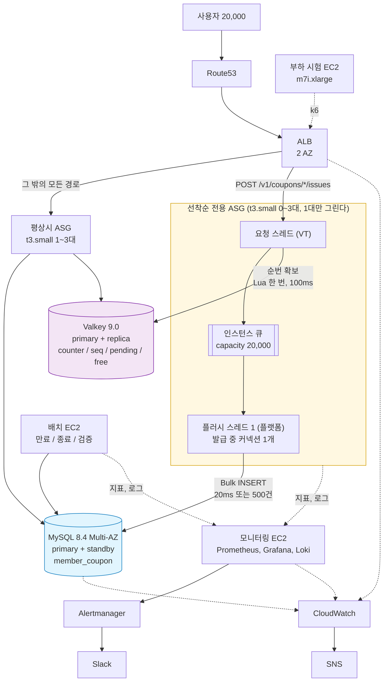
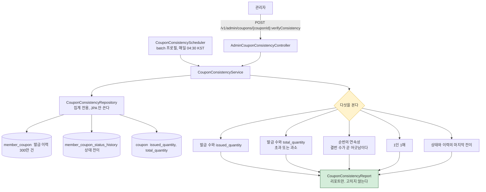
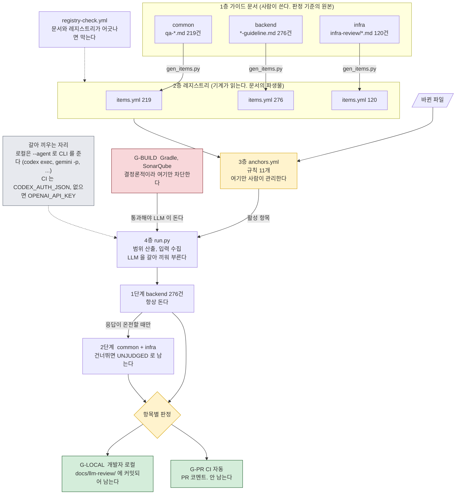

# fm-backend

신선식품 자사몰 백엔드. **대규모 트래픽 선착순 쿠폰 발급 시스템**이 이 프로젝트의 본론이다.

```
재고 10,000장 / 동시 요청 20,000명 / ramp-up 60초
  ->  초과 발급 0건 / 1인 1매 / 번호 유실 0 / p99 0.247초        2026-08-31, AWS 실측
```

Java 21 / Spring Boot 4.0.5 / MySQL 8.4 / Valkey(Redis) 9.0 / AWS (Terraform)
기간 2026-07-31 ~ 2026-08-31, 5명

```bash
git clone https://github.com/fresh-market/fm-backend.git backend
cd backend
./gradlew bootRun      # compose.yaml 의 MySQL 과 Valkey 를 자동으로 띄운다
```

**처음 작업한다면 [docs/project/project-guideline.md](./docs/project/project-guideline.md) 부터 본다.** 작업 흐름과 병합을 막는 조건이 거기에 있다.

| | |
|---|---|
| [1. 프로젝트 기획](#1-프로젝트-기획) | 왜 신선식품이고 왜 선착순 쿠폰인가 |
| [2. 프로젝트 전체 흐름](#2-프로젝트-전체-흐름) | 커머스 경로와 캠페인 경로 |
| [3. 아키텍처](#3-아키텍처) | 13개 도메인, 3계층, 패키지 경계 |
| [4. AWS 인프라](#4-aws-인프라) | 단일 환경, 그리고 선착순만 갈라 놓은 전용 경로 |
| [5. 선착순 쿠폰 설계와 근거](#5-선착순-쿠폰-설계와-근거) | 정합성과 동시성 파이프라인 |
| [6. 부하 시험: 결과, 해석, 개선](#6-부하-시험-결과-해석-개선) | 워밍업이 p99 를 가른다 |
| [문서 위키](#문서-위키) | 어디에 무엇이 있나 |

---

## 1. 프로젝트 기획

### 왜 신선식품인가

신선식품은 **안 팔리면 재고가 남는 것이 아니라 폐기가 된다.** 같은 상품이라도 입고 차수마다 소비기한이 다르고, 그 차이가 그대로 판매 가능 기간이 된다. 그래서 이 도메인에는 성격이 다른 두 문제가 동시에 있다.

```
평상시   로트 단위 재고를 소비기한 임박순(FEFO)으로 정확히 깎는다     꾸준한 쓰기 경합
이벤트   임박 재고를 떨기 위한 선착순 쿠폰을 연다                     한 순간에 몰리는 부하
```

**선착순 쿠폰이 두 문제를 하나로 잇는다.** 배치가 소비기한이 임박한 로트를 임박순 -> 판매율 저조순으로 고른다. 그 로트가 30% 정률 할인 쿠폰의 대상이 된다. 캠페인 대상 선정이 배치의 산출물이고, 그 목록이 이벤트의 입력이 된다.

### 주어진 요구사항

주제는 **대규모 트래픽 선착순 쿠폰 발급 시스템**이다([docs/coupon/requirement.md](./docs/coupon/requirement.md)).

| | |
|---|---|
| 발급 | 재고 10,000장에 20,000명이 동시에 요청해도 **초과 발급 0건, 1인 최대 1매** |
| 부하 | ramp-up 60초이고 도구는 자유이며 처리량 자체는 평가하지 않는다 |
| 정합성 | 발급/사용/취소/만료 **전체 상태**를 관리하고 반복 요청과 동시 요청에도 한 번만 반영 |
| 검증 | 발급 이력 **300만 건 전체**를 대상으로, 재실행하면 같은 결과 |
| 더미 | 가상 회원 100만 명, 발급 이력 300만 건 |
| 그 밖 | 개인정보 마스킹, 외부 연동 Mocking |

### 팀이 스스로 건 기준

요구사항이 지연을 재지 않으므로 SLO 를 하나 더 걸었다.

> 부하 시험 환경에서 요구 부하를 걸었을 때, **처리된 발급 응답의 p99 가 1초 이하다.**

팀은 이 한 줄에서 타임아웃 계층 전체를 역산했다(5장). 그리고 팀은 커머스 도메인도 함께 만들어, 요구사항 명세 72개 기능을 32개 테이블과 13개 도메인으로 옮겼다.

---

## 2. 프로젝트 전체 흐름

두 경로가 `stock_lot` 에서 만난다. **커머스는 로트를 소진하고, 캠페인은 남은 로트를 대상으로 삼는다.**

```
커머스 경로
  상품 등록 -> 로트 입고 -> 장바구니 -> 주문 생성(재고 예약) -> 결제 완료(예약 확정) -> 배송/클레임

캠페인 경로
  일별 판매 집계 -> 소비기한 만료 처리 -> 캠페인 대상 로트 선정 -> 쿠폰 이벤트 열기
                                                    -> 선착순 발급(동시 2만) -> 종료/카운터 정산
```

### 주문 한 건

```
회원 -> order   POST /v1/orders
order -> cart      getCheckoutInfo      소유권/수량 확인 후 스냅샷
order -> product   findOptionInfos      상품명/가격/판매 가능 여부
order -> stock     reserve              주문 항목 저장 후 재고 예약
order -> payment   결제 요청 이벤트 발행
payment -> order   PaymentApprovedEvent
order -> stock     confirm              예약 확정 (availableQty 재차감 없음)
order -> cart      removeCheckedOutItems 구매분만 멱등 삭제
```

결제가 실패하거나 취소되거나 만료되면 `release` 로 RESERVED 재고만 해제한다. **주문이 그 시점 값을 전부 복사한다.** 나중에 상품 가격이 바뀌어도 이미 만든 주문이 따라 바뀌지 않는다.

### 캠페인 대상을 만드는 배치

| 배치 | 주기 | 하는 일 | 다음 단계에 넘기는 것 |
|---|---|---|---|
| 소비기한 만료 | 일 1회 | 경과 로트를 판매 불가로 전환 -> 폐기 등록 | 가용 재고 0 이면 품절 |
| 일별 판매 집계 | 일 1회 | 결제 완료 주문 기준 `daily_sales` 적재 | **판매율 저조 판정의 원천** |
| 캠페인 대상 선정 | 이벤트 전 | 임박순 -> 저조순으로 로트를 뽑는다 | 쿠폰 이벤트의 대상 목록 |
| 쿠폰 만료 / 이벤트 종료 | 주기 / 마감 후 | 조건부 UPDATE 로 상태 전이, Redis 네 키 정리 | 카운터 정산 |
| 정합성 검증 | 수동 | 발급 이력 **300만 건 전체**를 훑는다 | 리포트만. **고치지 않는다** |

**팀은 회수 배치와 검증 배치를 섞지 않는다.** 회수 배치는 고치고 검증 배치는 잰다. 검증이 고치면 재실행 결과가 달라져 요구사항을 위반한다.

---

## 3. 아키텍처

### 도메인 13개, 3계층

DDL 32개 테이블을 13개 도메인으로 나눴다. **베이스 패키지의 직계 하위 패키지가 곧 도메인**이다.

```
L2   order  payment  claim  shipment  review  qna  statistics      여러 도메인을 조립한다
        |
L1   stock  coupon  cart                                           쓰기 경합이 있는 영역
        |
L0   member  product  admin                                        아무것도 참조하지 않는 기준 데이터
        |
     common  config                                                도메인 무지. 응답 봉투, 예외, 인증, 커서
```

**아래로만 부른다. 같은 층끼리는 직접 부르지 않는다**(`DPB-5-01`). 같은 층이 필요하면 상위 도메인이 조립한다. `ArchitectureTest` 가 빌드에서 강제하므로, 규칙을 어긴 코드는 `check` 에서 걸린다.

| | 결과 |
|---|---|
| `cart` -> `coupon` (같은 층) | 막힌다 |
| `stock` -> `order` (위로) | 막힌다 |
| `order` -> `stock` (아래로) | 통과 |

### 패키지 구조

```
com.freshmarket
├── product/                    65 파일. 도메인 하나가 어떻게 생겼나
│   ├── ProductApi.java             공개 계약. 다른 도메인은 이것만 본다
│   ├── ProductOptionInfo.java      계약이 주고받는 값. 엔티티는 안 나간다
│   └── internal/
│       ├── controller/             상품, 카테고리, 관리자 상품/카테고리/이미지
│       ├── service/                ProductService, CategoryService, ProductOptionAvailabilityService ...
│       ├── batch/                  옵션 판매상태 동기화, 미확정 이미지 정리
│       ├── client/                 ImageStorageClient, S3ImageStorageClient
│       ├── entity/                 Product, ProductOption, ProductImage, Category ...
│       ├── repository/             ProductQueryRepository 등 6개
│       └── config/  dto/  exception/
├── coupon/  member/  stock/  order/  payment/  cart/  admin/
├── common/                     응답 봉투, 예외 계층, 인증 필터, 커서 페이지네이션
└── config/
```

문서상 13개 도메인 중 **코드로 구현된 것은 8개**다(`claim`, `shipment`, `review`, `qna`, `statistics` 는 스키마와 API 명세까지 확정하고 구현은 남겨 두었다).

### 도메인 경계 규칙

| 규칙 | 내용 |
|---|---|
| 공개 계약 | `XxxApi` 인터페이스로만 노출하고 **엔티티는 도메인 밖으로 안 내보낸다** |
| 계약 생성 시점 | `XxxApi` 는 다른 도메인이 실제로 호출할 때 만들고 미리 만들지 않는다(`DPB-1-03`) |
| 관리자 기능 | 각 도메인의 `Admin~` 클래스가 맡고 `admin` 도메인은 계정과 감사 로그만 갖는다 |
| 참조와 의존 | `stock_allocation -> order_item` 은 **참조지 의존이 아니라서**, 재고가 주문을 부르지 않고 자기 원장에 원인을 적을 뿐이라 코드에서는 연관 대신 `Long orderItemId` 로 든다 |
| API 경로 | `/v1/...` 회원과 `/v1/admin/...` 관리자로 **소비자가 다르면 경로를 나누고**, 표준 메서드로 안 되면 콜론 표기를 쓴다(`POST /v1/orders/{id}:cancel`) |
| 응답 | 성공과 실패가 **같은 봉투**라 분기 전에 파싱을 끝낼 수 있다 |
| 인증 | JWT stateless 이고, `type` 클레임이 회원 토큰의 관리자 API 접근을 막고 권한은 `role` 로 판정하며 **기본값은 거부** |

### 병합을 막는 게이트

```
빌드, 테스트, JaCoCo(*.internal.service.* 메서드 커버리지 100%), SonarQube Blocker 0
+ anchors.yml 이 "바뀐 파일 -> 켤 검증 항목 + 함께 볼 파일" 을 정하는 LLM 검증
```

컨트롤러 한 줄이 바뀌었을 때 위반인지 알려면 `SecurityConfig` 와 서비스를 같이 봐야 한다. 그 동봉 규칙을 `anchors.yml` 이 갖는다. 규칙은 `*-guideline.md`, 왜 그런지는 `*-rationale.md` 로 **짝을 지어** 둔다.

---

## 4. AWS 인프라

Terraform 으로 코드화한 **단일 환경**이다(`ap-northeast-2`). 인프라 저장소는 [`fm-infra`](https://github.com/fresh-market/fm-infra) 가 따로 갖는다.


**두 AZ(`ap-northeast-2a`, `2c`)에 걸쳐 있다.**

* **ASG 둘** - 평상시 앱과 선착순 전용
* **단독 인스턴스 셋** - 모니터링(`t4g.small`), 배치(`t3.small`), 부하 시험용(시험 때만)
* **저장소** - RDS MySQL 8.4 Multi-AZ, ElastiCache Valkey 9.0(primary + replica, 자동 장애 조치)
* **이미지** - S3 에 두고 CloudFront + OAC 로 내보낸다
* **설정과 알림** - SSM Parameter Store, CloudWatch -> SNS

### 고정 이중화 대신 오토스케일링

```
app ASG      min 1  /  desired 1  /  max 3      2 AZ 서브넷에 걸쳐 있다
정책         TargetTrackingScaling - ALBRequestCountPerTarget (대상당 요청 수)
헬스체크      ELB. grace 300초
```

**팀은 두 대를 고정으로 띄우지 않는다.** 한산할 때 1대로 내려가고, 그 구간에서는 **앱이 여전히 단일 장애점이다.** 확장이 걸려 있는 동안에만 해소된다. 비용을 예산 안에 두면서 피크를 받기 위한 선택이고 **앱이 상태를 갖지 않아서** 팀이 그렇게 할 수 있다 - JWT stateless 라 어느 인스턴스가 죽어도 사용자가 로그아웃되지 않고 인스턴스를 자유롭게 교체할 수 있다. 세션 공유도 스티키 세션도 필요 없다.

| | 왜 그 값인가 |
|---|---|
| `min_size` **1** | 0 이면 트래픽이 없을 때 정책이 스케일 인으로 **0 까지 내려 서비스가 사라지므로**, 세션을 끝낼 때만 `stop.sh` 가 min 을 0 으로 내린다 |
| `max_size` **3** | 정한 상한이 3 이고(`INF-39`), 배포가 `desired + 1` 로 신규를 띄우므로 **3대까지 올라간 상태에서는 배포가 막히는데**, 앱 풀을 8 로 낮춘 뒤로는 4대도 커넥션 예산에 들어 배포 막힘이 아플 만큼이면 올릴 수 있다 |
| CPU 가 아니라 **도착률** | 선착순은 CPU 가 오르기 전에 큐가 먼저 쌓여 도착률이 먼저 움직이는 신호다 |
| 임계값 | **아직 실측이 아니라서**, 대상당 분당 6,000 은 시작값이고 한 대가 견디는 도착률을 부하 시험에서 재 역산해야 한다 |

**스케일 인 안전장치는 미확보다.** 축소는 lifecycle hook 유예와 ALB deregistration delay 에 기대고 있고, 처리 중이던 요청이 끊기는지는 아직 확인하지 않았다.

### 선착순 경로만 가른 ALB 규칙

**이 인프라가 쿠폰을 위해 만든 장치 중에 이것이 가장 크다.**

```
ALB 리스너 규칙 (priority 15)
  POST /v1/coupons/*/issues  ->  coupon 대상 그룹  ->  전용 ASG (prod,coupon 프로필)
  그 밖의 모든 경로           ->  app 대상 그룹     ->  평상시 ASG
```

### 왜 선착순만 ASG 를 따로 두었나

같은 애플리케이션 이미지를 프로필만 바꿔 띄우는데도 그룹을 나눈 이유가 다섯이다.

**1. 이 그룹은 쿠폰 부하만 받는다. 이것이 다섯 중 가장 크다.** 평상시 앱과 인스턴스가 겹치지 않으므로 **다른 기능의 성능에 영향이 없고**, 잰 수치가 오직 발급 경로의 것이 된다. 그래서 팀은 운영에 올리기 전에 개발 서버에서 **같은 모양의 예측 가능한 환경**으로 미리 대비할 수 있다. 대수와 프로필과 경로가 같으면 개발에서 본 것이 운영에서도 그대로 나온다 - 6장의 회차별 비교가 성립하는 것도 이 조건 덕분이다.

**2. 격벽이다.** 안 나누면 선착순 트래픽이 톰캣 스레드와 커넥션 풀을 다 먹어 **상품 조회와 주문이 함께 죽는다.** 이벤트가 90초 동안 CPU 90% 를 치는데, 그 부하를 평상시 경로와 같은 인스턴스에 태울 이유가 없다.

**3. 오토스케일링이 이 트래픽에는 안 듣는다**(`INF-40`). 확장 판정에 최소 3분이 걸리는데 **선착순 쇄도는 그보다 짧게 끝난다.** 알람이 울리고 인스턴스가 부팅되는 사이에 재고가 이미 소진된다. 그래서 전용 ASG 에는 정책을 걸지 않고 `min 0 / desired 0`, 대수는 `coupon-event.sh open 3` 이 **이벤트 전에 미리** 정한다. 끝나면 0 으로 내린다.

**4. 설정이 정반대다.** 평상시 앱은 풀을 넉넉히 쓰고 헬스체크를 촘촘히 보지만, 전용 인스턴스는 **풀을 2로 조이고 헬스체크를 느슨하게** 해야 한다. 한 그룹에 두면 어느 한쪽 기준으로 맞출 수밖에 없다.

**5. 되돌리기와 비교가 쉬워진다.** `coupon_dedicated_enabled` 를 끄면 ALB 규칙만 사라지고 발급 요청은 평상시 앱으로 흐른다. 경로가 막히지 않으므로 언제든 되돌릴 수 있고, 버전(v1~v4) 비교도 다른 트래픽에 오염되지 않는다.

| 전용 경로에만 다른 것 | 값 | 왜 |
|---|---|---|
| 프로필 | `prod,coupon` | [`application-coupon.yml`](./src/main/resources/application-coupon.yml) 이 타임아웃과 큐와 플러시 값을 갖는다 |
| Hikari 풀 | **2** | 발급 요청이 트랜잭션을 안 열어 DB 를 쓰는 것은 플러시 스레드 1 과 캐시 적재 1 뿐이다 |
| 헬스체크 | 앱보다 느슨 | 이벤트 90초 동안 CPU 90% 를 쳐서 **바쁜 인스턴스를 죽은 것으로 오판하면 ASG 가 종료시킨다** |
| 용량 조절 | `coupon-event.sh open 3` | 2만 건이 몇 초에 몰리는데 알람 평가와 부팅에 수 분이 걸려 **미리 올려 두는 것이 본 수단이다** |

**커넥션 예산이 확장의 상한을 정한다.** `db.t4g.micro` 의 `max_connections` 는 60(실측)이고 `coupon-event.sh` 가 앱과 배치와 전용 풀 크기를 더해 검산한 뒤에만 ASG 를 올린다. 전용 풀을 2로 줄였기 때문에 3대까지 세울 수 있었다(실측 사용 37/60).

**이벤트 구간에는 캐시 등급이 올라간다.** 평상시 Valkey 는 조회 캐시라 `Degradable`(죽으면 원본 조회로 강등)이지만, 이벤트 중에는 **순번의 판정 주체**라 `Critical` 로 승격해 2노드 + 자동 페일오버로 둔다. 키를 잃으면 DB 와 앱 큐에서 재건한다(5장).

---

## 5. 선착순 쿠폰 설계와 근거

**이 장은 무엇을 왜 그렇게 정했는지만 적는다.** 키 구조와 스크립트와 설정값은 [`docs/coupon/`](./docs/coupon/) 이 갖는다. **값이 바뀔 때 고칠 자리를 하나로 두려는 것이다.**

### 5.0 구성



**이 인프라는 선착순만 ASG 를 갈라 놓았다.** 평상시 앱과 인스턴스가 겹치지 않아 **다른 기능의 성능에 영향이 없고 잰 수치가 오직 발급 경로의 것이 된다**(4장).

**이벤트 구간에는 캐시 등급이 올라간다.** 평상시 Valkey 는 조회 캐시라 죽으면 원본 조회로 강등하지만, 이벤트 중에는 **순번의 판정 주체**라 2노드에 자동 페일오버를 둔다.

**전용 인스턴스는 설정이 정반대다.** 풀을 2로 조이고 헬스체크를 느슨하게 한다. 한 그룹에 두면 어느 한쪽 기준으로 맞출 수밖에 없다.

**큐는 인스턴스마다 하나씩이고 공유하지 않는다.** 요청 스레드가 티켓을 자기 인스턴스의 큐에 넣고 자면, 그 인스턴스의 플러시 스레드 하나가 **20ms 마다 또는 500건이 차면** 끊어서 한 번에 `INSERT` 한다.

**이래서 요청이 2만이어도 커넥션 수요가 안 는다.** 플러시 스레드만 커넥션을 쓰고 그 수가 인스턴스 수에 묶여 있다.

**발급이 도는 동안 인스턴스 하나는 커넥션을 1개만 쓴다.** 요청 스레드는 트랜잭션을 안 열고 `flush-threads` 가 1이라 DB 를 만지는 것이 그 스레드 하나뿐이다. 캐시는 이벤트가 열릴 때 한 번 채우고 **발급 창 안에서 다섯 값이 고정되므로 마감까지 DB 를 다시 안 친다.**

**팀은 그 한 번 때문에 풀을 2로 뒀다.** 이벤트가 열리는 순간에만 캐시 적재와 플러시가 겹치는데 1이면 플러시가 그것을 기다리고 그 대기가 `slow-call-duration` 을 넘기면 **DB 쓰기 회로가 열려 그 배치가 통째로 밀린다.**

> 겹치는 구간과 1로 못 내리는 근거는 [resource-budget.md](./docs/resource-budget.md) 에 있다.

**알림은 두 경우로 나뉜다.** 앱이 내는 지표는 Alertmanager 가 Slack 으로 보내고 **모니터링이 죽어도 알아야 하는 것**은 CloudWatch 가 SNS 로 보낸다. 가르는 기준이 그 한 줄이다.

### 5.1 버전과 v4 채택

| 버전 | 무엇을 바꾸나 | 무엇을 얻나 | 대가 |
|---|---|---|---|
| v1 | DB 조건부 UPDATE | 기준선. 추가 인프라 0 | 한 행에 락이 몰린다 |
| v2 | 카운터를 Redis 로 | **거절이 DB 를 안 거친다** | 캐시가 판정 주체가 된다 |
| v3 | 인스턴스별 큐 + Bulk INSERT | DB 왕복 감소 | 배치 윈도우만큼 응답이 늦다 |
| **v4** | **가상 스레드** | **대기 중 캐리어 스레드 반납 - 채택안** | pinning 확인 필요 |
| v5 | 배치를 별도 서버로 | DB 커넥션이 인스턴스 수와 무관해진다 | 요청과 응답이 분산되어 p99 는 나빠질 것으로 예상 |
| v6 / v7 | 미리 넣은 행을 update 로 잡는다 | 결번이 행으로 실재한다 | **DDL 을 늘려 접었다** |

**v2 가 이득의 대부분을 가져간다.** 재고 1만에 2만이 오면 1만이 소진 거절인데, v1 은 판정이 락 뒤에 있어 **거절되는 절반도 커넥션을 잡고 기다린다.** v2 는 `INCR` 결과가 한도를 넘으면 DB 를 아예 안 건드린다.

**한 단계에 변수 하나.** v4 는 v3 위에서 설정 한 줄만 바꾼다. **팀이 접은 v6 과 v7 도 [기각 근거와 함께 남겼다](./docs/coupon/coupon.md).** 팀이 v7 을 접은 것은 `orders` 가 `member_coupon` 을 참조하기 때문이다. 전용 테이블에 미리 넣어 두면 그 행을 `member_coupon` 으로 옮기기 전까지 **사용자가 받은 쿠폰을 주문에 못 쓴다.**

> v4 가 정하고 만든 것은 [coupon-v4.md](./docs/coupon/coupon-v4.md) 에 있다.

### 5.2 버전이 바뀌어도 변하지 않는 다섯

| 요구 | 지켜야 할 것 | 어긋나면 |
|---|---|---|
| R1 | 발급 수가 `total_quantity` 를 넘지 않는다 | 준비한 것보다 많이 나가는 **사업 손실** |
| R2 | 한 회원이 같은 쿠폰을 두 장 받지 않는다 | 형평성이 깨진다 |
| R3 | 순번(`issue_seq`)이 겹치지 않는다 | 같은 번호로 두 행이 생겨 상한 강제가 무너진다 |
| R4 | 재시도가 두 장을 만들지 않는다 | 네트워크 오류 한 번에 R1, R2 가 깨진다 |
| R5 | 같은 상태 변경이 반복되거나 중첩돼도 한 번만 반영된다 | 사용과 만료가 중복 처리되어 이력과 재고가 어긋난다 |

**R1 이 가장 비싸다.** 나머지는 사후에 정정할 수 있지만 이미 나간 쿠폰은 회수하기 어렵다. 그래서 팀은 R1 에서 R4 까지를 앱이 아니라 **스키마에 맡겼다.**

### 5.3 락 경합을 없앤 행별 한도 스냅샷


**재고를 한 행에 두고 `UPDATE` 로 깎으면 그 행에 락이 몰린다.** 발급이 전부 같은 행을 기다려서 그 구조가 처리량을 약 330 TPS 에 묶고 있었다. 상한을 지키려면 누군가는 "지금까지 몇 장 나갔나"를 봐야 하는데, **그 질문이 공유 자원 하나를 만든다.**

**그래서 팀은 상한 판정을 행마다 독립으로 만들었다.** 발급 행을 넣을 때 그 행에 발급 개수 한도의 스냅샷을 박아 두고 `CHECK` 와 `UNIQUE` 로 막는다. 한도는 `issue_limit` 이고 이벤트를 열 때 `coupon.total_quantity` 에서 떠 온 값이다. 상한은 `chk_mc_issue_seq` 가, 순번과 1인 1매는 `uk_mc_coupon_seq` 와 `uk_mc_coupon_member` 가 지킨다.

**삽입 한 건이 다른 행을 안 보고 자기 행만으로 상한을 판정한다.** 집계를 읽지 않으니 `INSERT` 끼리 기다릴 일이 없다.

**그래서 순번 발급기가 어디에 있든 초과 발급은 나지 않는다.** 안전을 스키마가 책임지므로 **버전 사이의 차이가 "안전한가" 가 아니라 "얼마나 빠르고 얼마나 자주 실패하는가" 가 된다.** 그래서 팀은 위쪽 구현을 v1 에서 v7 까지 자유롭게 바꿔 볼 수 있었다.

**R5 만 앱이 지킨다.** 앱은 읽고 판단한 뒤 쓰지 않고, 지금 상태를 `WHERE` 에 넣어 한 문장으로 만든다.

> 스키마가 무엇을 어떻게 막는지, 주문이 쿠폰을 두 번 못 쓰게 하는 장치까지는 [coupon.md 2장](./docs/coupon/coupon.md) 에 있다.

### 5.4 발급 한 건의 파이프라인

```
1. 자격 확인   기간, is_active, 대상 등급          (쿠폰 스냅샷 캐시로 DB 왕복 0)
2. 순번 확보   Lua 스크립트 한 번                   <- 동시성도 병목도 전부 여기다
3. 발급 기록   인스턴스 큐 -> 배치 INSERT -> COMMIT  (여기서 1인 1매가 최종 판정된다)
4. 응답        커밋과 Redis 확정 표시가 끝난 뒤
```

**요청과 응답은 끝까지 동기다.** 뒤 버전들이 요청을 묶어 쓰지만 그것은 **묶어서 쓰되 커밋까지 기다리는 것**이지 나중에 쓰는 것이 아니다. 그래서 **앱이 발급됐다고 답한 요청은 반드시 행이 있다.**

**요청 스레드는 트랜잭션을 안 연다.** 큐에 티켓을 넣고 자고 플러시 스레드만 DB 를 쓴다. **요청이 2만이어도 커넥션 수요는 안 는다. 이 설계의 요점이 거기에 있다.**

**이벤트가 시작되면 조건이 고정된다.** 앱은 시작된 이벤트의 일정을 못 바꾸고 소진 전이고 마감 전이면 스위치를 못 끈다. 다섯 값이 전부 그대로이므로 자격 확인을 캐시할 수 있고, 요청마다 하던 쿠폰 조회가 사라진다.

**2번에서 앱은 Redis 키 넷을 Lua 하나로 다룬다.** 나눠 부르면 그 사이에 남이 끼어든다.

> 키 넷이 각각 무엇을 담고 언제 값이 들고 나는지는 [coupon-redis-keys.md](./docs/coupon/coupon-redis-keys.md), 스크립트 넷이 무엇을 묶는지는 [coupon-redis-scripts.md](./docs/coupon/coupon-redis-scripts.md), 큐와 플러시가 어떻게 도는지는 [coupon-v4.md](./docs/coupon/coupon-v4.md) 에 있다.

### 5.5 응답 상태 코드 설계

| 응답 | 상태 | 왜 이렇게 나누나 |
|---|---|---|
| 발급 | 200 | `{ "issueSeq": 6, "alreadyIssued": false }` |
| **이미 발급** | **200** | 서버가 "다시 눌렀다" 와 "클라이언트가 자동 재시도했다" 를 구분 못 하는데 실패로 답하면 사용자가 못 받은 줄 알고 계속 눌러 그 요청이 다시 부하가 된다 |
| 소진, 회수 여지 | 409 | 미확정 번호가 남아 있어 기준 시간이 지나면 그 번호가 다시 나온다 |
| **소진, 최종** | **410** | 다시 나올 번호가 없다 |
| 혼잡 | 503 + `Retry-After` | 앱이 순번을 못 받았거나 예산 안에 못 끝낸 것이고 **재고는 남아 있다** |

**팀은 재시도 폭풍 때문에 409 와 410 을 갈랐다.** 소진 응답을 받는 사람이 약 1만 명인데 그들이 전부 재시도하면 **가장 힘든 순간에 부하가 두 배가 된다.** 410 은 "그만 두드려라" 를 프로토콜로 말한다. 비용은 소진 경로의 `ZCARD` 하나이고, **앱이 오판해도 409 쪽으로 기울어** 받을 수 있었던 사람을 돌려보내지 않는다.

**앱이 소진(409, 410)과 혼잡(503)을 뭉치면** 재고가 남았는데 마감으로 답하거나, 끝난 이벤트에 재시도를 유도한다.

### 5.6 장애를 대비한 설계

| 죽은 것 | 진행 중이던 발급 | 앱이 하는 일 | 순번 처리 |
|---|---|---|---|
| **앱 인스턴스 급사** | **응답도 못 간 채 큐째로 사라진다** | 상태를 안 들고 있어 ASG 교체가 곧 복구다 | 재시도시 같은 번호로 발급 / 60초 뒤 회수 |
| **Redis 사망**<br/>primary + replica | **전부 완료된다** | 대체 발급기 없이 새 요청만 혼잡(503)으로 끊는다 | 복구 뒤 재건이 `free` 를 채운다 |
| **RDB 사망**<br/>primary + standby | **전부 실패한다** | 회로를 열어 순번 확보 자체를 건너뛴다 | 재시도시 같은 번호로 발급 / 60초 뒤 회수 |
| **앱과 Redis 동시 사망** | 큐에 있던 것이 사라지고 새 순번도 못 준다 | 위 둘을 그대로 한다 | 회수와 재건이 각각 제 일을 한다 |

**1. 앱 인스턴스가 급사하면 큐가 함께 사라진다.** 프로세스가 통째로 죽어 `catch` 가 돌 기회가 없다. **잃는 규모의 상한이 곧 큐 길이**라, `queue-capacity` 는 성능 값인 동시에 손실 상한이다. 사용자가 다시 누르면 매핑이 같은 번호를 돌려줘 그대로 발급되고, 안 오는 것만 남아 **소진 시점에 회수가 푼다.**

**2. Redis 가 죽으면 진행 중인 발급은 안 끊긴다.** 큐 항목이 번호와 회원과 응답 통로뿐이고 플러시 스레드는 DB 에만 쓰기 때문이다. **셋 중 진행 중인 발급에 가장 무해하다.** 앱은 새 요청만 혼잡(503)으로 끊는다. **대체 순번 발급기를 두지 않는다.**

**키를 잃으면 DB 와 앱 큐에서 다시 세운다.** 카운터가 서기 전까지 스크립트가 `-2` 로 요청을 막으므로 **재건이 언제 돌든 틀린 번호가 안 나간다.** 그 대신 재건이 끝날 때까지 발급이 멈추고, 그 시간이 **약 3.4초**다(큐 수집 대기 3초 + 읽고 쓰기 0.4초).

**3. RDB 가 죽으면 번호만 나가고 행이 안 만들어진다.** 커밋된 발급은 동기 복제라 안 사라지지만, **DB 가 죽어도 Redis 는 멀쩡해서 `INCR` 이 계속 성공한다.** 번호는 나가는데 쓸 곳이 없는 유일한 경우다.

**그래도 앱이 그 번호를 반납하지 않는다.** 장애로 못 쓴 번호는 그 사용자 것으로 남긴다. 반납하면 나중에 온 사람이 그 번호를 가져가고, **먼저 온 사람은 재시도해서 맨 뒤로 간다.** 순번은 도착 순서의 기록이고 그것을 잃을 이유가 사용자 쪽에 없다.

**대신 회로가 번호를 덜 태운다.** DB 쓰기 실패가 쌓여 회로가 열리면 요청 스레드가 `INCR` 자체를 건너뛰어 **묶일 번호가 애초에 안 생긴다.**

**4. 앱과 Redis 가 함께 죽어도 새 장치가 필요 없다.** 앱 사망은 회수가 소진 시점에 풀고 Redis 사망은 재건이 채우는데, **훅이 각각 따로 있어 서로를 안 기다린다.**

장애를 주입해서 계측했다. 선착순 쿠폰 발급이 절반쯤 나간 지점(k6+17초)에서 장애를 걸고 20초 유지했다.

| 회차 | 장애 | 발급 | `max_seq` | 결번 | 초과 발급 | p99 |
|---|---|---:|---:|---:|---:|---:|
| F-1b | 앱 컨테이너 급사 | **10,000** | 10,000 | 0 | 0 | 0.522초 |
| F-2e | 캐시 Multi-AZ 페일오버 | 9,989 | 10,000 | 11 | 0 | **1.041초** |
| F-3c | 앱 급사 + 캐시 페일오버 | 9,031 | 9,035 | 4 | 0 | 0.321초 |

**셋 다 초과 발급 0 이고 1인 1매가 지켜졌다.** 정합성은 어느 장애에서도 안 깨졌다.

**`max_seq` 가 회차마다 10,000 이다.** 번호는 끝까지 나갔고 **그중 몇 장이 DB 에 못 들어갔느냐만 갈렸다.**

**복구는 페일오버보다 오래 걸린다.** 캐시 페일오버 자체는 20초인데 **순번 확보가 막힌 구간은 45초를 넘었다.** 캐시가 돌아와도 회로가 반열림을 거쳐야 닫히고 **닫히는 순간 밀린 요청과 재시도가 한꺼번에 들어온다.** 실패는 장애 구간보다 그 시점에 몰린다.

**그 대가가 p99 다.** F-2e 는 재고를 9,989장 내보내는 대신 p99 가 1.041초로 SLO 를 넘었다. **재고를 다 내보내는 것과 p99 1초를 장애 중에 동시에 지키지는 못한다.**

> 대체 경로를 새로 만들지 않는다는 원칙은 [failure-response.md](./docs/incident/failure-response.md), 구성 요소별 상세는 [coupon.md 8장](./docs/coupon/coupon.md), 재건 절차는 [redis-promotion-rebuild.md](./docs/coupon/redis-promotion-rebuild.md), 회로를 어디에 거는지는 [coupon-failure.md](./docs/coupon/coupon-failure.md) 에 있다.

### 5.7 SLO 에서 역산한 타임아웃 계층

**팀이 스스로 건 p99 1초에서 안쪽 값들을 거꾸로 깎아 내려갔다.** 요청 예산 안에 배치 윈도와 커넥션 획득과 실행과 커밋과 확정 표시가 전부 들어가야 한다.

**계층이 역전되면 안 된다.** 안쪽(DB)이 바깥쪽(요청 예산)보다 길면 **요청 스레드가 먼저 포기해 혼잡(503)으로 답한 뒤에 그 배치가 커밋된다.** 실패했다고 답했는데 발급된 상태가 되고, 사용자가 안 돌아오면 그 슬롯은 죽은 재고다.

**이 계층은 두 번 무너졌고 원인이 서로 달랐다.**

**한 번은 적힌 값과 도는 값이 갈려서다.** 팀이 HikariCP 의 하한 250ms 를 모르고 그보다 작게 적어 **적힌 합과 도는 합이 달랐다.** 전용 서버가 기동조차 못 해서 알았다.

**또 한 번은 세는 항목이 모자라서다.** 예전 산식이 예산 안의 두 항목을 안 세고 통과라고 봤는데 **실제 합은 예산을 넘고 있었다.** 팀은 확정 표시의 왕복 둘을 스크립트 하나로 묶어 고쳤다.

**두 번 다 산식이 틀린 것이지 값이 틀린 것이 아니었다.** 그래서 **이 README 는 값을 안 갖는다.**

> 계층의 실제 값과 산식은 [`application-coupon.yml`](./src/main/resources/application-coupon.yml) 의 주석과 [coupon.md 6장](./docs/coupon/coupon.md) 에 있다.

### 5.8 정합성 검증

성능 측정과 별개로, 요구사항이 **스스로 검증할 수단**을 요구한다.



**회수와 종료 배치가 끝난 뒤에 돈다.** 먼저 돌면 아직 보정되지 않은 것을 어긋남으로 센다.

**고치지 않는다.** 회수는 고치는 것이고 검증은 재는 것이다. 검증이 고치면 재실행 결과가 달라져 요구사항을 위반한다.

**배치 프로필만 `socketTimeout` 이 300초다.** 그 검증은 두 표를 통째로 훑는 한 문장을 쓰는데 그 문장이 전역값 10초를 넘긴다.

**검증이 상태를 들고 있으면 안 된다.** 앱은 매번 300만 건을 처음부터 전부 훑고 중간 결과를 저장하지 않는다. 그래야 같은 데이터로 재실행했을 때 같은 결과가 나온다.

> 검증 항목과 어긋남의 모양은 [coupon.md 10장](./docs/coupon/coupon.md) 에 있다.

---

## 6. 부하 시험: 결과, 해석, 개선

이 장은 **처음 요구 부하를 통과시킨 회차**와 거기서 찾아낸 것을 적는다. 시나리오는 [`loadtest/issue.js`](./loadtest/issue.js) 다.

**그 뒤에 팀은 AWS 에 인프라를 올려 19회차를 더 돌렸다**(6.5). 장애 회차도 같은 인프라에서 돌렸다.

* 회차를 왜 그렇게 짰나 - [coupon-load-scenarios.md](./docs/coupon/coupon-load-scenarios.md)
* 회차별 값 - [coupon-load-rounds.md](./docs/coupon/coupon-load-rounds.md)
* 초기 회차 기록 - [`fm-infra`](https://github.com/fresh-market/fm-infra)

### 6.1 결과

| | |
|---|---|
| 일시 | 2026-08-31 15:28:56 ~ 15:30:34 KST |
| 커밋 | `82daeb9` / 전용 `t3.small` 3대 / **운영 타임아웃 값** |
| 부하 | `ramping-vus` 0 -> 20,000 VU / 60초, VU 하나가 사람 하나, m7i-flex.large 에서 k6 1.7.1 |

| 항목 | 기준 | 실측 | |
|---|---|---:|---|
| 초과 발급 | 0건 | **0건** (10,000 / 재고 10,000) | 통과 |
| 1인 최대 | 1매 | **1매** | 통과 |
| 결번(`gap`) | 0 | **0** | 통과 |
| ramp-up | 60초 | **60초** | 통과 |
| **p99 (전체)** | 1초 이하 | **0.247초** | 통과 |
| 실패율 | | **0.00%** | |
| 혼잡 503 / 재시도 | | **0 / 0** | |
| 504 / 502 / 연결 오류 | | **0 / 0 / 0** | |

```sql
SELECT COUNT(*), MAX(issue_seq), MAX(issue_seq) - COUNT(*) AS gap, COUNT(DISTINCT member_id)
  FROM member_coupon WHERE coupon_id = 900001;
-- 10000 / 10000 / 0 / 10000
```

**k6 가 받은 200 응답 10,000건과 DB 행 10,000건이 일치한다.** "실패했다고 답했는데 실제로는 발급된" 죽은 재고가 0건이라는 뜻이다.

꼬리는 409 가 만든다. 평균은 200 의 절반(0.021초)인데 최대는 1.117초로 두 배다. **재고가 바닥나는 그 순간에 요청이 몰린다.**

#### 대시보드에서 직접 본 것

2026-08-31 19:38~19:45 KST 회차다(캡처 파일 타임스탬프 기준). 7.1 이 기록한 15:28 회차와는 다른 회차이고, 발급 10,000 / 소진 10,000 으로 요구 부하와 같은 시나리오다.


**발급 200 과 소진 409 가 각각 정확히 10,000 에서 평평해진다.** 200 이 먼저 닿고 409 가 뒤따른다. "봐서는 안 되는 것" 패널이 `No data` 라 초과 발급과 서버 오류 계열이 한 건도 없다.

아래쪽이 더 중요하다. 회로 상태는 값이 없고 즉시 거절도 0 req/s 인데, **느린 호출 비율은 램프 구간에 60% 까지 두 번 튀었다.** 임계선이 50% 다.

> **오진이 지금도 재현된다는 증거다.** 이 회로를 metrics-only 로 안 바꿨으면 그 두 번의 스파이크에서 회로가 열렸고, 6.3 의 붕괴가 그대로 일어났다. 판정은 그대로 두고 거절만 안 하기 때문에 **무엇이 느렸는지는 여전히 보이면서** 재고가 남은 요청을 거절하지 않는다.


**꼬리가 서버 밖에 있다.** 응답 분해가 그 근거다.

```
blocked p99 (409)   약 640ms      생성기가 연결을 얻기까지 기다린 시간
waiting p99 (409)   약 380ms      서버가 답을 만든 시간
waiting p99 (200)   약 270ms
connecting, sending 거의 0
```

서버가 답하는 시간보다 생성기가 연결을 기다린 시간이 길다. 소진이 나는 순간에 2만 VU 가 한꺼번에 연결을 잡으려 하기 때문이고, 6.1 에서 409 의 최대가 200 보다 두 배였던 것과 같은 현상이다. `connecting` 과 `sending` 이 0 에 가까우므로 네트워크나 전송이 아니라 **생성기 쪽 연결 확보**가 그 구간의 정체다. 실패율은 내내 0% 다.


**요청 2만 건이 도는 동안 플랫폼 스레드가 39개에서 평평하다.** 요청이 늘어도 스레드가 안 는다 - v4 의 가상 스레드가 하는 일이 이것이다. 프로세스 CPU 는 램프 구간에 최대 70% 를 치고 그 뒤 0% 로 떨어진다. `t3.small` 2 vCPU 에 여유가 남았다는 뜻이라, 차가운 회차가 100% 로 포화됐던 것과 대비된다(6.2).

배치의 "마지막 성공 이후 경과" 는 `OptionAvailabilitySyncScheduler.retryPendingSyncs()` 에서 10분까지 올라갔다 0 으로 떨어지는 톱니를 그린다. **톱니가 곧 살아 있다는 신호다** - 계속 올라가기만 하면 그 배치가 멈춘 것이다.


| 패널 | 본 것 | 무엇을 뒷받침하나 |
|---|---|---|
| HikariCP 커넥션 | 풀이 **2 에서 고정** | 발급 중에 쓰는 것은 1개이고 **요청이 2만이어도 커넥션 수요가 안 느는 것이 이 설계의 요점이다**(5.0) |
| 톰캣 스레드 | **No data** | 가상 스레드를 켜서 톰캣 스레드 풀 자체가 안 쓰인다 |
| 힙 사용량 | 1 GiB 미만 | |
| GC 일시정지 | **최대 1ms** | 회로 지표를 켜다 GC 정지가 330ms 까지 올랐던 적이 있는데 그 문제가 재발하지 않았다(6.4) |

**앱은 작은 커넥션 풀과 스레드 수를 유지한 채로 처리했다.** 요청 20,000건이 도는 동안 HikariCP 풀은 2, 커널 스레드는 39 에서 평평했다. **요청 수가 늘어도 커넥션과 스레드 수요가 따라 늘지 않는다**는 뜻이고, 그 상태로 p99 가 SLO 안에 들었다. 발급 요청은 트랜잭션을 안 열고 큐에 넣은 뒤 자며 플러시 스레드 1 과 캐시 적재 1 만 DB 를 쓴다(5.0).

> **다만 이것을 p99 의 공으로 돌리지 않는다.** 같은 풀과 같은 스레드 수로도 차가운 JVM 에서는 p99 가 4.69초였다(6.2). p99 를 실제로 가른 변수는 워밍업이고, 뒤에 팀이 배치 윈도와 큐 상한과 플러시 스레드를 바꿔 여섯 회차를 쟀는데 **셋 다 서로 구별되지 않았다**(6.5). **p99 를 가르는 변수는 워밍업 하나다.**

### 6.2 해석: 값을 조여서 고칠 수 없는 문제

회로를 뺀 뒤에도 남은 것은 p99 하나다. 같은 커밋, 같은 사양, 같은 시나리오, 차이는 **본 시험 전에 트래픽이 지나갔느냐** 하나다.

| | 차가움 | 데워짐 |
|---|---:|---:|
| 발급 / 소진 | 9,979 / 10,000 | **10,000 / 10,000** |
| 실패율 | 0.00% | 0.00% |
| 혼잡 503 | 21 | **0** |
| **p99** | **4.69초** | **0.247초** |

**발급 정합성은 차가워도 지켜진다.** 초과 발급 0, 인스턴스 유실 0, 서버 오류 0. 못 지키는 것은 p99 하나이고 그 차이가 19배다.

그 시간이 어디에 있었나. 앱이 잰 최대 5,638ms 와 k6 가 잰 5,660ms 가 거의 같다 - **ALB 큐잉이 아니라 앱이 그만큼 붙잡고 있었다.** `commit-wait` 800ms 와 Redis 왕복 200ms 를 합쳐도 1초인데 한 요청이 4,839ms 를 머물렀다. 나머지는 **어느 타임아웃도 덮지 않는 구간**, CPU 를 얻기까지 기다린 시간이다.

```
JIT 컴파일 증가분   차가움 49,676ms  /  데워짐 11,113ms      90초 회차 동안
node CPU steal      차가움 11.0%     /  데워짐 3.7%
```

**차가운 JVM 은 요청을 처리하면서 동시에 자기를 컴파일한다.**

### 6.3 개선: 코드로 넣은 워밍업

`coupon-event.sh` 가 이벤트 직전에 인스턴스를 띄우므로 **실제 이벤트는 항상 차갑게 시작한다.** 그래서 팀은 운영 절차 대신 기동 절차로 만들었다.

기준은 가동 시간이 아니라 **처리한 요청 수**다.

| 워밍업 트래픽 | 그 트래픽의 최대 응답 | p95 |
|---|---:|---:|
| 200건 | 1.72초 | 1.41초 |
| **3,000건** | **171ms** | **88ms** |

**초반 요청 하나가 후반 요청보다 7배 더 데운다**(0->200 은 건당 20ms, 200->3,200 은 건당 2.7ms). JVM 이 자주 도는 메서드부터 컴파일한다.

```yaml
coupon.warmup:
  enabled: true
  coupon-id: 1000000    # 전용 워밍업 쿠폰. 카운터를 소진 상태로 세워 member_coupon 에 안 쓴다
  requests: 3000        # 여기서 p99 가 1초 아래로 떨어졌다 (0건이면 4.69초)
  concurrency: 20       # 순차로 보내면 실제 이벤트의 동시성을 못 흉내 낸다
  max-duration: 60s     # 못 채워도 끝낸다. 없으면 readiness 가 안 올라가 이벤트를 못 연다
  write-rows: 5000      # 배치 INSERT 를 넣었다 되돌리며 데운다. 0 이면 안 한다
  write-timeout: 20s    # 한 라운드의 트랜잭션 상한
```

`CouponWarmupRunner` 가 `ApplicationRunner` 라 `ApplicationReadyEvent` **앞에** 돈다. 스프링 부트가 그 이벤트에서 readiness 를 올리므로, 여기서 데우면 readiness 가 자연히 늦춰지고 `coupon-event.sh open` 의 "healthy 대기" 가 곧 "warm 대기" 가 된다. 스크립트는 안 바뀐다.

**HTTP 요청은 큐 앞에서 멈춘다.** 카운터를 소진으로 세워 두어 순번 확보에서 끝나기 때문이다. 그래서 배치 INSERT 는 `CouponWriteWarmup` 이 따로 맡는다. 그것이 워밍업 회원과 발급분을 한 트랜잭션에 넣고 통째로 롤백하므로 **운영 데이터에 한 행도 안 남는다.** 외래 키 검사는 같은 트랜잭션 안을 보므로 통과한다.

**큐 뒤는 둘을 합쳐도 못 데운다.** 큐 submit 과 플러시 스레드와 `markCommitted` 와 future 완료는 커밋이 성공해야만 도는 코드다. 롤백하면 그 앞에서 끝나고, 돌게 하려면 커밋해야 하고, 커밋하면 행이 남는다.

설정값과 물렸던 것들은 [`docs/coupon/warmup.md`](./docs/coupon/warmup.md) 에 있다.

### 6.4 시험 중에 고친 것

**시험의 수확은 통과 자체보다 이쪽이 크다.** 설계보다 관측과 도구에서 나온 문제가 대부분이었다.

| 문제 | 어떻게 드러났나 | 조치 |
|---|---|---|
| 전용 서버가 기동조차 못 함 | `connectionTimeout cannot be less than 250ms` | 타임아웃 계층을 다시 세움 |
| `rewriteBatchedStatements` 미적용 | 494행이 **495개의 INSERT 문**으로 나감 | 드라이버 옵션을 `data-source-properties` 로 이관 |
| **시나리오가 ramp-up 을 재현 못 함** | 같은 설정인데 도착률이 364/s 와 2,000/s 로 갈림 | VU 하나 = 사람 하나, 한 번만 발사 |
| k6 임계가 SLO 와 달랐음 | `p(95)<2000` 통과가 SLO 통과인지 알 수 없었다 | 임계를 `p99<1000` 으로 |
| 전용 서버 지표 미수집 | 정작 시험 대상의 지표가 전무 | `prometheus.yml` 에 `coupon` job 추가 |
| 3대가 한 이름으로 겹침 | 전부 `freshmarket-coupon` 으로 표시 | 모든 EC2 job 에 `instance_id` 라벨 |
| 배치 서버 메모리 고갈 | 익스포터가 죽었는데 **JVM 만 살아 `up=1`** | t3.micro -> t3.small |
| 헬스체크가 바쁜 인스턴스를 죽임 | 20초 안에 두 번 늦으면 퇴출 -> ASG 종료 | Timeout 5->8초, ASG 타입 ELB->EC2 |
| 마이그레이션 번호 충돌 | DB 는 V30 인데 새 파일이 V23. 3대가 크래시 루프 | `V31` 로 올림 |

**`up = 1` 이 정상을 뜻하지 않았다.** 관측 도구 자신의 실명(失明)은 그 도구가 못 잡는다.

`ramping-vus` 건도 남길 만하다. 그것은 도착률을 정하지 않고 VU 가 응답을 기다리는 동안 다음 요청을 못 보낸다. **앱이 느리면 부하가 저절로 약해지고 빠르면 세진다** - 시험이 스스로 봐주고 잘하면 벌을 주고 있었다. 그래서 팀은 그 전 회차의 지연 수치를 서로 비교할 수 없어 기록에서 걷어냈다(**정합성 결과는 그 회차들에서도 항상 지켜졌다**).

### 6.5 실제 인프라에서 다시 한 계측

**팀은 AWS 에 인프라를 올려 한 번에 한 변수만 움직이며 19회차를 돌렸다.** 워밍업(W) -> 배치 윈도(B) -> 큐 상한(Q) -> 플러시 스레드(T) 순이다.

```
워밍업 끔    2.396 ~ 3.313초    SLO 를 못 지킨다
워밍업 켬    0.302 ~ 0.518초    약 8배
```

**워밍업 말고는 구별되지 않았다.** 나머지 셋을 바꾼 여섯 값이 0.302 에서 0.529초 사이에 고르게 흩어져 있고 설정별 경향이 없다. **이 부하 모양에서 그 셋은 병목이 아니다.** 팀은 기본값을 유지한다.

> 회차별 값은 [coupon-load-rounds.md](./docs/coupon/coupon-load-rounds.md) 에 있다.

---

### 6.6 아직 확인하지 않은 것

* **요구 조건보다 세게 걸면 어디서 무너지는지.** 팀은 상한을 아직 안 쟀다
* 워밍업을 본 쿠폰으로 하면 재고가 줄어 별도 쿠폰이 필요하다 - 지금은 전용 쿠폰(`V33__seed_coupon_warmup.sql`)으로 우회
* `MAX_ATTEMPTS 5` 는 근거가 없는 값이다. 사람이 몇 번 다시 누르는지 계측한 적이 없다
* **회로가 닫히고 밀린 것이 다 빠지기까지 걸린 시간.** 이 값이 회수 기준 시간의 진짜 하한인데 팀에게 그 지표가 없다

---

## 7. 코드 리뷰 검증 시스템

**팀은 코드 리뷰를 사람의 기억에 맡기지 않는다.** 가이드 문서에 적어 둔 점검 항목을 기계가 읽는 목록으로 뽑는다. 바뀐 파일에 걸리는 것만 골라 LLM 에게 판정시킨다.



### 7.1 문서가 원본이고 레지스트리는 파생물

| 저장소 | 판정 기준 | 항목 | 무엇을 다루나 |
|---|---|---:|---|
| common | `qa-*.md` | 219 | 품질 속성 |
| backend | `*-guideline.md` | 276 | 코드 관용과 패턴 |
| infra | `infra-review/*-guideline.md` | 120 | 인프라 제약 |

**`gen_items.py` 가 문서에서 목록을 뽑는다.** 사람이 목록을 손으로 고치면 문서와 어긋나므로, `registry-check.yml` 이 둘의 일치를 CI 에서 지킨다. **판정 기준은 셋에서 오지만 판정 대상은 backend 코드 하나다.**

### 7.2 볼 항목을 정하는 앵커 규칙

**전부를 매번 보면 LLM 이 한 번에 못 삼킨다.** 그래서 `anchors.yml` 이 바뀐 파일의 모양을 보고 켤 항목을 고른다.

```
controller   service    entity     repository   external-client
api-contract migration  app-config test         archunit        build
```

**이 열한 개만 생성물이 아니다.** 어떤 파일이 어떤 항목을 켜는지는 사람이 정하는 판단이라 팀이 손으로 관리한다.

### 7.3 게이트 셋 중 차단하는 하나

| 게이트 | 무엇이 도나 | 막나 | 결과가 어디 남나 |
|---|---|---|---|
| **G-BUILD** | Gradle, SonarQube | **막는다** | - |
| G-PR | develop 을 향한 PR 에서만 도는 LLM 판정 | 안 막는다 | 안 남는 PR 코멘트 |
| G-LOCAL | 위 전부 | 안 막는다 | `docs/llm-review/` 에 커밋되어 남는다 |

**LLM 은 갈아 끼운다.** 로컬은 `./verify.sh --agent "codex exec"` 처럼 CLI 를 준다. CI 는 `CODEX_AUTH_JSON` 으로 돌다가 없으면 API 키로 떨어진다.

**판정은 두 단계로 나눠 부른다.** 1단계가 backend 항목을 본다. 그 응답이 온전할 때만 2단계가 common 과 infra 를 본다. 건너뛴 항목은 `UNJUDGED` 로 남아 **통과와 구분된다.**

### 7.4 LLM 게이트를 차단으로 안 두는 이유

**팀은 이 게이트의 재현율을 안 쟀다.** 놓치는 비율을 모르는 채로 막으면, 통과가 "문제가 없다" 가 아니라 "이번엔 못 찾았다" 인데도 사람이 통과를 믿게 된다.

**그래서 결정론적인 것만 막는다.** G-BUILD 는 같은 입력에 같은 답을 내므로 오탐이 없다. LLM 게이트는 읽을거리로만 둔다. **판정을 믿을 만큼 재기 전까지는 이 배치를 안 바꾼다.**
---

## 문서 위키

| | |
|---|---|
| [project-guideline.md](./docs/project/project-guideline.md) | 작업 흐름, 병합을 막는 조건 |
| [git-convention.md](./docs/project/git-convention.md) | 브랜치와 커밋 규칙 |
| [tech-stack.md](./docs/project/tech-stack.md) | 라이브러리와 선정 근거 |
| [configuration.md](./docs/project/configuration.md) | 설정 파일과 로컬 DB |
| [resource-budget.md](./docs/resource-budget.md) | 인스턴스별 커넥션과 스레드 예산 |
| [api/README.md](./docs/api/README.md) | API 명세 (72개 기능) |
| [code-architecture/domain-map.md](./docs/code-architecture/domain-map.md) | 13개 도메인과 층 |
| [code-architecture/](./docs/code-architecture/) | 규칙은 `guideline`, 근거는 `rationale` 로 짝 |
| [coupon/coupon.md](./docs/coupon/coupon.md) | **선착순 쿠폰 설계 전체** |
| [coupon/requirement.md](./docs/coupon/requirement.md) | 주어진 요구사항 |
| [coupon/coupon-redis-keys.md](./docs/coupon/coupon-redis-keys.md) | 발급이 쓰는 Redis 키 여섯, 그리고 언제 무엇이 바뀌나 |
| [coupon/coupon-redis-scripts.md](./docs/coupon/coupon-redis-scripts.md) | Lua 스크립트 넷이 무엇을 묶고 언제 도나 |
| [coupon/redis-promotion-rebuild.md](./docs/coupon/redis-promotion-rebuild.md) | 재건이 무엇이고 어떤 순서로 도나 |
| [incident/failure-response.md](./docs/incident/failure-response.md) | **앱이 장애에 어떻게 반응하나** (공통) |
| [coupon/coupon-failure.md](./docs/coupon/coupon-failure.md) | **선착순 발급이 장애에 어떻게 반응하나** (회로와 실측) |
| [coupon/coupon-v4.md](./docs/coupon/coupon-v4.md) | 채택안 v4 가 정하고 만든 것 |
| [coupon/coupon-load-scenarios.md](./docs/coupon/coupon-load-scenarios.md) | 부하 회차를 왜 그렇게 짰나 |
| [coupon/coupon-load-rounds.md](./docs/coupon/coupon-load-rounds.md) | 회차별 설정과 실측값 |
| [coupon/coupon-reclaim-after.md](./docs/coupon/coupon-reclaim-after.md) | 회수 기준 시간을 60초로 둔 근거 |
| [coupon/warmup.md](./docs/coupon/warmup.md) | 워밍업이 무엇을 데우고 무엇을 못 데우나 |
| [coupon/rebuild-measurement-2026-09-21.md](./docs/coupon/rebuild-measurement-2026-09-21.md) | 재건을 실제로 일으켜 본 회차와 거기서 찾은 것 |
| [coupon/rebuild-measurement-2026-09-21b.md](./docs/coupon/rebuild-measurement-2026-09-21b.md) | 캐시 유실을 직접 주입해 본 회차. 기여가 DB 읽기 뒤에 있다 |
| [coupon/virtual-thread-measurement.md](./docs/coupon/virtual-thread-measurement.md) | 가상 스레드를 어떻게 쟀나 |
| [verification/verification-guide.md](./docs/verification/verification-guide.md) | 검증 도구 사용법 |
| [loadtest/](./loadtest/) | k6 시나리오, 더미 데이터 시드 |
| [wiki](https://github.com/fresh-market/fm-backend/wiki) | 팀 문서, 문제 해결 공유 |
| [`fm-infra`](https://github.com/fresh-market/fm-infra) | Terraform, 배포 스크립트, **부하 시험 기록** |

작업은 [프로젝트 보드](https://github.com/orgs/fresh-market/projects/6) 의 이슈에서 시작한다.

## 팀

| 이름 | 맡은 영역 |
|---|---|
| devjohnpark | 선착순 쿠폰 / 인프라 / 공통 모듈 / 코드 검증 시스템 |
| muzimzz | 회원 / 인증 / 주문 / 결제 / 장바구니 |
| jaeungchoi | 상품 / 옵션 / 상품 이미지 / 재고 |
| gyudongjeong | 관리자 계정 / 인증 / 감사 로그 |
| taejoong15 | 재고(로트) / 캠페인 대상 / 상품 |
