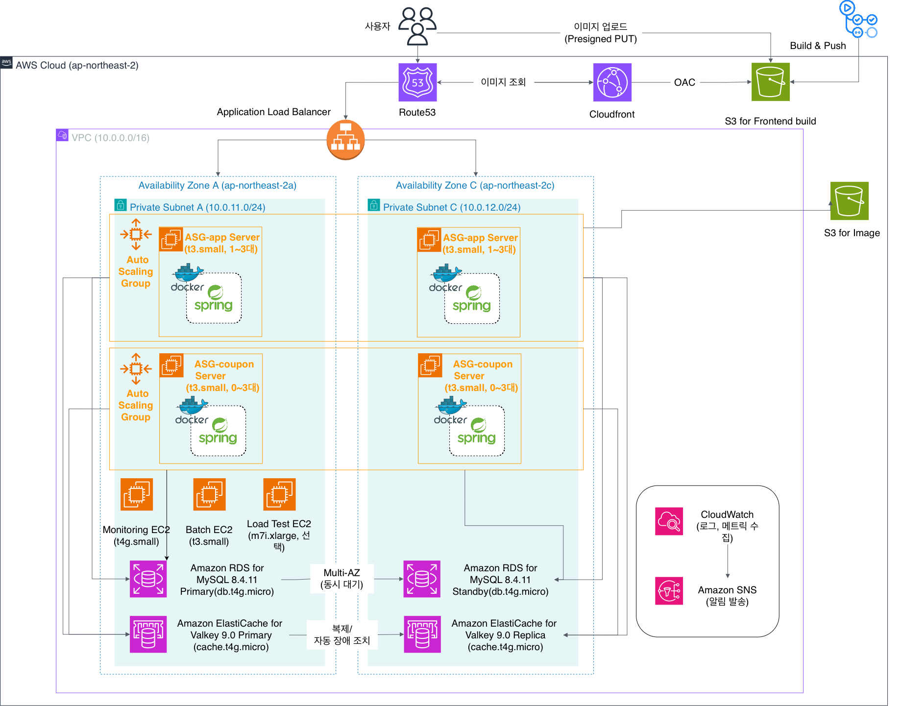
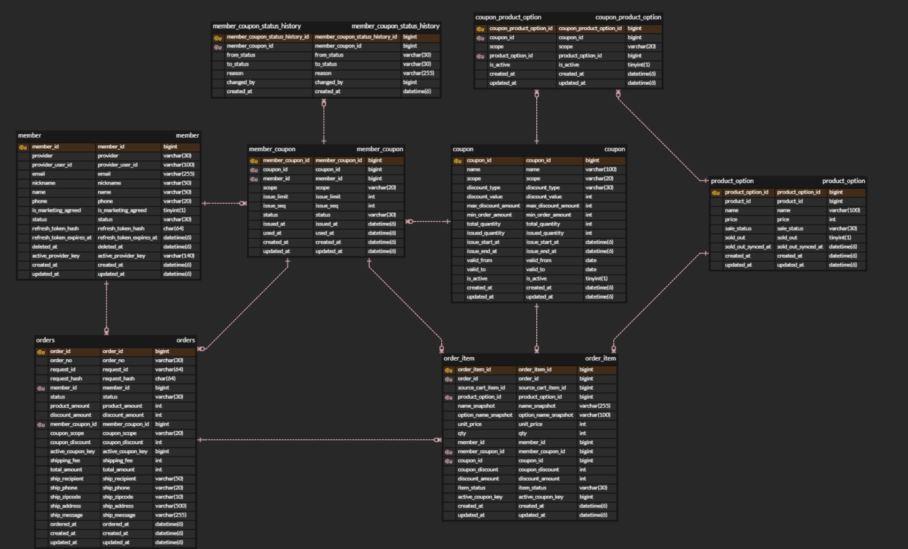
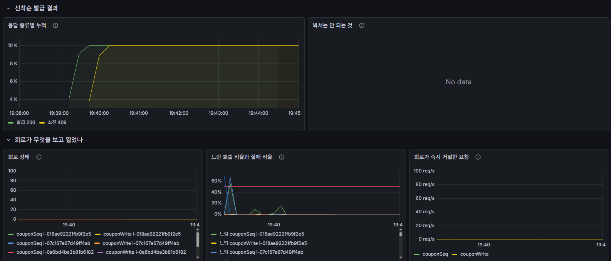
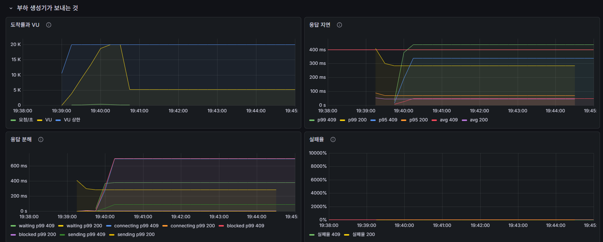
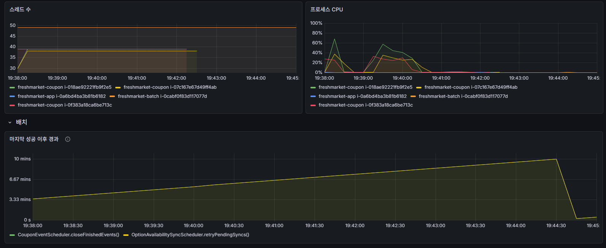
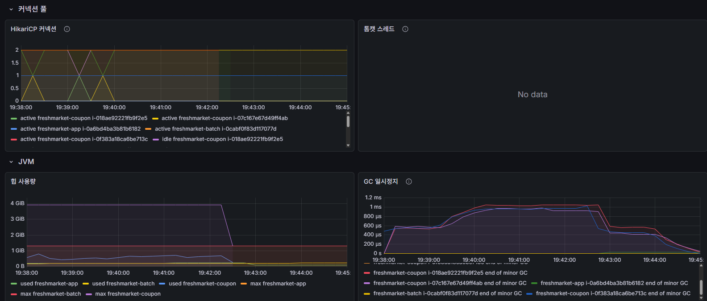

# fm-backend

신선식품 자사몰 백엔드. **대규모 트래픽 선착순 쿠폰 발급 시스템**이 이 프로젝트의 본론이다.

```
재고 10,000장 · 동시 요청 20,000명 · ramp-up 60초
  ->  초과 발급 0건 · 1인 1매 · 번호 유실 0 · p99 0.247초        2026-08-31, AWS 실측
```

Java 21 · Spring Boot 4.0.5 · MySQL 8.4 · Valkey 9.0 · AWS (Terraform)
기간 2026-07-31 ~ 2026-08-31 · 5명

```bash
git clone https://github.com/fresh-market/fm-backend.git backend
cd backend
./gradlew bootRun      # compose.yaml 의 MySQL 과 Valkey 를 자동으로 띄운다
```

**처음 작업한다면 [docs/project-guideline.md](./docs/project-guideline.md) 부터 본다.** 작업 흐름과 병합을 막는 조건이 거기에 있다.

| | |
|---|---|
| [1. 프로젝트 기획](#1-프로젝트-기획) | 왜 신선식품이고 왜 선착순 쿠폰인가 |
| [2. AWS 인프라](#2-aws-인프라) | 단일 환경, 그리고 선착순만 갈라 놓은 전용 경로 |
| [3. 아키텍처](#3-아키텍처) | 13개 도메인, 3계층, 패키지 경계 |
| [4. 프로젝트 전체 흐름](#4-프로젝트-전체-흐름) | 커머스 경로와 캠페인 경로 |
| [5. 선착순 쿠폰 설계와 근거](#5-선착순-쿠폰-설계와-근거) | 정합성과 동시성 파이프라인 |
| [6. 부하 시험: 결과, 해석, 개선](#6-부하-시험-결과-해석-개선) | 통과보다 오진을 찾은 것이 소득이다 |
| [7. 도메인별 핵심 로직과 트러블슈팅](#7-도메인별-핵심-로직과-트러블슈팅) | 각자 맡은 영역 |
| [문서 지도](#문서-지도) | 어디에 무엇이 있나 |

---

## 1. 프로젝트 기획

### 왜 신선식품인가

신선식품은 **안 팔리면 재고가 남는 것이 아니라 폐기가 된다.** 같은 상품이라도 입고 차수마다 소비기한이 다르고, 그 차이가 그대로 판매 가능 기간이 된다. 그래서 이 도메인에는 성격이 다른 두 문제가 동시에 있다.

```
평상시   로트 단위 재고를 소비기한 임박순(FEFO)으로 정확히 깎는다     꾸준한 쓰기 경합
이벤트   임박 재고를 떨기 위한 선착순 쿠폰을 연다                     한 순간에 몰리는 부하
```

**두 문제를 하나로 잇는 것이 선착순 쿠폰이다.** 유통기한이 임박한 로트를 임박순 -> 판매율 저조순으로 골라 30% 정률 할인 쿠폰의 대상으로 삼는다. 캠페인 대상 선정이 배치의 산출물이고, 그 목록이 이벤트의 입력이 된다.

### 주어진 요구사항

주제는 **대규모 트래픽 선착순 쿠폰 발급 시스템**이다([docs/coupon/requirement.md](./docs/coupon/requirement.md)).

| | |
|---|---|
| 발급 | 재고 10,000장에 20,000명이 동시에 요청해도 **초과 발급 0건, 1인 최대 1매** |
| 부하 | ramp-up 60초. 도구는 자유. 처리량 자체는 평가하지 않는다 |
| 정합성 | 발급/사용/취소/만료 **전체 상태**를 관리하고, 반복·동시 요청에도 한 번만 반영 |
| 검증 | 발급 이력 **300만 건 전체**를 대상으로, 재실행하면 같은 결과 |
| 더미 | 가상 회원 100만 명, 발급 이력 300만 건 |
| 그 밖 | 개인정보 마스킹, 외부 연동 Mocking |

**오픈 시각이 정해져 있다는 것이 핵심이다.** 재고 10,000장에 20,000명이 오면 **절반은 반드시 못 받는다.** 그 절반을 어떻게 돌려보내느냐가 설계의 대부분을 정했다(5장의 409/410 분기).

### 팀이 스스로 건 기준

요구사항이 지연을 재지 않으므로 SLO 를 하나 더 걸었다.

> 부하 시험 환경에서 요구 부하를 걸었을 때, **처리된 발급 응답의 p99 가 1초 이하다.**

이 한 줄에서 타임아웃 계층 전체를 역산했다(5장). 그리고 커머스 도메인도 함께 만들었다. 요구사항 명세 72개 기능을 32개 테이블, 13개 도메인으로 옮겼다.

---

## 2. AWS 인프라

Terraform 으로 코드화한 **단일 환경**이다(`ap-northeast-2`). 인프라 저장소는 [`fm-infra`](https://github.com/fresh-market/fm-infra) 가 따로 갖는다.



두 AZ(`ap-northeast-2a`, `2c`)에 걸쳐 있고, **ASG 가 둘**이다 — 평상시 앱과 선착순 전용. 그 밖에 모니터링(`t4g.small`), 배치(`t3.small`), 부하 시험용(시험 때만)이 단독 인스턴스로 있다. 저장소는 RDS MySQL 8.4 Multi-AZ 와 ElastiCache Valkey 9.0 (primary + replica, 자동 장애 조치)이고, 이미지는 S3 에 두고 CloudFront + OAC 로 내보낸다. 설정은 SSM Parameter Store 가, 알림은 CloudWatch -> SNS 가 맡는다.

### 앱은 고정 이중화가 아니라 오토스케일링이다

```
app ASG      min 1  /  desired 1  /  max 3      2 AZ 서브넷에 걸쳐 있다
정책         TargetTrackingScaling — ALBRequestCountPerTarget (대상당 요청 수)
헬스체크      ELB. grace 300초
```

**두 대를 고정으로 띄우지 않는다.** 한산할 때 1대로 내려가고, 그 구간에서는 **앱이 여전히 단일 장애점이다.** 확장이 걸려 있는 동안에만 해소된다. 비용을 예산 안에 두면서 피크를 받기 위한 선택이고, 그것이 가능한 것은 **앱이 상태를 갖지 않기 때문이다** — JWT stateless 라 어느 인스턴스가 죽어도 로그아웃되지 않고 인스턴스를 자유롭게 교체할 수 있다. 세션 공유도 스티키 세션도 필요 없다.

| | 왜 그 값인가 |
|---|---|
| `min_size` **1** | 0 이면 트래픽이 없을 때 정책이 스케일 인으로 **0 까지 내려 서비스가 사라진다.** 세션을 끝낼 때만 `stop.sh` 가 min 을 0 으로 내린다 |
| `max_size` **3** | 정한 상한이 3 이다(`INF-39`). 배포가 `desired + 1` 로 신규를 띄우므로 **3대까지 올라간 상태에서는 배포가 막힌다.** 앱 풀을 8 로 낮춘 뒤로는 4대도 커넥션 예산에 들어, 배포 막힘이 아플 만큼이면 올릴 수 있다 |
| CPU 가 아니라 **도착률** | 선착순은 CPU 가 오르기 전에 큐가 먼저 쌓인다. 도착률이 먼저 움직이는 신호다 |
| 임계값 | **아직 실측이 아니다.** 대상당 분당 6,000 은 시작값이고, 한 대가 견디는 도착률을 부하 시험에서 재 역산해야 한다 |

**스케일 인 안전장치는 미확보다.** 축소는 lifecycle hook 유예와 ALB deregistration delay 에 기대고 있고, 처리 중이던 요청이 끊기는지는 아직 확인하지 않았다.

### 선착순 경로만 갈라 놓았다

**이것이 이 인프라에서 쿠폰을 위해 만든 가장 큰 장치다.**

```
ALB 리스너 규칙 (priority 15)
  POST /v1/coupons/*/issues  ->  coupon 대상 그룹  ->  전용 ASG (prod,coupon 프로필)
  그 밖의 모든 경로           ->  app 대상 그룹     ->  평상시 ASG
```

### 왜 선착순만 ASG 를 따로 두었나

같은 애플리케이션 이미지를 프로필만 바꿔 띄우는데도 그룹을 나눈 이유가 넷이다.

**① 격벽.** 안 나누면 선착순 트래픽이 톰캣 스레드와 커넥션 풀을 다 먹어 **상품 조회와 주문이 함께 죽는다.** 이벤트가 90초 동안 CPU 90% 를 치는데, 그 부하를 평상시 경로와 같은 인스턴스에 태울 이유가 없다.

**② 오토스케일링이 이 트래픽에는 안 듣는다**(`INF-40`). 확장 판정에 최소 3분이 걸리는데 **선착순 쇄도는 그보다 짧게 끝난다.** 알람이 울리고 인스턴스가 부팅되는 사이에 재고가 이미 소진된다. 그래서 전용 ASG 에는 정책을 걸지 않고 `min 0 / desired 0`, 대수는 `coupon-event.sh open 3` 이 **이벤트 전에 미리** 정한다. 끝나면 0 으로 내린다.

**③ 설정이 정반대다.** 평상시 앱은 풀을 넉넉히 쓰고 헬스체크를 촘촘히 보지만, 전용 인스턴스는 **풀을 2로 조이고 헬스체크를 느슨하게** 해야 한다. 한 그룹에 두면 어느 한쪽 기준으로 맞출 수밖에 없다.

**④ 되돌리기와 비교가 쉬워진다.** `coupon_dedicated_enabled` 를 끄면 ALB 규칙만 사라지고 발급 요청은 평상시 앱으로 흐른다. 경로가 막히지 않으므로 언제든 되돌릴 수 있고, 버전(v1~v4) 비교도 다른 트래픽에 오염되지 않는다.


**그리고 이것이 가장 크다 — 이 그룹은 쿠폰 부하만 받는다.** 평상시 앱과 인스턴스가 겹치지 않으므로 **다른 기능의 성능에 영향이 없고**, 잰 수치가 오직 발급 경로의 것이 된다. 그래서 운영에 올리기 전에 개발 서버에서 **같은 모양의 예측 가능한 환경**으로 미리 대비할 수 있다. 대수와 프로필과 경로가 같으면 개발에서 본 것이 운영에서도 그대로 나온다 — 6장의 회차별 비교가 성립하는 것도 이 조건 덕분이다.

| 전용 경로에만 다른 것 | 값 | 왜 |
|---|---|---|
| 프로필 | `prod,coupon` | [`application-coupon.yml`](./src/main/resources/application-coupon.yml) 이 타임아웃·큐·플러시 값을 갖는다 |
| Hikari 풀 | **2** | 발급 요청은 트랜잭션을 안 연다. DB 를 쓰는 것은 플러시 스레드 1 + 캐시 적재 1 뿐이다 |
| 헬스체크 | 앱보다 느슨 | 이벤트 90초 동안 CPU 90% 를 친다. **바쁜 인스턴스를 죽은 것으로 오판하면 ASG 가 종료시킨다** |
| 용량 조절 | `coupon-event.sh open 3` | 2만 건이 몇 초에 몰리는데 알람 평가와 부팅에 수 분이 걸린다. **미리 올려 두는 것이 본 수단이다** |

**커넥션 예산이 확장의 상한이다.** `db.t4g.micro` 의 `max_connections` 는 60(실측)이고, `coupon-event.sh` 가 앱·배치·전용 풀 크기를 더해 검산한 뒤에만 ASG 를 올린다. 전용 풀을 2로 줄였기 때문에 3대까지 세울 수 있었다(실측 사용 37/60).

**이벤트 구간에는 캐시 등급이 올라간다.** 평상시 Valkey 는 조회 캐시라 `Degradable`(죽으면 원본 조회로 강등)이지만, 이벤트 중에는 **순번의 판정 주체**라 `Critical` 로 승격해 2노드 + 자동 페일오버로 둔다. 키를 잃으면 DB 와 앱 큐에서 재건한다(5장).

---

## 3. 아키텍처

### 도메인 13개, 3계층

DDL 32개 테이블을 13개 도메인으로 나눴다. **베이스 패키지의 직계 하위 패키지가 곧 도메인**이다.

```
L2   order  payment  claim  shipment  review  qna  statistics      여러 도메인을 조립한다
        |
L1   stock  coupon  cart                                           쓰기 경합이 있는 영역
        |
L0   member  product  admin                                        아무것도 참조하지 않는 기준 데이터
        |
     common  config                                                도메인 무지. 응답 봉투, 예외, 인증, 커서
```

**아래로만 부른다. 같은 층끼리는 직접 부르지 않는다**(`DPB-5-01`). 같은 층이 필요하면 상위 도메인이 조립한다. `ArchitectureTest` 가 빌드에서 강제하므로 어기면 `check` 가 실패한다.

| | 결과 |
|---|---|
| `cart` -> `coupon` (같은 층) | 막힌다 |
| `stock` -> `order` (위로) | 막힌다 |
| `order` -> `stock` (아래로) | 통과 |

### 패키지 구조

```
com.freshmarket
├── coupon/                     76 파일. 이 프로젝트의 본론
│   ├── CouponApi.java              공개 계약. 다른 도메인은 이것만 본다
│   └── internal/
│       ├── controller/             발급, 쿠폰함, 발급 현황, 관리자
│       ├── service/                CouponIssueService, CouponEventService, CouponConsistencyService ...
│       ├── redis/                  CouponSeqAllocator / Committer / Initializer / Rebuilder / Contributor
│       ├── issue/                  CouponIssueQueue, CouponIssueFlusher, CouponWriteCircuit
│       ├── batch/                  만료, 이벤트 종료, 정합성 검증 스케줄러
│       ├── warmup/                 CouponWarmupRunner (6장)
│       ├── cache/  audit/  entity/  repository/  dto/  exception/  config/
├── product/  member/  stock/  order/  payment/  cart/  admin/
├── common/                     응답 봉투, 예외 계층, 인증 필터, 커서 페이지네이션
└── config/
```

문서상 13개 도메인 중 **코드로 구현된 것은 8개**다(`claim`, `shipment`, `review`, `qna`, `statistics` 는 스키마와 API 명세까지 확정하고 구현은 남겨 두었다).

### 도메인 경계 규칙

| 규칙 | 내용 |
|---|---|
| 공개 계약 | `XxxApi` 인터페이스로만 노출한다. **엔티티를 도메인 밖으로 내보내지 않는다** |
| 계약 생성 시점 | `XxxApi` 는 다른 도메인이 실제로 호출할 때 만든다(`DPB-1-03`). 미리 만들지 않는다 |
| 관리자 기능 | 각 도메인의 `Admin~` 클래스가 맡는다. `admin` 도메인은 계정과 감사 로그만 갖는다 |
| 참조와 의존 | `stock_allocation -> order_item` 은 **참조지 의존이 아니다.** 재고는 주문을 부르지 않고 자기 원장에 원인을 적을 뿐이라, 코드에서는 연관 대신 `Long orderItemId` 로 든다 |
| API 경로 | `/v1/...` 회원, `/v1/admin/...` 관리자. **소비자가 다르면 경로를 나눈다.** 표준 메서드로 안 되면 콜론 표기(`POST /v1/orders/{id}:cancel`) |
| 응답 | 성공과 실패가 **같은 봉투**. 분기 전에 파싱을 끝낼 수 있다 |
| 인증 | JWT stateless. `type` 클레임이 회원 토큰의 관리자 API 접근을 막고 권한은 `role` 로 판정한다. **기본값은 거부** |

### 병합을 막는 게이트

```
빌드 · 테스트 · JaCoCo(*.internal.service.* 메서드 커버리지 100%) · SonarQube Blocker 0
+ anchors.yml 이 "바뀐 파일 -> 켤 검증 항목 + 함께 볼 파일" 을 정하는 LLM 검증
```

컨트롤러 한 줄이 바뀌었을 때 위반인지 알려면 `SecurityConfig` 와 서비스를 같이 봐야 한다. 그 동봉 규칙을 `anchors.yml` 이 갖는다. 규칙은 `*-guideline.md`, 왜 그런지는 `*-rationale.md` 로 **짝을 지어** 둔다.

---

## 4. 프로젝트 전체 흐름

두 경로가 `stock_lot` 에서 만난다. **커머스는 로트를 소진하고, 캠페인은 남은 로트를 대상으로 삼는다.**

```
커머스 경로
  상품 등록 -> 로트 입고 -> 장바구니 -> 주문 생성(재고 예약) -> 결제 완료(예약 확정) -> 배송/클레임

캠페인 경로
  일별 판매 집계 -> 소비기한 만료 처리 -> 캠페인 대상 로트 선정 -> 쿠폰 이벤트 열기
                                                    -> 선착순 발급(동시 2만) -> 종료/카운터 정산
```

### 주문 한 건

```
회원 -> order   POST /v1/orders
order -> cart      getCheckoutInfo      소유권/수량 확인 후 스냅샷
order -> product   findOptionInfos      상품명/가격/판매 가능 여부
order -> stock     reserve              주문 항목 저장 후 재고 예약
order -> payment   결제 요청 이벤트 발행
payment -> order   PaymentApprovedEvent
order -> stock     confirm              예약 확정 (availableQty 재차감 없음)
order -> cart      removeCheckedOutItems 구매분만 멱등 삭제
```

결제 실패·취소·만료면 `release` 로 RESERVED 재고만 해제한다. **주문 시점 값을 전부 복사한다.** 나중에 상품 가격이 바뀌어도 이미 만든 주문이 따라 바뀌지 않는다.

### 재고 차감 — 조건부 UPDATE 한 문장

```sql
-- FEFO: 소비기한이 임박한 로트부터 고른다
UPDATE stock_lot SET available_qty = available_qty - ?
 WHERE stock_lot_id = ? AND available_qty >= ?;
```

| 방식 | 무엇이 문제인가 |
|---|---|
| 예약 행만 쌓고 `initial_qty - SUM(qty)` | 삽입이라 경합이 없어 보이지만 **넣기 전에 합계를 확인해야 해서 읽고 쓰는 사이가 생긴다** |
| 그 구간을 `FOR UPDATE` 로 막는다 | 잠금을 **트랜잭션 내내** 들게 되어 더 길어진다 |
| `CHECK` 로 막는다 | **못 막는다.** 자기 행만 볼 수 있어서다 |
| **조건부 UPDATE (채택)** | 한 문장이라 그 사이가 없고 잠금이 문장 동안만 잡힌다. FEFO 목록도 컬럼 하나만 읽으면 된다 |

초과 판매를 나중에 취소해도 되는 도메인이면 삽입 전용이 낫다. **신선식품 재고는 그게 안 된다.**

### 이미지 업로드 — S3 와 MySQL 은 한 트랜잭션이 아니다

```
관리자 -> 서버   presigned URL 요청
서버   -> DB     이미지 행을 status = PENDING 으로 미리 만든다
관리자 -> S3     URL 로 직접 PUT (서버를 거치지 않는다)
관리자 -> 서버   업로드 완료 신고 (uploadId 만)
서버   -> S3     HeadObject 로 실제 존재를 직접 확인
서버   -> DB     PENDING -> CONFIRMED
```

**신고를 그대로 믿지 않는다.** `CONFIRMED` 로 가는 경로가 서버의 직접 확인 하나뿐이라 깨진 링크가 원천 차단되고, 서비스에는 `CONFIRMED` 만 노출한다. 삭제는 반대 순서로 S3 를 먼저 지운다.

### 배치가 캠페인 대상을 만든다

| 배치 | 주기 | 하는 일 | 다음 단계에 넘기는 것 |
|---|---|---|---|
| 소비기한 만료 | 일 1회 | 경과 로트를 판매 불가로 전환 -> 폐기 등록 | 가용 재고 0 이면 품절 |
| 일별 판매 집계 | 일 1회 | 결제 완료 주문 기준 `daily_sales` 적재 | **판매율 저조 판정의 원천** |
| 캠페인 대상 선정 | 이벤트 전 | 임박순 -> 저조순으로 로트를 뽑는다 | 쿠폰 이벤트의 대상 목록 |
| 쿠폰 만료 / 이벤트 종료 | 주기 / 마감 후 | 조건부 UPDATE 로 상태 전이, Redis 네 키 정리 | 카운터 정산 |
| 정합성 검증 | 수동 | 발급 이력 **300만 건 전체**를 훑는다 | 리포트만. **고치지 않는다** |

**회수 배치와 검증 배치를 섞지 않는다.** 회수는 고치는 것이고 검증은 재는 것이다. 검증이 고치면 재실행 결과가 달라져 요구사항을 위반한다.

---

## 5. 선착순 쿠폰 설계와 근거

전체 설계는 [docs/coupon/coupon.md](./docs/coupon/coupon.md) 에 있다. 여기서는 결론과 그 근거만 옮긴다.

### 5.1 버전이 바뀌어도 변하지 않는 다섯

| | 지켜야 할 것 | 어긋나면 |
|---|---|---|
| R1 | 발급 수가 `total_quantity` 를 넘지 않는다 | 준비한 것보다 많이 나간다. **사업 손실** |
| R2 | 한 회원이 같은 쿠폰을 두 장 받지 않는다 | 형평성이 깨진다 |
| R3 | 순번(`issue_seq`)이 겹치지 않는다 | 같은 번호로 두 행이 생겨 상한 강제가 무너진다 |
| R4 | 재시도가 두 장을 만들지 않는다 | 네트워크 오류 한 번에 R1, R2 가 깨진다 |
| R5 | 같은 상태 변경이 반복·중첩돼도 한 번만 반영된다 | 사용과 만료가 중복 처리되어 이력과 재고가 어긋난다 |

**R1 이 가장 비싸다.** 나머지는 사후에 정정할 수 있지만 이미 나간 쿠폰은 회수하기 어렵다. 그래서 R1~R4 를 앱이 아니라 **스키마에 맡겼다.**

### 5.2 DB 가 앱과 무관하게 막는다



`coupon` 이 정책을 갖고 `member_coupon` 이 발급 한 건이다. 상태 변화는 `member_coupon_status_history` 가 전이(`from_status -> to_status`)로 남기고, 대상 상품은 `coupon_product_option` 이 잇는다.

**발급된 쿠폰은 그 자리에서 주문에 쓸 수 있다.** `member_coupon` 에 행이 들어가는 순간 주문 쪽이 참조할 대상이 생기기 때문이다. 발급과 사용 사이에 다른 적재나 동기화 단계가 없다.

```
발급   member_coupon 에 INSERT (status = ISSUED)
사용   orders.member_coupon_id       장바구니 쿠폰 — 주문 전체에 하나
       order_item.member_coupon_id   상품 쿠폰 — 라인마다 하나
```

`scope` 가 그 둘을 가른다. 장바구니 쿠폰은 주문 하나에 한 장, 상품 쿠폰은 상품 하나에 한 장이다. **같은 쿠폰이 두 번 쓰이는 것은 DB 가 막는다.**

```sql
active_coupon_key BIGINT GENERATED ALWAYS AS (
  CASE WHEN status NOT IN ('CANCELED','RETURNED') THEN member_coupon_id ELSE NULL END)
UNIQUE KEY uk_order_active_coupon (active_coupon_key)
```

**살아 있는 주문 한정으로 쿠폰당 1건**이다. 취소나 반품이면 계산 컬럼이 `NULL` 이 되어 그 쿠폰을 다시 쓸 수 있고, 교환은 상품이 유지되므로 쿠폰도 유지된다. `order_item` 에도 같은 컬럼과 제약이 있다. R1~R4 를 순번과 UNIQUE 로 지킨 것과 **같은 방식**이다 — 앱이 세지 않고 DB 가 행 하나로 판정한다.

```sql
UNIQUE KEY uk_mc_coupon_member (coupon_id, member_id)   -- R2 1인 1매, R4 재시도
UNIQUE KEY uk_mc_coupon_seq    (coupon_id, issue_seq)   -- R3 순번 중복 불가
CHECK (issue_seq >= 1 AND issue_seq <= issue_limit)     -- R1 상한
```

원래 걸고 싶은 제약은 `행 수 <= total_quantity` 인데 **MySQL 은 CHECK 에 집계와 서브쿼리를 금지한다.** 그래서 상한을 세는 방법이 둘로 갈린다.

```
coupon 에 카운터를 두고 UPDATE     한 행에 락이 몰려 직렬화된다. 천장이 약 330 TPS
각 행에 1..issue_limit 을 배정      공유하는 행이 없다. INSERT 끼리 경합하지 않는다
```

**순번은 집계 제약을 개별 행 제약으로 바꾸는 변환이다.** `issue_limit` 은 행을 만들 때 `coupon.total_quantity` 를 복사한 값이라, 삽입 한 건이 다른 행을 안 보고 자기 행만으로 상한을 판정한다.

그 결과 **순번 발급기가 어디에 있든 초과 발급은 나지 않는다.**

| 카운터가 어긋난 방향 | 무슨 일이 나나 | 무엇이 막나 |
|---|---|---|
| 실제보다 작다 | 이미 쓴 번호를 다시 발급한다 | `uk_mc_coupon_seq` |
| 실제보다 크다 | 번호가 한도를 넘는다 | `chk_mc_issue_seq` |

**그래서 버전 사이의 차이는 "안전한가" 가 아니라 "얼마나 빠르고 얼마나 자주 실패하는가" 다.** 안전을 스키마가 책임지기 때문에 위쪽 구현을 v1~v7 까지 자유롭게 바꿔 볼 수 있었다.

R5 만 앱이 지킨다. **읽고 판단한 뒤 쓰지 않고**, 지금 상태를 `WHERE` 에 넣어 한 문장으로 만든다.

```sql
UPDATE member_coupon SET status = 'USED', used_at = NOW(6)
 WHERE member_coupon_id = ? AND member_id = ? AND status = 'ISSUED';
-- 1행이면 이번 요청이 바꾼 것이다. 0행은 원인을 갈라 응답한다
```

### 5.3 발급 한 건의 파이프라인

```
1. 자격 확인   기간, is_active, 대상 등급         (쿠폰 스냅샷 캐시로 DB 왕복 0)
2. 순번 확보   Lua 스크립트 한 번                  <- 동시성도 병목도 전부 여기다
3. 발급 기록   인스턴스 큐 -> 배치 INSERT -> COMMIT (여기서 1인 1매가 최종 판정된다)
4. 응답        커밋과 Redis 확정 표시가 끝난 뒤
```

**요청과 응답은 끝까지 동기다.** 뒤 버전들이 요청을 묶어 쓰지만 그것은 **묶어서 쓰되 커밋까지 기다리는 것**이지 나중에 쓰는 것이 아니다. 그래서 발급되었다고 답한 요청은 반드시 행이 있다.

**이벤트가 시작되면 조건이 얼어붙는다.** 시작된 이벤트의 일정은 못 바꾸고, 소진 전·마감 전에는 스위치를 못 끈다. 다섯 값이 전부 고정되므로 자격 확인을 캐시할 수 있고, 요청마다 하던 쿠폰 조회가 사라진다.

### 5.4 순번 확보 — Redis 네 키와 Lua 하나

나눠 부르면 그 사이에 남이 끼어들기 때문에 [스크립트 하나](./src/main/resources/redis/scripts/coupon-issue-seq.lua)로 끝낸다.

| 키 | 타입 | 무엇을 담나 | 역할 |
|---|---|---|---|
| `coupon:{id}:counter` | String | **마지막으로 나간 번호.** 이벤트를 열 때 `0` 으로 선다 | 번호를 만든다(`INCR` 결과가 곧 발급 번호). 키가 없으면 스크립트가 `-2` 를 돌려주므로 **이 키의 존재 자체가 이벤트의 문**이다. 네 키의 수명도 이것이 들고 있다 |
| `coupon:{id}:seq` | Hash | 회원 -> 순번. `"6"` 이면 미확정, `"6:1"` 이면 커밋까지 끝났다 | **누가 몇 번을 받았는가.** 스크립트 첫머리의 `HGET` 이 곧 "이미 받았는가" 의 답이라 별도 조회가 없다(R4). 확정 표시 `":1"` 이 붙은 재요청은 DB 를 안 치고 Redis 에서 끝난다 |
| `coupon:{id}:free` | Sorted Set | 실패해 **반납된** 번호 (점수 = 번호) | 구멍을 메운다. `ZPOPMIN` 이 `INCR` 보다 먼저 돌아 낮은 번호부터 다시 나간다. 정렬집합이라 같은 번호가 두 번 들어가지 않는다 |
| `coupon:{id}:pending` | Sorted Set | 아직 커밋 안 된 회원 (**점수 = 번호를 준 시각**) | 아래 참조 |

**넷은 함께 살고 함께 죽는다.** 수명은 `counter` 가 들고 있고(`issue_end_at + 60초`) 나머지 셋은 만들어지는 자리에서 그 만료 시각을 물려받는다. 이벤트를 여는 시점에는 `counter` 밖에 없어서 한꺼번에 걸 수 없기 때문이다.

```lua
if redis.call('EXISTS', KEYS[3]) == 0 then return '-2' end   -- 재건 중의 문
local mine = redis.call('HGET', KEYS[1], ARGV[1])
if mine then return mine end                                  -- 재시도는 여기서 끝난다 (R4)
```

**반납이 `DECR` 이 아닌 이유.** A 가 6번, B 가 7번을 받고 A 가 실패하면 `DECR` 은 **맨 위 번호(7)** 를 회수하므로 다음 사람이 B 의 번호를 받는다. 그래서 번호를 **지목해** `free` 에 넣는다.

#### `pending` 이 네 가지를 한다

`seq` 만으로는 안 된다. `seq` 는 회원->순번이라 **언제** 받았는지를 못 담고, 확정된 값(`"6:1"`)도 재요청 응답에 필요해 지울 수 없다. 그래서 "아직 응답을 못 받은 사람"만 따로 세는 자리를 둔다.

| | |
|---|---|
| **미확정 티켓 대장** | `give()` 가 번호를 주면서 `ZADD`, 플러시가 커밋을 끝내면 `markCommitted()` 가 `":1"` 을 붙이면서 `ZREM`. **DB 행이 되기 전까지의 구간을 이 집합이 표시한다** |
| **회수 대상 목록** | 점수가 발급 시각이라 `ZRANGEBYSCORE` 로 `reclaim-after`(60초)를 넘긴 것을 바로 집는다. 회수된 번호는 `free` 를 거치지 않고 요청자에게 직행한다 |
| **소진의 최종성 판정** | `ZCARD` 가 0 이면 다시 나올 번호가 없다 -> **410**. 남아 있으면 기준 시간이 지날 때 그 번호가 나온다 -> **409**. 소진 뒤 `free` 로 번호가 돌아오는 길 둘이 **모두 진행 중인 티켓을 전제**하므로, 이 한 번의 `ZCARD` 가 완전한 답이 된다 |
| **재건의 입력** | Redis 가 키를 잃으면 `pending` 의 정의는 **"각 인스턴스 큐에 남아 있는 티켓"** 이다. DB 행은 확정분이라 `"N:1"` 로 가고, 큐 티켓이 미확정분이라 `pending` 으로 간다 |

**앱이 급사하면 반납 주체가 사라진다.** 그때 `pending` 이 그 구멍을 덮는다 — 소진 시점에 스크립트가 기준 시간을 넘긴 번호를 집어 지금 요청자에게 준다. **주기 배치가 필요 없고, 재고가 남은 동안에는 그 줄에 닿지도 않아 평상시 비용이 0 이다.**

시각은 앱이 아니라 `redis.call('TIME')` 이 매긴다. 점수를 쓰는 인스턴스와 재는 인스턴스가 달라서, 앱 시계를 쓰면 시계가 어긋난 한 대가 살아 있는 요청의 번호까지 뺏는다.

확정 표시가 붙은 번호는 회수하지 않는다(`string.find(seq, ':')`). 그리고 재건이 큐를 훑는 동안 플러시는 `paused` 로 멈춘다 — 안 그러면 재건이 확정된 매핑을 미확정으로 덮고, 회수가 그 번호를 남에게 넘겨 **같은 번호가 두 번 나간다.**

### 5.5 응답 다섯 가지

| 응답 | 상태 | 왜 이렇게 나누나 |
|---|---|---|
| 발급 | 200 | `{ "issueSeq": 6, "alreadyIssued": false }` |
| **이미 발급** | **200** | 서버는 "다시 눌렀다" 와 "클라이언트 자동 재시도" 를 구분 못 한다. 실패로 답하면 못 받은 줄 알고 계속 누르고 그것이 다시 부하가 된다 |
| 소진, 회수 여지 | 409 | `pending` 에 미확정 번호가 남아 있다. 기준 시간이 지나면 그 번호가 다시 나온다 |
| **소진, 최종** | **410** | `pending` 이 비었다. 다시 나올 번호가 없다 |
| 혼잡 | 503 + `Retry-After` | 순번을 못 받았거나 예산 안에 못 끝냈다. **재고는 남아 있다** |

**409 와 410 을 가른 이유가 재시도 폭풍이다.** 소진 응답을 받는 사람이 약 1만 명인데 그들이 전부 재시도하면 가장 힘든 순간에 부하가 두 배가 된다. 410 은 "그만 두드려라" 를 프로토콜로 말한다. 비용은 소진 경로의 `ZCARD` 하나이고, 오판해도 409 쪽으로 기울어 받을 수 있었던 사람을 돌려보내지 않는다.

**소진과 혼잡을 뭉치면** 재고가 남았는데 마감으로 답하거나, 끝난 이벤트에 재시도를 유도한다.

### 5.6 구현 사다리 — v4 를 채택했다

| | 무엇을 바꾸나 | 무엇을 얻나 | 대가 |
|---|---|---|---|
| v1 | DB 조건부 UPDATE | 기준선. 추가 인프라 0 | 한 행에 락이 몰린다 |
| v2 | 카운터를 Redis 로 | **거절이 DB 를 안 거친다** | 캐시가 판정 주체가 된다 |
| v3 | 인스턴스별 큐 + Bulk INSERT | DB 왕복 감소 | 배치 윈도우만큼 응답이 늦다 |
| **v4** | **가상 스레드** | **대기 중 캐리어 스레드 반납 — 채택안** | pinning 확인 필요 |
| v5 | 배치를 별도 서버로 | DB 커넥션이 인스턴스 수와 무관해진다 | 분산 요청-응답. p99 는 나빠진다 |
| v6 / v7 | 미리 넣은 행을 update 로 잡는다 | 구멍이 행으로 실재한다 | **DDL 을 늘린다. 접었다** |

**v2 가 이득의 대부분을 가져간다.** 재고 1만에 2만이 오면 1만이 소진 거절인데, v1 은 판정이 락 뒤에 있어 **거절되는 절반도 커넥션을 잡고 기다린다.** v2 는 `INCR` 결과가 한도를 넘으면 DB 를 아예 안 건드린다.

**한 단계에 변수 하나.** v4 는 v3 위에서 설정 한 줄만 바꾼다. 접은 v6/v7 도 [근거와 함께 남겼다](./docs/coupon/coupon-v6.md).

### 5.7 기록 경로 — 큐와 플러시

```
요청 스레드(가상)  순번을 받아 큐에 티켓(seq, memberId, future)을 넣고 잠든다
플러시 스레드(플랫폼)  batch-window 20ms 또는 batch-size 500 에서 끊어 Bulk INSERT + COMMIT
                       -> markCommitted 로 Redis 에 "6:1" 표시 + pending 제거
                       -> future 완료.  그제서야 요청 스레드가 깨어나 응답한다
```

플러시만 플랫폼 스레드다. 하는 일이 JDBC 블로킹이고 **그 개수를 정확히 N 으로 잡아 두고 재는 것이 목적**인데, 가상 스레드로 두면 실제로 몇 개가 DB 를 두드리는지 알 수 없어 그 N 이 의미를 잃는다.

기록이 실패하면 원인을 갈라 되돌린다.

| 실패 | 조치 |
|---|---|
| `uk_mc_coupon_member` (이미 있는 회원) | 이번 번호를 `free` 에 **반납**하고 매핑을 원래 순번으로 고친다. 지우기만 하면 그 회원이 계속 새 번호를 태운다 |
| `uk_mc_coupon_seq` (남이 쓰는 번호) | **반납하지 않는다.** 매핑만 지워 다음 요청이 새 번호를 받게 한다 |

### 5.8 타임아웃 계층은 SLO 에서 역산했다

```
Redis timeout        100ms   예산 밖이다. 요청 하나가 Redis 를 두 번 친다 (인증 커트라인, 순번)
commit-wait          800ms   큐에 넣은 뒤 커밋+확정까지의 상한
  ├ connection-timeout 300ms   HikariCP 가 하한 250ms 를 강제한다
  └ socketTimeout      300ms   합 600ms < 800ms 라 계층이 유지된다
                     100 x 2 + 800 = 1,000ms  ->  SLO 경계에 정확히 닿는다
```

**계층이 역전되면 안 된다.** 안쪽(DB)이 바깥쪽(요청 예산)보다 길면 요청 스레드가 먼저 포기해 혼잡으로 답한 뒤에 그 배치가 커밋된다. **실패했다고 답했는데 발급된 상태**가 되고, 사용자가 안 돌아오면 그 슬롯은 죽은 재고다.

이 계층은 한 번 무너진 적이 있다. HikariCP 의 하한 250ms 를 모르고 100 으로 적어 **적힌 값 350ms 와 도는 값 500ms 가 갈렸다.** 전용 서버가 기동조차 못 해서 알았다.

### 5.9 죽었을 때

| 대상 | 등급 | 어떻게 흐르나 |
|---|---|---|
| ALB / 앱 / MySQL | Critical | 앱은 stateless 라 교체로 복구한다 |
| Valkey (조회 캐시) | Degradable | 원본 조회로 떨어진다. 적재 실패는 무시한다 |
| **Valkey (이벤트 중 순번)** | **Critical 로 승격** | 2노드 + 자동 페일오버. 키를 잃으면 재건한다 |
| 배치 / 모니터링 | Deferrable | 지연을 허용한다 |

**Redis 가 죽으면 대체 순번 발급기를 두지 않는다.** 순번을 못 받은 요청은 혼잡으로 끊고, **이미 순번을 받아 큐에 있는 요청은 그대로 발급된다**(큐 항목이 `(seq, memberId, future)` 뿐이고 플러시는 DB 에만 쓴다). 그래서 서킷 브레이커를 Redis 호출에만 건다. 대체 경로를 두지 않는 가장 큰 이유는 **그 코드가 평소에 안 돌아 정작 필요한 날 처음 실행된다**는 것이다.

**키를 잃으면 DB 와 앱 큐에서 다시 세운다**([redis-promotion-rebuild.md](./docs/coupon/redis-promotion-rebuild.md)). 요청을 막는 장치를 새로 만들지 않는다 — 스크립트가 `counter` 가 없으면 `-2` 를 주므로, 재건은 **카운터를 가장 마지막에 쓰고 그 쓰기가 곧 문을 여는 동작**이다. 카운터는 세지 않고 `max(DB의 MAX(issue_seq), 큐들의 최대)` 를 본다. 개수로 더하면 `free` 재사용분이 넘치게 세어 **반드시 실패할 번호**를 만든다.

### 5.10 정합성 검증

성능 측정과 별개로, 요구사항이 **스스로 검증할 수단**을 요구한다.

```
POST /v1/admin/coupons/{couponId}:verifyConsistency
```

| 검증 | 어긋남의 모양 |
|---|---|
| 발급 수와 `issued_quantity` | 카운터가 실제 행 수와 다르다 |
| 발급 수와 `total_quantity` | 초과, 또는 과소 |
| 순번의 연속성 | 구멍 수가 곧 어긋남이다 |
| 1인 1매 | UNIQUE 가 막지만 결과로도 확인한다 |
| 상태와 이력 (R5) | `status` 와 이력의 마지막 전이가 같은가 |

**상태를 들고 있으면 안 된다.** 매번 300만 건을 처음부터 훑고 중간 결과를 저장하지 않는다. 그래야 같은 데이터로 재실행했을 때 같은 결과가 나온다.

---

## 6. 부하 시험: 결과, 해석, 개선

전체 회차 기록은 [`fm-infra`](https://github.com/fresh-market/fm-infra) 의 `docs/verification/선착순쿠폰_부하시험_기록.md` 에 있다. 시나리오는 [`loadtest/issue.js`](./loadtest/issue.js) 다.

### 6.1 결과

| | |
|---|---|
| 일시 | 2026-08-31 15:28:56 ~ 15:30:34 KST |
| 커밋 | `82daeb9` · 전용 `t3.small` 3대 · **운영 타임아웃 값** |
| 부하 | `ramping-vus` 0 -> 20,000 VU / 60초, VU 하나가 사람 하나, m7i-flex.large 에서 k6 1.7.1 |

| 항목 | 기준 | 실측 | |
|---|---|---:|---|
| 초과 발급 | 0건 | **0건** (10,000 / 재고 10,000) | 통과 |
| 1인 최대 | 1매 | **1매** | 통과 |
| 번호 유실(`gap`) | 0 | **0** | 통과 |
| ramp-up | 60초 | **60초** | 통과 |
| **p99 (전체)** | 1초 이하 | **0.247초** | 통과 |
| 실패율 | | **0.00%** | |
| 혼잡 503 / 재시도 | | **0 / 0** | |
| 504 / 502 / 연결 오류 | | **0 / 0 / 0** | |

```sql
SELECT COUNT(*), MAX(issue_seq), MAX(issue_seq) - COUNT(*) AS gap, COUNT(DISTINCT member_id)
  FROM member_coupon WHERE coupon_id = 900001;
-- 10000 / 10000 / 0 / 10000
```

**k6 가 받은 200 응답 10,000건과 DB 행 10,000건이 일치한다.** "실패했다고 답했는데 실제로는 발급된" 죽은 재고가 0건이라는 뜻이다.

꼬리는 409 가 만든다. 평균은 200 의 절반(0.021초)인데 최대는 1.117초로 두 배다. **재고가 바닥나는 그 순간에 요청이 몰리기 때문이다.**

#### 대시보드에서 직접 본 것

2026-08-31 19:38~19:45 KST 회차다(캡처 파일 타임스탬프 기준). 6.1 이 기록한 15:28 회차와는 다른 회차이고, 발급 10,000 / 소진 10,000 으로 요구 부하와 같은 시나리오다.



**발급 200 과 소진 409 가 각각 정확히 10,000 에서 평평해진다.** 200 이 먼저 닿고 409 가 뒤따른다. "봐서는 안 되는 것" 패널이 `No data` 라 초과 발급과 서버 오류 계열이 한 건도 없다.

아래쪽이 더 중요하다. 회로 상태는 값이 없고 즉시 거절도 0 req/s 인데, **느린 호출 비율은 램프 구간에 60% 까지 두 번 튀었다.** 임계선이 50% 다.

> **오진이 지금도 재현된다는 증거다.** 이 회로를 metrics-only 로 안 바꿨으면 그 두 번의 스파이크에서 회로가 열렸고, 6.2 의 붕괴가 그대로 일어났다. 판정은 그대로 두고 거절만 안 하기 때문에 **무엇이 느렸는지는 여전히 보이면서** 재고가 남은 요청을 거절하지 않는다.



**꼬리가 서버 밖에 있다.** 응답 분해가 그것을 보여 준다.

```
blocked p99 (409)   약 640ms      생성기가 연결을 얻기까지 기다린 시간
waiting p99 (409)   약 380ms      서버가 답을 만든 시간
waiting p99 (200)   약 270ms
connecting, sending 거의 0
```

서버가 답하는 시간보다 생성기가 연결을 기다린 시간이 길다. 소진이 나는 순간에 2만 VU 가 한꺼번에 연결을 잡으려 하기 때문이고, 6.1 에서 409 의 최대가 200 보다 두 배였던 것과 같은 현상이다. `connecting` 과 `sending` 이 0 에 가까우므로 네트워크나 전송이 아니라 **생성기 쪽 연결 확보**가 그 구간의 정체다. 실패율은 내내 0% 다.



**요청 2만 건이 도는 동안 플랫폼 스레드가 39개에서 평평하다.** 요청이 늘어도 스레드가 안 는다 — v4 의 가상 스레드가 하는 일이 이것이다. 프로세스 CPU 는 램프 구간에 최대 70% 를 치고 그 뒤 0% 로 떨어진다. `t3.small` 2 vCPU 에 여유가 남았다는 뜻이라, 차가운 회차가 100% 로 포화됐던 것과 대비된다(6.3).

배치의 "마지막 성공 이후 경과" 는 `OptionAvailabilitySyncScheduler.retryPendingSyncs()` 가 10분까지 올라갔다 0 으로 떨어지는 톱니를 그린다. **톱니가 곧 살아 있다는 신호다** — 계속 올라가기만 하면 그 배치가 멈춘 것이다.



| 패널 | 본 것 | 무엇을 뒷받침하나 |
|---|---|---|
| HikariCP 커넥션 | active 가 **2 에서 고정** | `maximum-pool-size: 2`. **요청이 2만이어도 커넥션 수요가 안 느는 것이 이 설계의 요점이다**(5.7) |
| 톰캣 스레드 | **No data** | 가상 스레드를 켜서 톰캣 스레드 풀 자체가 안 쓰인다 |
| 힙 사용량 | 1 GiB 미만 | |
| GC 일시정지 | **최대 1ms** | 회로 지표를 켜다 GC 정지를 330ms 로 만들었던 문제가 재발하지 않았다(6.5) |

### 6.2 해석 ① — 회로가 재고를 지키지 않고 이벤트를 망가뜨렸다

**이 시험의 가장 큰 소득이다.** 같은 코드, 같은 차가운 JVM, 순번 확보 회로만 껐다.

| | 회로 켜짐 | **회로 꺼짐** |
|---|---:|---:|
| 혼잡 503 | 27,382 | **3** |
| 재시도 | 25,202 | **3** |
| 발급 (DB) | 8,870 | **10,000** |
| 번호 유실 | 16 | **0** |
| 살아남은 대수 | 3 -> 2 | **3 유지** |
| 504 / 연결 오류 | 4,663 / 4,663 | **0 / 0** |

무엇이 잘못이었나. 회로의 느림 판정 기준 **50ms** 는 Redis 가 느린지 보라고 정한 값인데, 회로가 실제로 잰 것은 `executeCallable` 이 도는 시간 전체였다. 거기에는 가상 스레드가 CPU 를 얻기까지 기다린 시간이 들어간다.

```
차가운 JVM -> 요청당 CPU 5배 -> 2 vCPU 포화 -> 스케줄 대기가 측정에 섞임
  -> Redis 왕복 0.8ms 가 105~323ms 로 측정 -> 느린 호출 100% -> 회로 열림
    -> 재고가 남았는데 503 -> 재시도로 요청 2.26배 -> CPU 100%
      -> 헬스체크 5초 초과 -> ALB 퇴출 -> ASG 종료
```

**회로가 자기 앱의 느림을 Redis 장애로 오진했고, 그 오진이 진짜 장애를 만들었다.** 그동안 ElastiCache `EngineCPUUtilization` 은 3.7% 였다.

> **개선**: `CouponSeqAllocator` 가 이 회로를 `transitionToMetricsOnlyState()` 로 넘긴다. 판정과 지표는 그대로 두고 거절만 안 한다. 무엇이 느렸는지는 여전히 볼 수 있다. Redis 가 진짜로 죽으면 순번을 못 받아 `congested-seq-unavailable` 로 답하는 것은 같다 — 회로는 그 판정을 **빨리** 하려던 장치였을 뿐이고, 그 대가가 오진이었다.

이것을 밝히는 데 하루가 걸린 이유가 따로 있다. 회로를 `CircuitBreaker.of` 로 따로 만들어 **Micrometer 가 그것을 보지 못했다.** 회로가 열려도 `/actuator/prometheus` 에 아무 흔적이 없었다. 게다가 레지스트리에 등록해 고치려다 **지표를 보려던 행위가 지표가 재려던 현상을 만들었다** — 스프링이 이벤트 소비자를 붙이자 호출마다 이벤트 객체가 생겨 GC 최대 정지가 104ms -> 330ms 가 됐고 발급이 7,281 -> 295 로 떨어졌다. 지금은 설정을 resilience4j 스타터로 옮겨 이 문제가 없다.

### 6.3 해석 ② — 값을 조여서 고칠 수 있는 문제가 아니었다

회로를 뺀 뒤에도 남은 것은 p99 하나다. 같은 커밋·같은 사양·같은 시나리오, 차이는 **본 시험 전에 트래픽이 지나갔느냐** 하나다.

| | 차가움 | 데워짐 |
|---|---:|---:|
| 발급 / 소진 | 9,979 / 10,000 | **10,000 / 10,000** |
| 실패율 | 0.00% | 0.00% |
| 혼잡 503 | 21 | **0** |
| **p99** | **4.69초** | **0.247초** |

**발급 정확성은 차가워도 지켜진다.** 초과 발급 0, 인스턴스 유실 0, 서버 오류 0. 못 지키는 것은 p99 하나이고 그 차이가 19배다.

그 시간이 어디에 있었나. 앱이 잰 최대 5,638ms 와 k6 가 잰 5,660ms 가 거의 같다 — **ALB 큐잉이 아니라 앱이 그만큼 붙잡고 있었다.** `commit-wait` 800ms 와 Redis 왕복 200ms 를 합쳐도 1초인데 한 요청이 4,839ms 를 머물렀다. 나머지는 **어느 타임아웃도 덮지 않는 구간**, CPU 를 얻기까지 기다린 시간이다.

```
JIT 컴파일 증가분   차가움 49,676ms  /  데워짐 11,113ms      90초 회차 동안
node CPU steal      차가움 11.0%     /  데워짐 3.7%
```

**차가운 JVM 은 요청을 처리하면서 동시에 자기를 컴파일한다.**

### 6.4 개선 — 워밍업을 코드로 넣었다

`coupon-event.sh` 가 이벤트 직전에 인스턴스를 띄우는 설계라 **실제 이벤트는 항상 차갑게 시작한다.** 그래서 운영 절차가 아니라 기동 절차로 만들었다.

기준은 가동 시간이 아니라 **처리한 요청 수**다.

| 워밍업 트래픽 | 그 트래픽의 최대 응답 | p95 |
|---|---:|---:|
| 200건 | 1.72초 | 1.41초 |
| **3,000건** | **171ms** | **88ms** |

**초반 요청 하나가 후반 요청보다 7배 더 데운다**(0->200 은 건당 20ms, 200->3,200 은 건당 2.7ms). 자주 도는 메서드부터 컴파일되기 때문이다.

```yaml
coupon.warmup:
  enabled: true
  coupon-id: 1000000    # 전용 워밍업 쿠폰. 카운터를 소진 상태로 세워 member_coupon 에 안 쓴다
  requests: 3000        # 여기서 p99 가 1초 아래로 떨어졌다 (0건이면 4.69초)
  concurrency: 20       # 순차로 보내면 실제 이벤트의 동시성을 못 흉내 낸다
  max-duration: 60s     # 못 채워도 끝낸다. 없으면 readiness 가 영영 안 올라가 ASG 가 교체를 반복한다
```

`CouponWarmupRunner` 가 `ApplicationRunner` 라 `ApplicationReadyEvent` **앞에** 돈다. 스프링 부트가 그 이벤트에서 readiness 를 올리므로, 여기서 데우면 readiness 가 자연히 늦춰지고 `coupon-event.sh open` 의 "healthy 대기" 가 곧 "warm 대기" 가 된다. 스크립트는 안 바뀐다.

### 6.5 시험 중에 고친 것

**시험의 수확은 통과 자체보다 이쪽이 크다.** 대부분은 설계가 아니라 관측과 도구의 문제였다.

| 문제 | 어떻게 드러났나 | 조치 |
|---|---|---|
| 전용 서버가 기동조차 못 함 | `connectionTimeout cannot be less than 250ms` | 타임아웃 계층을 다시 세움 |
| `rewriteBatchedStatements` 미적용 | 494행이 **495개의 INSERT 문**으로 나감 | 드라이버 옵션을 `data-source-properties` 로 이관 |
| **시나리오가 ramp-up 을 재현 못 함** | 같은 설정인데 도착률이 364/s 와 2,000/s 로 갈림 | VU 하나 = 사람 하나, 한 번만 발사 |
| k6 임계가 SLO 와 달랐음 | `p(95)<2000` 통과가 SLO 통과인지 알 수 없었다 | 임계를 `p99<1000` 으로 |
| 전용 서버 지표 미수집 | 정작 시험 대상의 지표가 전무 | `prometheus.yml` 에 `coupon` job 추가 |
| 3대가 한 이름으로 겹침 | 전부 `freshmarket-coupon` 으로 표시 | 모든 EC2 job 에 `instance_id` 라벨 |
| 배치 서버 메모리 고갈 | 익스포터가 죽었는데 **JVM 만 살아 `up=1`** | t3.micro -> t3.small |
| 헬스체크가 바쁜 인스턴스를 죽임 | 20초 안에 두 번 늦으면 퇴출 -> ASG 종료 | Timeout 5->8초, ASG 타입 ELB->EC2 |
| 마이그레이션 번호 충돌 | DB 는 V30 인데 새 파일이 V23. 3대가 크래시 루프 | `V31` 로 올림 |

**`up = 1` 이 정상을 뜻하지 않았다.** 관측 도구 자신의 실명(失明)은 그 도구가 못 잡는다.

`ramping-vus` 건도 남길 만하다. 그것은 도착률을 정하지 않고 VU 가 응답을 기다리는 동안 다음 요청을 못 보낸다. **앱이 느리면 부하가 저절로 약해지고 빠르면 세진다** — 시험이 스스로 봐주고 잘하면 벌을 주고 있었다. 그래서 그 전 회차의 지연 수치는 서로 비교할 수 없어 기록에서 걷어냈다(**정합성 결과는 그 회차들에서도 항상 지켜졌다**).

### 6.6 아직 확인하지 않은 것

* **요구 조건보다 세게 걸면 어디서 무너지는지.** 상한을 아직 안 쟀다
* **Redis 를 실제로 죽여 본 적이 없다.** 재건 경로는 통합 테스트까지만 확인했다
* 워밍업을 본 쿠폰으로 하면 재고가 줄어 별도 쿠폰이 필요하다 — 지금은 전용 쿠폰(`V33__seed_coupon_warmup.sql`)으로 우회
* `MAX_ATTEMPTS 5` 는 근거가 없는 값이다. 사람이 몇 번 다시 누르는지 재 본 적이 없다

---

## 7. 도메인별 핵심 로직과 트러블슈팅

### coupon — 선착순 발급 (devjohnpark)

5장과 6장이 전부다. 요약하면 **DB 가 지킬 수 있는 것은 DB 가 지키게 하고**(R1~R4 를 스키마로), 앱은 순번 확보 하나에 집중했다. 함께 만든 것으로 Redis 재건, 정합성 검증 배치, 워밍업 러너, 이벤트 종료 정산이 있다.

### product — 두 개의 동시성 문제 (jaeungchoi / taejoong15)

**① 상품코드를 `AUTO_INCREMENT` 에 맡길 수 없다**

* 두 관리자가 동시에 등록하면 각자 다음 순번을 계산해 **같은 코드**를 만든다
* 삭제된 코드도 재사용하지 않으므로 **누적 발급 순번**을 알아야 한다 -> `COUNT(*)` 를 못 쓴다
* `product_code` 는 INSERT **시점**에 있어야 하는데 `product_id` 는 INSERT **직후**에 정해진다
* -> `requestId` 멱등키 + `UNIQUE` 로 **DB 를 최종 방어선**으로 삼는다

**② 이미지 — S3 와 DB 를 한 트랜잭션으로 묶을 수 없다**

* 업로드 성공 + DB 실패 -> **고아 파일** / DB 기록 + 업로드 실패 -> **깨진 링크**
* 원인은 하나 — DB 기록의 근거가 **클라이언트 신고**뿐이다
* -> SQS/Lambda 대신 서버가 `HeadObject` 로 직접 확인한다(4장)

함께 쓰는 안전장치로, 카테고리는 `existsById()` 로 미리 확인하고 공급처는 리포지토리가 없어 **FK 위반을 잡아 `SUPPLIER_NOT_FOUND` 로 바꾼다** — DB 제약이 곧 검증 로직이다. 확인과 저장 사이의 경합은 `AdminCategoryService.delete()` 의 비관적 락이 막는다. 옵션은 최소 1개를 강제한다. 옵션 없는 상품이 잠깐이라도 존재할 이유가 없어 2단계 등록을 채택하지 않았다.

### member — 외부 연동은 반드시 실패한다 (muzimzz)

**설계**

* 카카오는 **로그인 시점의 신원 확인까지만**. 이후 인증은 자체 JWT 이고 카카오 토큰은 보관하지 않는다
* `state` 로 CSRF, `nonce` 로 ID 토큰 재생 공격 방어
* Refresh 는 rotation. 같은 토큰이 두 번 오면 **탈취를 의심해 전부 비운다**
* 연결 해제 웹훅은 카카오 규격상 **실패해도 200 을 반환**해야 해서, 실패를 삼키지 않고 따로 남겨 회수한다

**트러블슈팅**

* `INCR` 은 TTL 을 못 건다. **EXPIRE 직전 연결이 끊기면 키가 영구히 남는다**
* 서킷 실패 판단이 너무 넓었다 -> **상태코드 없는 예외를 전송 오류로만** 좁혔다
* 서킷으로 인한 실패가 재시도 카운트를 소모하고 있었다 -> 분리
* ALB 사설 IP 가 접근 로그에 찍히고 있었다 -> `X-Forwarded-For` 기준으로
* Redis 장애 로그에서 **타임아웃과 그 외를 구별**

주문·결제·장바구니도 같은 사람이 맡았다. 주문은 **가장 많이 조립하는 도메인**이라(cart 로 스냅샷, member 로 배송지, product 로 가격, stock 에 예약) 계약을 먼저 확정하고 붙였다([order-create-foundation.md](./docs/order-create-foundation.md)).

### admin — 실패했을 때 무엇으로 답할 것인가 (gyudongjeong)

* 셀프 가입 불가. **최고관리자가 발급**하고 임시 비밀번호는 첫 로그인에 변경을 강제한다
* `type=ADMIN` 클레임으로 **회원 토큰의 관리자 API 접근 차단**
* **토큰 재발급의 Redis 보상 실패를 "결과 미확정" 으로 처리한다** — 성공도 실패도 아니라고 답하는 편이 안전하다
* 로그인 시 Redis 가 죽으면 DB fallback. 저장 실패는 **도메인 예외로 변환**
* 토큰 무효화만 MySQL 에 둔다. Redis 에 두면 **소실 시 취소된 토큰이 되살아난다**

### stock — 재고와 캠페인 대상 (taejoong15 / jaeungchoi)

* 로트 단위 FEFO + 조건부 UPDATE(4장). 예약/확정/해제를 `StockApi` 로 노출한다
* **재고를 줄이지 않는 회수품 폐기를 소진율에서 빼고 있었다** — 캠페인 대상 선정이 틀어진다
* 소진율 계산에 **정수 오버플로 가능성**. 퍼센타일 컷도 정수 연산으로 바꿨다
* 조회 API 의 **트랜잭션 안에서 외부 도메인을 호출**하고 있었다 -> 밖으로 뺐다
* 커서 페이징(`PageTokens` / `PageCursor`)을 **`common` 으로 올렸다** — 도메인마다 두면 규칙이 갈린다

---

## 문서 지도

| | |
|---|---|
| [project-guideline.md](./docs/project-guideline.md) | 작업 흐름, 병합을 막는 조건 |
| [git-convention.md](./docs/git-convention.md) | 브랜치와 커밋 규칙 |
| [tech-stack.md](./docs/tech-stack.md) | 라이브러리와 선정 근거 |
| [configuration.md](./docs/configuration.md) | 설정 파일과 로컬 DB |
| [resource-budget.md](./docs/resource-budget.md) | 인스턴스별 커넥션과 스레드 예산 |
| [api/README.md](./docs/api/README.md) | API 명세 (72개 기능) |
| [code-architecture/domain-map.md](./docs/code-architecture/domain-map.md) | 13개 도메인과 층 |
| [code-architecture/](./docs/code-architecture/) | 규칙은 `guideline`, 근거는 `rationale` 로 짝 |
| [coupon/coupon.md](./docs/coupon/coupon.md) | **선착순 쿠폰 설계 전체** |
| [coupon/requirement.md](./docs/coupon/requirement.md) | 주어진 요구사항 |
| [coupon/redis-promotion-rebuild.md](./docs/coupon/redis-promotion-rebuild.md) | Redis 키 재건 운영 절차 |
| [verification/verification-guide.md](./docs/verification/verification-guide.md) | 검증 도구 사용법 |
| [loadtest/](./loadtest/) | k6 시나리오, 더미 데이터 시드 |
| [wiki](https://github.com/fresh-market/fm-backend/wiki) | 팀 문서, 문제 해결 공유 |
| [`fm-infra`](https://github.com/fresh-market/fm-infra) | Terraform, 배포 스크립트, **부하 시험 기록** |

작업은 [프로젝트 보드](https://github.com/orgs/fresh-market/projects/6) 의 이슈에서 시작한다.

## 팀

| | 맡은 영역 |
|---|---|
| devjohnpark | 선착순 쿠폰 / 인프라 / 공통 모듈 / 검증 시스템 |
| muzimzz | 회원 / 인증 / 주문 / 결제 / 장바구니 |
| jaeungchoi | 상품 / 옵션 / 상품 이미지 / 재고 |
| gyudongjeong | 관리자 계정 / 인증 / 감사 로그 |
| taejoong15 | 재고(로트) / 캠페인 대상 / 상품 |
