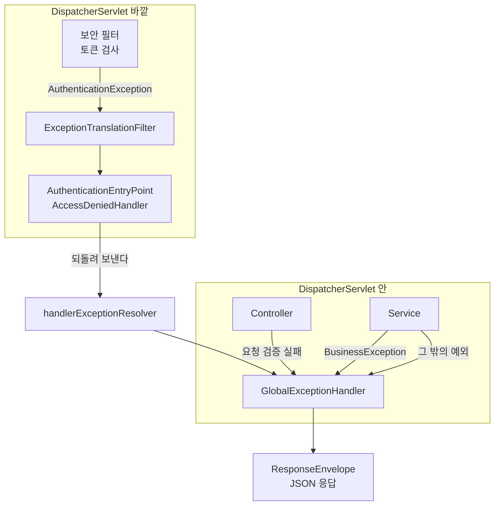
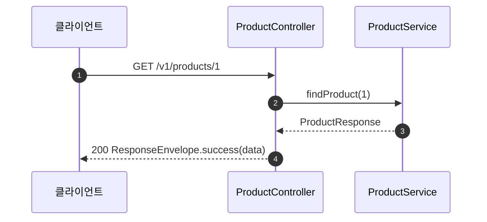
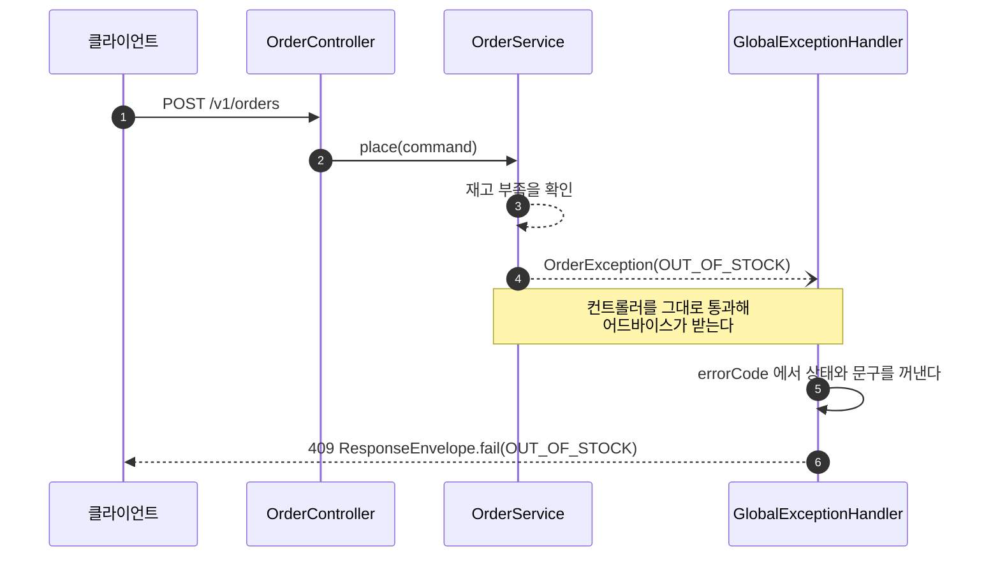
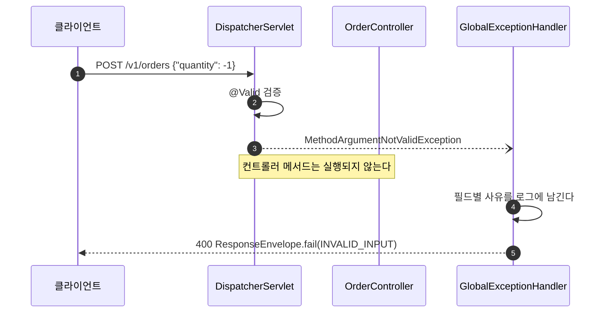
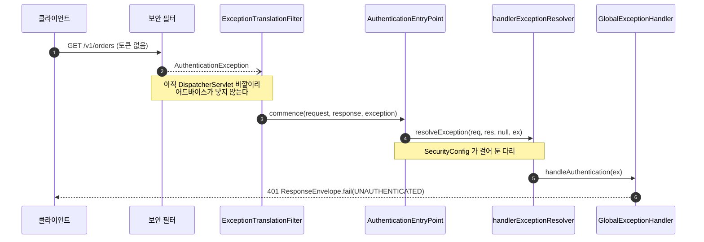
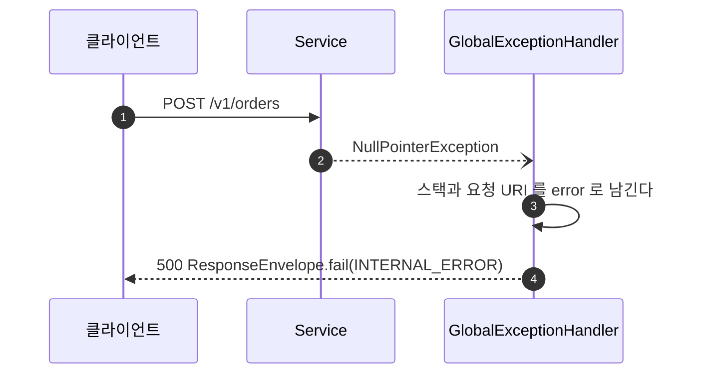

# 응답과 예외 처리 흐름

이 문서는 `common.response` 와 `common.exception` 이 실제로 어떻게 맞물려 도는지를 설명한다.
새 도메인을 붙일 때 무엇을 만들어야 하는지, 어디에 손대면 안 되는지를 여기서 확인한다.

한 줄로 줄이면 이렇다. **성공이든 실패든 모든 응답은 `ResponseEnvelope` 하나로 나가고, 실패 문구는 언제나 `ErrorCode` 에서만 나온다.**

## 1. 응답은 항상 같은 모양이다

```json
// 성공
{
  "code": "SUCCESS",
  "message": "요청이 성공적으로 처리되었습니다.",
  "data": { "productId": 1, "name": "유기농 당근" }
}

// 실패
{
  "code": "ORDER-001",
  "message": "재고가 부족합니다.",
  "data": null
}
```

성공 여부는 `code` 가 `SUCCESS` 인지로 판별한다. 따로 `success` 불리언을 두지 않는다.
HTTP 상태 코드가 이미 성공과 실패를 알려 주고, 본문에 같은 사실을 한 번 더 적으면 둘이 어긋날 자리만 생기기 때문이다.

`data` 는 성공 응답의 본체이고, 실패 응답에서는 대부분 `null` 이다.

## 2. 구성 요소는 넷이다

| 클래스 | 역할 | 누가 만드나 |
|---|---|---|
| `ResponseEnvelope<T>` | 모든 응답의 봉투. `success` / `fail` 팩터리를 가진다 | 공통. 손대지 않는다 |
| `ErrorCode` | 상태, 코드, 문구 셋을 묶은 인터페이스 | 공통. 도메인이 구현한다 |
| `CommonErrorCode` | 도메인과 무관한 프레임워크 경계 오류 9종 | 공통. 도메인 오류를 여기 넣지 않는다 |
| `BusinessException` | 도메인 실패의 추상 뿌리. `ErrorCode` 를 들고 있다 | 공통. 도메인이 상속한다 |
| `GlobalExceptionHandler` | 컨트롤러 경계까지 온 예외를 봉투로 바꾼다 | 공통. 도메인은 건드릴 일이 없다 |

여기서 핵심은 **문구가 한 곳에서만 나온다**는 것이다.
`GlobalExceptionHandler` 는 예외의 `getMessage()` 를 응답에 싣지 않는다. 그건 로그로만 간다.

## 3. 전체 그림

예외가 어디서 나든 결국 한 곳으로 모인다.



`SecurityConfig` 가 `AuthenticationEntryPoint` 와 `AccessDeniedHandler` 를 `handlerExceptionResolver` 로 넘기는 것이 이 그림의 핵심이다.
이 한 줄이 없으면 인증 실패만 봉투 밖으로 나가서 오류 응답이 두 종류가 된다.

## 4. 흐름별로 보기

### 4.1 성공

가장 흔한 경우다. 컨트롤러가 봉투를 직접 씌운다.



```java
@GetMapping("/{id}")
ResponseEntity<ResponseEnvelope<ProductResponse>> findProduct(@PathVariable Long id) {
    return ResponseEntity.ok(ResponseEnvelope.success(productService.findProduct(id)));
}
```

목록이면 `data` 자리에 `PageResponse` 가 들어간다.

```java
ResponseEnvelope.success(PageResponse.from(productService.findAll(pageable)))
```

돌려줄 값이 없으면 인자 없는 `success()` 를 쓴다.

### 4.2 도메인이 던진 실패

서비스가 정책 위반을 발견하면 자기 도메인 예외를 던진다. 컨트롤러는 아무것도 하지 않는다.



HTTP 상태 코드는 `OrderErrorCode.OUT_OF_STOCK` 이 들고 있는 값이 그대로 쓰인다.
핸들러가 상태를 정하지 않으므로, 상태를 바꾸고 싶으면 `ErrorCode` 를 고친다.

### 4.3 요청이 잘못된 경우

Bean Validation 이 걸리면 컨트롤러 메서드는 아예 실행되지 않는다.



**어느 필드가 왜 틀렸는지는 응답에 담기지 않는다.** 로그에만 남는다.

```
WARN  invalid body. fields=[quantity: 1 이상이어야 합니다]
```

응답에 넣지 않는 이유는 `api-design-rationale.md` 에 있다.
담기는 키가 오류마다 달라 계약으로 굳지 않고, 클라이언트가 거기 기대기 시작하면 조용히 계약이 되기 때문이다.
폼 화면이 필드별 오류를 필요로 하게 되면, 동적 맵을 되살리는 대신 검증 전용 응답 타입을 계약으로 설계해서 넣는다.

### 4.4 인증과 인가 실패

**여기가 이 문서에서 가장 헷갈리는 부분이다.**

`@RestControllerAdvice` 는 `DispatcherServlet` 안에서만 돈다. 그런데 토큰 검사는 그보다 앞선 필터에서 일어난다.
그대로 두면 인증 실패 응답만 봉투 밖으로 나간다.



`SecurityConfig` 의 이 부분이 다리 역할을 한다.

```java
.exceptionHandling(handling -> handling
        .authenticationEntryPoint((request, response, exception) ->
                handlerExceptionResolver.resolveException(request, response, null, exception))
        .accessDeniedHandler((request, response, exception) ->
                handlerExceptionResolver.resolveException(request, response, null, exception)));
```

`handler` 자리에 `null` 을 넘기는 것은 이 시점에 대응하는 컨트롤러 메서드가 없기 때문이다.
`@ControllerAdvice` 에 등록된 핸들러는 그래도 찾아진다.

인증되지 않은 요청은 401 `UNAUTHENTICATED`, 인증은 됐지만 권한이 없으면 403 `PERMISSION_DENIED` 가 나간다.
403 응답에는 대상이 존재하는지에 대한 단서를 넣지 않는다. 존재 여부가 응답 차이로 새면 그것만으로 정보가 된다.

> **필터를 새로 만들 때 지킬 것**
> JWT 필터 같은 것을 추가하면, 그 안에서 나는 실패를 반드시 `AuthenticationException` 으로 바꿔 던진다.
> `ExceptionTranslationFilter` 는 `AuthenticationException` 과 `AccessDeniedException` 만 받는다.
> 다른 예외를 그대로 던지면 위 다리를 타지 못하고 봉투 밖으로 나간다.

### 4.5 예상하지 못한 예외

어디에도 걸리지 않은 예외는 마지막 핸들러가 받는다.



응답에는 예외 종류도 메시지도 싣지 않는다. 내부 구조의 단서가 되기 때문이다.
클라이언트는 `"서버 오류가 발생했습니다."` 만 본다. 원인은 로그에서 찾는다.

## 5. 예외와 오류 코드 대응표

`GlobalExceptionHandler` 가 잡는 것은 다음 열한 가지다.

| 예외 | ErrorCode | 상태 | 언제 |
|---|---|---|---|
| `BusinessException` | 자기 `ErrorCode` | 그것이 정한 값 | 도메인 정책 위반 |
| `BindException` | `INVALID_INPUT` | 400 | 본문 검증 실패 |
| `ConstraintViolationException`, `HandlerMethodValidationException` | `INVALID_INPUT` | 400 | 경로 변수와 쿼리 파라미터 검증 실패 |
| `HttpMessageNotReadableException` 외 2종 | `MALFORMED_REQUEST` | 400 | 본문 파싱 실패, 타입 불일치, 필수 파라미터 누락 |
| `AuthenticationException` | `UNAUTHENTICATED` | 401 | 토큰이 없거나 유효하지 않음 |
| `AccessDeniedException` | `PERMISSION_DENIED` | 403 | 권한 없음 |
| `NoResourceFoundException` | `ENDPOINT_NOT_FOUND` | 404 | 매핑된 경로가 없음 |
| `HttpRequestMethodNotSupportedException` | `METHOD_NOT_ALLOWED` | 405 | 경로는 있으나 메서드가 다름 |
| `MaxUploadSizeExceededException` | `CONTENT_TOO_LARGE` | 413 | 업로드 크기 초과 |
| `HttpMediaTypeNotSupportedException` | `UNSUPPORTED_MEDIA_TYPE` | 415 | Content-Type 처리 불가 |
| `Exception` | `INTERNAL_ERROR` | 500 | 그 밖의 전부 |

`ENDPOINT_NOT_FOUND` 는 **경로가 없는 것**이지 리소스를 못 찾은 것이 아니다.
"주문을 찾을 수 없다" 는 도메인이 아는 실패라 `OrderErrorCode` 로 간다.

## 6. 새 도메인을 붙일 때 만드는 것

도메인마다 예외 클래스 하나와 오류 코드 enum 하나를 만든다. 실패 종류마다 예외 클래스를 만들지 않는다.

```java
// order/internal/exception/OrderErrorCode.java
@Getter
@RequiredArgsConstructor
public enum OrderErrorCode implements ErrorCode {

    ORDER_NOT_FOUND(HttpStatus.NOT_FOUND, "ORDER-001", "주문을 찾을 수 없습니다."),
    OUT_OF_STOCK(HttpStatus.CONFLICT, "ORDER-002", "재고가 부족합니다."),
    ALREADY_PAID(HttpStatus.CONFLICT, "ORDER-003", "이미 결제된 주문입니다.");

    private final HttpStatus httpStatus;
    private final String code;
    private final String message;
}
```

```java
// order/internal/exception/OrderException.java
public class OrderException extends BusinessException {

    public OrderException(ErrorCode errorCode) {
        super(errorCode);
    }

    public OrderException(ErrorCode errorCode, Throwable cause) {
        super(errorCode, cause);
    }
}
```

서비스에서는 이렇게 던진다.

```java
throw new OrderException(OrderErrorCode.OUT_OF_STOCK);
```

외부 호출이 실패해서 감쌀 때만 두 번째 생성자를 쓴다. `cause` 를 넘겨야 스택이 끊기지 않는다.

```java
try {
    paymentClient.pay(request);
} catch (PaymentApiException e) {
    throw new OrderException(OrderErrorCode.PAYMENT_FAILED, e);
}
```

`GlobalExceptionHandler` 에는 아무것도 추가하지 않는다. `BusinessException` 핸들러가 이미 받는다.

## 7. 지킬 것

**오류 문구는 `ErrorCode` 에서만 나온다.**
던지는 자리에서 문장을 지어낼 수 없게 `BusinessException` 에 문자열 생성자를 두지 않았다.
같은 코드인데 메시지가 제각각이면 로그 집계가 문장으로 갈라지고, 내부 정보가 새는 통로가 된다.

**도메인 오류 코드를 `CommonErrorCode` 에 넣지 않는다.**
그 파일이 전 도메인 지식을 갖게 되면 경계가 무너진다. `CommonErrorCode` 는 도메인 지식이 필요 없는 프레임워크 경계 오류만 담는다.

**`fail(ErrorCode, T)` 의 `T` 에 `Map` 을 넣지 않는다.**
필드가 고정된 record 만 넣는다. 키가 상황마다 달라지는 값은 계약이 되지 않는다.

**컨트롤러에서 예외를 잡지 않는다.**
`try-catch` 로 감싸 직접 응답을 만들면 오류 구조가 두 곳으로 갈린다. 그대로 올려보내면 된다.

## 8. 아직 없는 것

- **`PageResponse` 는 오프셋 방식 하나뿐이다.** 무한 스크롤이 필요해지면 커서 방식 응답을 따로 만든다. 두 방식은 응답 모양이 달라 한 레코드로 합칠 수 없다.
- **검증 실패의 필드별 상세를 돌려주는 경로가 없다.** 필요해지면 전용 응답 타입을 설계해서 `fail(ErrorCode, T)` 로 내보낸다.
- **`common` 과 `config` 를 겨냥한 앵커 규칙이 없다.** `anchors.yml` 의 트리거가 전부 `**/domain/...` 이라, 이 문서가 설명하는 코드는 로컬 검증에서 `EJ` 항목만 판정된다.

## 관련 문서

- `api-design-guideline.md` 오류 응답과 페이지네이션 점검 항목
- `api-design-rationale.md` `metadata` 를 두지 않기로 한 근거
- `domain-package-boundary-guideline.md` 도메인마다 예외 하나와 오류 코드 enum 하나를 두는 근거
