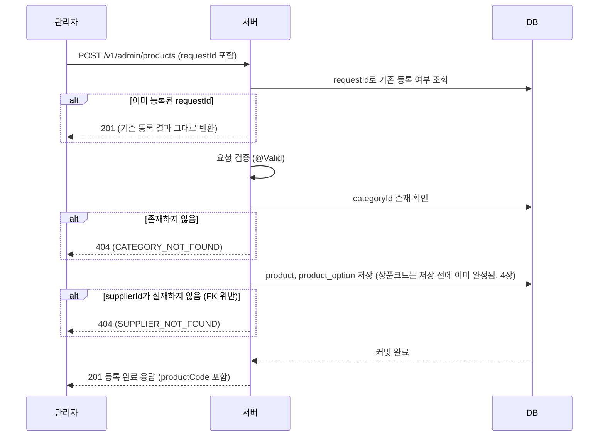

# 상품 등록 (관리자)

## 목차

1. [개요](#개요)
2. [요청 설계](#요청-설계)
3. [등록 흐름](#등록-흐름)
4. [상품코드 자동 생성 전략](#상품코드-자동-생성-전략)
   - [4.1 핵심 문제: 동시 등록 상황에서 중복 없는 생성](#41-핵심-문제-동시-등록-상황에서-중복-없는-생성)
   - [4.2 근본 원인 분석](#42-근본-원인-분석)
   - [4.3 검토했던 해결 방안](#43-검토했던-해결-방안)
   - [4.4 최종 채택 방식](#44-최종-채택-방식)
   - [4.5 한계와 보완책](#45-한계와-보완책)
5. [검증 규칙](#검증-규칙)
6. [목록·단건 조회](#목록단건-조회)

---

## 개요

관리자가 새 상품을 등록하는 기능이다. 상품과 그 상품이 파는 옵션(가격 단위)을 한 번에 등록받고,
서버가 상품코드를 자동으로 만들어 붙인다.

```
POST /v1/admin/products
```

등록 시점엔 재고가 없는 게 자연스럽고, 실제 입고는 별도의 "로트 입고" 흐름에서 이뤄진다 (`docs/api/product.md`).
상품 이미지 업로드도 등록과 분리된 별도 흐름이다 — 해당 내용은 [상품 이미지 업로드.md](./상품%20이미지%20업로드.md) 문서를 따로 둔다.

이 문서는 관리자 상품 등록 기능 전체의 설계와, 그 안에서 상품코드 자동 생성 방식을 어떻게 풀었는지 정리한다.

## 요청 설계

```json
POST /v1/admin/products
{
  "name": "제주 감귤 1kg",
  "requestId": "3fa85f64-5717-4562-b3fc-2c963f66afa6",
  "categoryId": 4,
  "supplierId": 2,
  "storageType": "COLD",
  "saleAvailableDaysFromExpiry": 3,
  "description": "...",
  "options": [ { "name": "1kg", "price": 12900 } ]
}
```

`AdminProductCreateRequest`가 상품 필드를, `AdminProductOptionCreateRequest` 목록이 옵션을 담는다.

### 왜 상품과 옵션을 한 번에 받는가

상품은 옵션 없이 존재할 이유가 없다. 판매 단위는 상품이 아니라 옵션이다 — 가격과 재고가 옵션에 붙는다
(`docs/api/product.md` "판매 단위는 상품이 아니라 옵션(`product_option`)이다").
그래서 등록 화면에서 옵션을 최소 1개(최대 50개) 강제한다(`@NotEmpty @Size(max = 50) List<AdminProductOptionCreateRequest> options`).
상품만 먼저 만들고 옵션을 나중에 붙이는 2단계 등록은, 옵션 없는 상품이 잠깐이라도 존재하게 둘 이유가 없어 채택하지 않았다.

### 왜 재고·소비기한을 여기서 안 받는가

재고와 소비기한은 로트(`stock_lot`) 단위로 입고되며, 등록과는 다른 시점에 다루는 값이다.
등록 요청에 넣으면 "상품 정보"와 "재고 정보"가 한 API에 섞여 책임이 흐려진다.

### 왜 상품코드를 여기서 안 받는가

상품코드는 서버가 만든다 (`API-2-06`). 클라이언트가 형식을 알거나 생성할 권한이 없다.
자세한 생성 방식은 [4장](#상품코드-자동-생성-전략)에서 다룬다.

### requestId로 재시도를 안전하게 만든다

`requestId`는 클라이언트가 생성하는 멱등키다(`API-5-07`, `AIP-155`). 네트워크 오류로 응답을 못 받은 클라이언트가
같은 요청을 다시 보내도, 서버는 새로 등록하지 않고 최초 등록 결과를 그대로 돌려준다. `product.request_id`에
`UNIQUE` 제약(`uk_product_request_id`)이 있어, 두 요청이 거의 동시에 들어와도 DB가 최종 방어선이 된다.

## 등록 흐름



카테고리와 공급처의 존재 확인 방식이 서로 다르다. 카테고리는 `CategoryRepository.existsById()`로 저장 전에
미리 확인한다. 공급처는 아직 `Supplier` 리포지토리 자체가 코드에 없어서 미리 확인할 방법이 없고, 대신 저장
시점에 `fk_product_supplier` 제약 위반을 잡아 `SUPPLIER_NOT_FOUND`로 바꾼다. DB 제약이 곧 검증 로직인 셈이다.

확인과 저장 사이에 카테고리가 삭제되는 경합은 `AdminCategoryService.delete()`의 비관적 락이 막아준다.
공급처는 삭제 기능 자체가 코드에 없어서 이 경합이 애초에 일어날 수 없다 — 막혀 있는 게 아니라 삭제할
방법이 없는 것뿐이다. 나중에 공급처 관리(등록/수정/삭제) 기능을 추가할 때는 카테고리와 같은 보호 장치
(비관적 락 등)를 함께 넣어야 한다.

## 상품코드 자동 생성 전략

DB 제약(`V1__init_schema.sql`)은 이렇다.

- `product_code VARCHAR(50) NOT NULL`
- `UNIQUE KEY uk_product_code (product_code)` — 삭제해도 값을 재사용하지 않는다

이 절은 이 코드를 동시 등록 상황에서도 중복 없이 생성하는 방법을 정리한다.

### 4.1 핵심 문제: 동시 등록 상황에서 중복 없는 생성

`product_id`처럼 DB `AUTO_INCREMENT`에 맡기면 동시성 문제는 저절로 해결되지만,
`product_code`는 사람이 읽는 포맷이라 그렇게 못 한다.

- 문제상황 1: 두 관리자가 거의 동시에 상품을 등록하면, 다음 순번을 각자 계산해서 같은 코드를 만들 수 있다 → `uk_product_code` 위반
- 문제상황 2: 삭제된 상품의 코드도 재사용하지 않으므로, "현재 상품 수"가 아니라 "지금까지 발급한 누적 순번"을 알아야 한다 → 단순 `COUNT(*)` 기반 생성은 쓸 수 없다

### 4.2 근본 원인 분석

초기에는 `product_id`(AUTO_INCREMENT)를 코드 재료로 재사용하는 접근을 검토했다. 하지만 이 접근은 순서 문제를 만든다.

```
INSERT 시점 : product_code 가 반드시 있어야 함 (NOT NULL)
product_id 확정 시점 : INSERT 가 끝난 직후 (AUTO_INCREMENT)
```

코드 재료(`product_id`)가 생기기도 전에 코드를 넣어야 하는 순서 문제라, 이 접근을 그대로 쓰려면
"임시값을 먼저 넣고 `product_id` 확정 후 UPDATE로 교체"하는 방법이 필요했다.

하지만 근본적으로 다시 보면, 코드가 굳이 `product_id`에서 나올 필요가 없다. 유일성만 충분히
보장되면 되므로, 애초에 `product_id`에 의존하지 않는 무작위 값을 쓰면 이 순서 문제 자체가 사라진다.

### 4.3 검토했던 해결 방안

| 방안 | 개요 | 장점 | 단점 |
|---|---|---|---|
| A. 임시값 INSERT 후 `product_id`로 실제 값 UPDATE | `NOT NULL`을 임시값으로 우회하고, INSERT 직후 확정된 `product_id`로 같은 트랜잭션 안에서 덮어쓴다 | 별도 테이블·락·재시도 불필요 | 코드에 내부 PK 정보가 드러남. INSERT 두 번(또는 INSERT+UPDATE) 필요 |
| B. 생성 테이블 + 조건부 UPDATE | `coupon.issued_quantity`와 동일 패턴으로 연도별 시퀀스를 별도 관리 | 완전한 연도별 순번(1번부터 리셋) 가능 | 테이블 추가, 락 구간 관리 필요 |
| C. INSERT 실패 시 재시도 | 후보 코드로 INSERT, `UNIQUE` 위반나면 재시도 | 별도 테이블 불필요 | 재시도 횟수 예측 어려움, 결번 발생 가능 |
| D. 영숫자 무작위 6자리 (채택) | `P-{연도}-{영숫자 6자리 무작위}`. `product_id`나 다른 재료에 전혀 의존하지 않고 INSERT 전에 완성 | 순서 문제 자체가 없음. 별도 테이블·락·재시도·UPDATE 전부 불필요. 내부 PK도 드러나지 않음 | 이론상 충돌 가능성이 0은 아님(4.5절) |

D는 A~C가 공통으로 전제한 "코드는 `product_id`에서 파생되어야 한다"는 가정 자체를 버린 방안이다.
36자(0-9, A-Z) 중 6자리 조합은 경우의 수가 실제 등록 빈도에서 충돌 확률이 무시할 수준으로 낮다. 
이 낮은 충돌 확률과, A~C가 요구하는 별도 인프라·순서 제어가
필요 없다는 단순함을 맞바꿔 D를 최종 채택했다.

### 4.4 최종 채택 방식

```java
// P-{연도}-{영숫자 6자리 랜덤}. product_id에 의존하지 않아 INSERT 전에 완성할 수 있다
private String generateProductCode() {
    StringBuilder suffix = new StringBuilder(CODE_RANDOM_LENGTH);
    for (int i = 0; i < CODE_RANDOM_LENGTH; i++) {
        suffix.append(CODE_ALPHABET.charAt(RANDOM.nextInt(CODE_ALPHABET.length())));
    }
    return "P-" + Year.now().getValue() + "-" + suffix;
}
```

`CODE_ALPHABET`은 `0-9A-Z`(36자), `CODE_RANDOM_LENGTH`는 6, 난수는 `SecureRandom`을 쓴다.
예: `P-2026-7K3QXZ`.

1. 관리자가 등록 요청을 보낸다. 요청에 `product_code`는 없다.
2. 서버가 `generateProductCode()`로 코드를 저장 전에 완전히 확정한다. `product_id`나 다른 DB 상태에
   의존하지 않으므로 이 시점에 이미 최종값이다.
3. `Product.register(...)`가 이 코드를 받아 엔티티를 만들고, 한 번의 INSERT로 저장을 마친다.
4. `uk_product_code` 위반이 나면(사실상 거의 없음, 4.5절) `DataIntegrityViolationException`이 그대로
   전파된다 — 별도 재시도 로직을 넣지 않았다.

왜 이 방식을 선택했는가

- 순서 문제 자체가 없다. 코드가 `product_id`를 필요로 하지 않으므로 "먼저 무엇을 확정해야 하는가"를
  고민할 이유가 없다.
- 동시 등록에도 락이나 재시도가 필요 없다. 두 요청이 같은 순간에 같은 6자리를 뽑을 확률이 극히 낮다.
- 새 테이블이나 UPDATE 단계가 필요 없다. INSERT 한 번으로 끝난다.
- 내부 PK 정보가 코드에 드러나지 않는다.

### 4.5 한계와 보완책

"연도별 순번"이 아니다. 코드에 들어가는 값이 무작위 문자열이라, 등록 순서나 누적 등록 수를
코드만 보고 추정할 수 없다. 순번이 명시적으로 필요해지면 별도 컬럼을 두거나 B안(생성 테이블)으로 전환해야 한다.

충돌 확률은 0이 아니지만 사실상 무시 가능하다. 36자 6자리 조합은 약 21억 가지다. 같은 연도 안에서
같은 값이 두 번 나올 확률은 등록 건수가 수만 건 수준이어도 매우 낮고, 그마저도 `uk_product_code`가
최종 방어선이라 실제로 충돌하면 그 등록 요청만 실패하고 재시도하면 된다.

난수원은 `SecureRandom`을 쓴다. 상품코드가 추측 가능한 예측형 값이면 곤란한 용도는 아니지만,
프로젝트 전체적으로 식별자 생성에 `SecureRandom`을 쓰는 원칙(`identifier-strategy-guideline.md`)과
일관성을 맞췄다.

## 검증 규칙

| 필드 | 필수 | 제약 |
|---|---|---|
| `name` | O | 255자 이하 |
| `requestId` | O | 100자 이하 |
| `categoryId` | O | 존재하는 카테고리, 양수 |
| `supplierId` | O | 양수(존재 확인은 저장 시점 FK로) |
| `storageType` | O | `ROOM`, `COLD`, `FROZEN` |
| `saleAvailableDaysFromExpiry` | | 0 이상, 생략 시 0 |
| `description` | | 2000자 이하 |
| `options` | O | 1개 이상 50개 이하 |
| `options[].name` | O | 100자 이하 |
| `options[].price` | O | 0 이상 |

## 목록·단건 조회

등록과 별도로, 관리자용 목록·단건 조회도 같은 서비스(`AdminProductService`)에 함께 구현되어 있다.

```
GET /v1/admin/products?query=&categoryId=&saleStatus=&includeDeleted=&pageToken=&pageSize=
GET /v1/admin/products/{productId}
```

- 판매안함·품절·삭제 상품까지 전부 조회 대상이다. `includeDeleted`로 삭제 상품 포함 여부만 가른다.
  회원용 조회와 달리 관리자는 삭제된 상품도 봐야 하므로, 단건 조회도 삭제 여부와 무관하게 응답하고
  존재 자체가 없을 때만 404를 준다.
- 커서 기반 페이지네이션을 쓴다(`createdAt desc, id desc` 고정 정렬). 리포지토리가 `pageSize + 1`건을
  가져와서 그 초과분으로 다음 페이지 존재 여부를 판단한다.
- 카테고리 이름은 배치로 조회한다. 페이지 안 상품들의 `categoryId`를 모아 한 번에 조회해서 N+1을 막는다.
- `saleStatus` 파라미터는 알 수 없는 문자열이 와도 400 대신 "필터 없음"으로 안전하게 처리한다.
