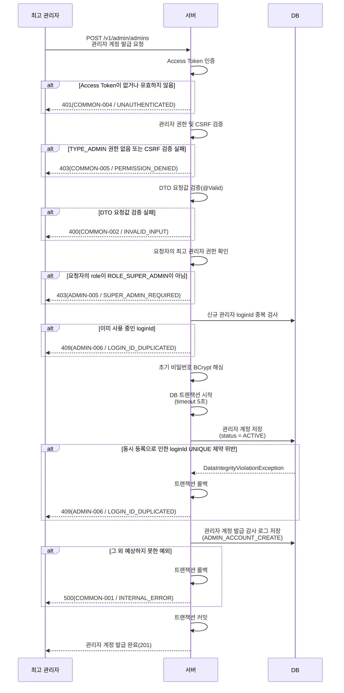
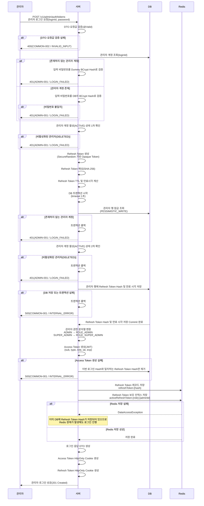
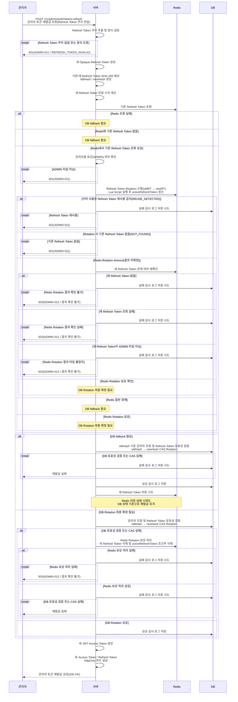
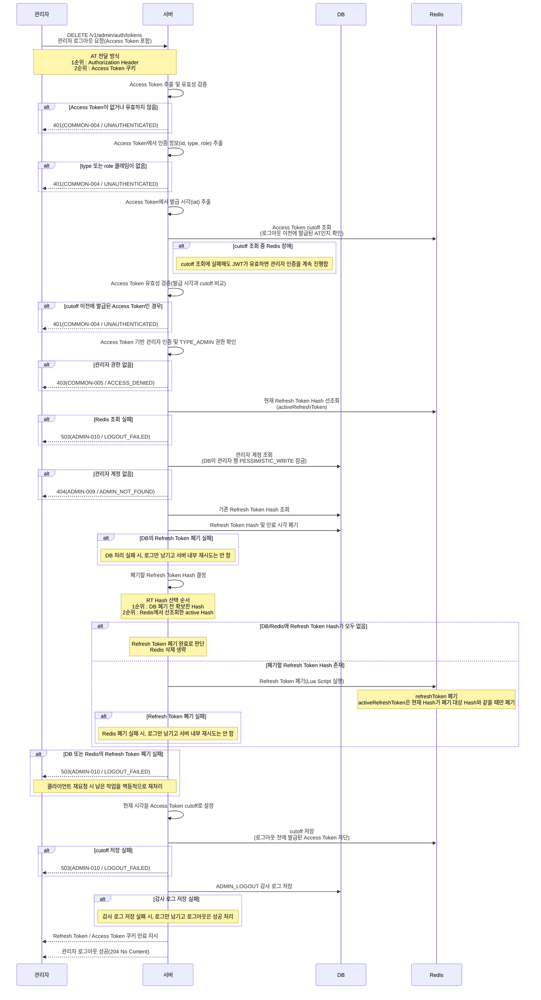

# 인증/인가 (관리자)

## 목차

1. [개요](#1-개요)
2. [설계](#2-설계)
   - [2.1 관리자 계정 발급 설계](#21-관리자-계정-발급-설계)
      - [2.1.1 관리자 AT의 `type`과 `role` 구분](#211-관리자-at의-type과-role-구분)
      - [2.1.2 `AdminRegistrationRequest` 요청값 검증](#212-adminregistrationrequest-요청값-검증)
      - [2.1.3 비밀번호 `BCrypt` 해싱](#213-비밀번호-bcrypt-해싱)
      - [2.1.4 `@Transactional` 대신 `TransactionTemplate`을 사용한 이유](#214-transactional-대신-transactiontemplate을-사용한-이유)
   - [2.2 관리자 로그인 설계](#22-관리자-로그인-설계)
      - [2.2.1 비밀번호 검증 방식](#221-비밀번호-검증-방식)
      - [2.2.2 보안을 위한 에러 코드 통일](#222-보안을-위한-에러-코드-통일)
      - [2.2.3 `RT` 생성 방식](#223-rt-생성-방식)
      - [2.2.4 `AT` 생성 방식](#224-at-생성-방식)
      - [2.2.5 `RT`와 `AT`를 클라이언트에게 전달하는 방식](#225-rt와-at를-클라이언트에게-전달하는-방식)
      - [2.2.6 관리자 계정 활성 상태를 2번 확인하는 이유](#226-관리자-계정-활성-상태를-2번-확인하는-이유)
      - [2.2.7 `AdminLoginRequest` 요청값 검증](#227-adminloginrequest-요청값-검증)
      - [2.2.8 로그인 트랜잭션 분리](#228-로그인-트랜잭션-분리)
      - [2.2.9 `AdminLoginResult` DTO의 용도](#229-adminloginresult-dto의-용도)
   - [2.3 관리자 토큰 재발급 설계](#23-관리자-토큰-재발급-설계)
      - [2.3.1 `RT Rotation`을 적용한 이유](#231-rt-rotation을-적용한-이유)
      - [2.3.2 `CAS Rotation`을 사용하는 이유](#232-cas-rotation을-사용하는-이유)
      - [2.3.3 `Redis Rotation timeout`을 별도로 처리하는 이유](#233-redis-rotation-timeout을-별도로-처리하는-이유)
   - [2.4 관리자 로그아웃 설계](#24-관리자-로그아웃-설계)
      - [2.4.1 로그아웃 과정에서 `AT`를 먼저 검증하는 이유](#241-로그아웃-과정에서-at를-먼저-검증하는-이유)
      - [2.4.2 `RT` 폐기 전 `Redis`와 `DB`에서 `RT Hash`를 확보하는 이유](#242-rt-폐기-전-redis와-db에서-rt-hash를-확보하는-이유)
      - [2.4.3 관리자 `DB`행을 비관적 잠금으로 조회한 이유](#243-관리자-db행을-비관적-잠금으로-조회한-이유)
      - [2.4.4 `DB`와 `Redis`에서의 `RT` 폐기 방식](#244-db와-redis에서의-rt-폐기-방식)
      - [2.4.5 두 저장소에서 모두 `RT` 폐기에 성공해야 하는 이유](#245-두-저장소에서-모두-rt-폐기에-성공해야-하는-이유)
      - [2.4.6 `AT`에 `cutoff`를 적용한 이유](#246-at에-cutoff를-적용한-이유)
      - [2.4.7 브라우저에게 `RT` / `AT` 쿠키 삭제를 지시하는 이유](#247-브라우저에게-rt-at-쿠키-삭제를-지시하는-이유)
   - [2.5 JWT 시간 처리 설계](#25-jwt-시간-처리-설계)
   - [2.5.1 `Clock`, `Instant`, `Date`의 용도](#251-clock-instant-date의-용도)
   - [2.5.2 시간 API 비교](#252-시간-api-비교)
3. [관리자 인증 인가 흐름](#3-관리자-인증-인가-흐름)
   - [3.1 관리자 계정 발급의 흐름](#31-관리자-계정-발급의-흐름)
   - [3.2 관리자 로그인의 흐름](#32-관리자-로그인의-흐름)
   - [3.3 관리자 토큰 재발급의 흐름](#33-관리자-토큰-재발급의-흐름)
   - [3.4 관리자 로그아웃의 흐름](#34-관리자-로그아웃의-흐름)
4. [트러블 슈팅](#4-트러블-슈팅)
   - [4.1 관리자 로그아웃의 성공 여부 판단 기준 설계](#41-관리자-로그아웃의-성공-여부-판단-기준-설계)
      - [4.1.1 문제점](#411-문제점)
      - [4.1.2 해결 방법(1차) : `DB`를 `RT` 폐기 여부 판단의 최종 기준으로 사용](#412-해결-방법1차-db를-rt-폐기-여부-판단의-최종-기준으로-사용)
      - [4.1.3 해결 방법(2차) : `DB` 또는 `Redis` 한쪽만 `RT` 폐기에 성공해도 로그아웃 성공 + 스케줄러 재처리](#413-해결-방법2차-db-또는-redis-한쪽만-rt-폐기에-성공해도-로그아웃-성공-스케줄러-재처리)
      - [4.1.4 해결 방법(최종) : `DB`와 `Redis`에서 모두 `RT` 폐기에 성공한 경우만 로그아웃 성공](#414-해결-방법최종-db와-redis에서-모두-rt-폐기에-성공한-경우만-로그아웃-성공)

---

## 1. 개요
관리자만 접근할 수 있는 API를 보호하기 위한 인증/인가 기능이다. 공통 인증 로직인 토큰 관리, 쿠키 처리 등은 회원과 공유함으로써 중복 구현을 줄였다. 다만, 관리자 계정은 보안과 접근 통제를 강화하기 위해서 자체 로그인과 관리자 전용 권한 검증 방식을 사용했다.
구현한 기능과 API는 다음과 같다.

```
POST    /v1/admin/admins                관리자 계정 발급
POST    /v1/admin/auth/tokens           관리자 로그인
POST    /v1/admin/auth/tokens:refresh   관리자 토큰 재발급
DELETE  /v1/admin/auth/tokens           관리자 로그아웃
```

> **Note:** 이 문서에서 별도의 역할을 명시하지 않고 **관리자**라고 표현한 경우, **일반 관리자(`ADMIN`)** 와 **최고 관리자(`SUPER_ADMIN`)** 를 모두 포함한다.

> **Note:** 이 문서에서는 가독성을 위해서 `Access Token`을 `AT`로, `Refresh Token`을 `RT`로 표기했다.

---

## 2. 설계

### 2.1 관리자 계정 발급 설계

#### 2.1.1 관리자 AT의 `type`과 `role` 구분
관리자 AT의 `type`은 모두 `ADMIN`이다. 인증 과정에서는 이를 기반으로 `TYPE_ADMIN`이라는  Authority(접근 권한 정보)를 생성한다. 이를 통해 일반 회원용 AT와 **관리자용 AT**를 구분하고, **관리자용 AT**를 가진 사용자만 **관리자 전용 API에 접근**할 수 있도록 했다.

한편, 관리자 AT의 `role`은 AT 소유자의 **관리자 권한 수준**을 나타낸다. 일반 관리자의 `role`은 `ROLE_ADMIN`이고, 최고 관리자의 `role`은 `ROLE_SUPER_ADMIN`이다.

#### 2.1.2 `AdminRegistrationRequest` 요청값 검증
`AdminRegistrationRequest`는 클라이언트로부터 **관리자 계정 발급에 필요한 입력값**을 전달 받아서 처리하기 위한 `DTO`이다.여기서는 다음 4가지 필수 입력값의 **유효성**을 검증한다.

```json
POST /v1/admin/admins
{
  "loginId": "admin.lee",
  "initialPassword": "Freshman!2026",
  "name": "이관리",
  "role": "ADMIN"
}
```

| 검증 대상 | 글자 수 | 허용 문자 | 비고 |
|---|---|---|---|
| `loginId` | 1~50 | 영어, 숫자, 점(`.`), 밑줄(`_`), 하이픈(`-`) | - |
| `initialPassword` | 10~72 | 소문자, 대문자, 숫자, 특수문자 | 4종류의 허용 문자를 각각 1개 이상 포함.</br>로그에서 마스킹 처리. |
| `name` | 1~50 | 문자(한글 포함), 공백, 점(`.`), 작은따옴표(`'`), 하이픈(`-`) | 로그에서 마스킹 처리. |
| `role` | 5 / 11 | `ADMIN` 또는 `SUPER_ADMIN` | - |

#### 2.1.3 비밀번호 `BCrypt` 해싱
DB 유출 시, **평문 비밀번호가 노출되지 않도록** 하고, 의도적으로 **연산 비용이 높은** `BCrypt`를 사용해서 **무차별 대입 공격의 비용을 높였다**.

`BCrypt`는 입력 비밀번호의 **앞 72 byte까지만 해싱에 반영**한다. 이를 고려해서 `initialPassword`의 **최대 길이를 72자로 제한**했다. 다만, 이는 **글자 수만 제한**한 것이므로, 문자 인코딩에 따라 72 byte를 초과할 수 있다. 또한 `BCrypt`는 **연산 비용이 크기 때문**에 **DB 트랜잭션 밖에서 수행**한다.

#### 2.1.4 `@Transactional` 대신 `TransactionTemplate`을 사용한 이유
`@Transactional`은 일반적으로 **메서드 단위**로 **트랜잭션**을 적용한다. 따라서 현재 `register()` 메서드 전체에 적용하면, 연산 비용이 큰 `BCrypt` 해싱 과정까지 트랜잭션 범위에 포함될 수 있다.
반면, `TransactionTemplate`은 **코드 블록 단위**로 **트랜잭션 경계를 직접 지정**할 수 있으므로, 의도한 대로 **관리자 계정 저장**과 **감사 로그 저장**만 **트랜잭션**으로 묶을 수 있다.

### 2.2 관리자 로그인 설계

#### 2.2.1 비밀번호 검증 방식

관리자 로그인에서는 계정 존재 여부와 관계없이 비밀번호 검증에 `BCrypt` 연산을 수행한다.

앞서 설명했듯이 `BCrypt`는 **의도적으로 연산 비용을 크게 만든 알고리즘**이다. 따라서 계정이 존재할 때만 비밀번호 검증을 수행하면, 계정이 있을 때와 없을 때의 처리 시간에 큰 차이가 생길 수 있다. 공격자는 이러한 시간 차이를 이용해 특정 계정의 존재 여부를 추측할 수 있다.
이를 방지하기 위해 계정이 존재하는 경우에는 입력 비밀번호를 DB에 저장된 실제 `passwordHash`와 검증하고, 계정이 존재하지 않는 경우에는 가짜 비밀번호 Hash인 `dummyPasswordHash`와 검증한다.

또한 비밀번호 검증에는 `equals()`가 아닌 `matches()`를 사용한다.

`BCrypt`는 `Salt`를 사용하기 때문에 같은 비밀번호라도 해시 결과가 매번 달라질 수 있으므로, 새로 생성한 `Hash`와 저장된 `Hash`를 문자열로 직접 비교하는 방식은 적합하지 않다.

따라서 `matches()`를 사용하여 입력한 평문 비밀번호와 `DB`에 저장된 `BCrypt Hash`가 서로 일치하는지 검증한다. 저장된 `BCrypt Hash`에는 검증에 필요한 알고리즘 정보, `Cost`, `Salt`, `Hash` 등이 포함되어 있기 때문이다.

참고로 `Cost`와 `Salt`는 다음과 같다.
1. `Cost` : `BCrypt` 연산의 작업량을 결정하는 값. 값이 높을수록 `Hash` 생성과 비밀번호 검증에 더 많은 연산이 필요함. 따라서 무차별 대입 공격이 더 어려워짐.

2. `Salt` : 비밀번호 해싱 시, 함께 사용하는 랜덤 값. 같은 비밀번호라도 서로 다른 `Salt`를 사용하면 서로 다른 `Hash`가 생성됨.

#### 2.2.2 보안을 위한 에러 코드 통일
존재하지 않는 ID, 비밀번호 불일치, 비활성화된 계정을 모두 `LOGIN_FAILED`로 처리하여 공격자가 응답을 통해 관리자 계정의 존재 여부나 상태를 유추하기 어렵게 했다.

#### 2.2.3 `RT` 생성 방식
`RT`는 `Opaque Token`으로 생성한다.
`RT`는 토큰 내부 정보를 해석하는 용도가 아니라, **현재 서버가 인정하는 유효한 토큰인지 확인**하는 용도로 사용한다. 따라서 `JWT`처럼 관리자 ID나 권한 등의 의미 있는 정보를 토큰 내부에 담을 필요가 없다. 따라서 랜덤 문자열 형태의 `Opaque Token`을 사용했다.

또한 `RT`는 관리자 인증 상태를 이어갈 수 있는 비밀값이므로, 예측하기 어려워야 한다. 따라서 일반적인 `Random`이 아닌 보안용 난수 생성기인 `SecureRandom`을 사용한다.

생성한 `RT` 원문은 `SHA-256`으로 해싱해서 저장한다. `SHA-256` 결과는 `256 bit`이며, 이를 `Hex` 문자열로 표현하면 **64자**가 된다. 따라서 `Admin` 엔티티의 `refreshTokenHash`도 **64자**로 길이가 제한되어 있다.

`RT`는 `DB`와 `Redis` 두 저장소에서 관리하며, 각각 역할이 다르다.
먼저, `Redis`에 저장하기 전에 `DB`에 `RT Hash`와 만료 시각을 저장한다. 이를 통해 `Redis`에 장애가 발생해도 `DB`에 저장된 `RT Hash`를 통해 해당 `RT`의 유효성을 확인할 수 있도록 했다.

다음으로 `Redis`에는 두 종류의 `RT` 관련 데이터를 저장한다.
첫 번째는 `refreshToken` 레코드로, `RT Hash`를 이용해 관리자 정보를 찾기 위한 데이터이다. 클라이언트가 `RT`를 보내면, 서버는 먼저 해당 `RT`를 해싱한 뒤, 이 키를 조회해서 관리자와 권한 정보를 확인한다.
> Key : `refreshToken:{RT_HASH}`<br/>
> Value : adminId | role | type | remember

두 번째는 `activeRefreshToken`으로, 관리자 정보를 이용해 현재 활성 상태인 `RT Hash`를 찾기 위한 보조 인덱스이다. 로그아웃처럼 관리자 정보는 알고 있지만, 현재 활성 `RT Hash`를 모르는 경우, 이 보조 인덱스를 이용해 해당 관리자의 현재 `RT Hash`를 찾는다.
> Key : activeRefreshToken:{role}:{adminId}<br/>
> Value : RT_HASH

관리자 `RT`의 유효 기간은 보안상 회원 `RT`보다 짧은 **1일(86,400초)**로 설정되어 있다.

#### 2.2.4 `AT` 생성 방식
`AT`는 `JWT`로 생성한다.
서버는 `AT` 자체를 별도로 저장하지 않기 때문에, 요청이 들어올 때마다 `JWT`의 내부 정보와 서명을 검증한다. 따라서 서버가 요청을 받을 때 관리자 주체, 권한, 만료 여부 등을 빠르게 판단할 수 있도록 관리자 인증 및 인가에 필요한 정보를 담을 수 있는 `JWT`를 사용했다.
`JWT`의 형태는 아래와 같다.

```json
{
  "sub": "15",
  "type": "ADMIN",
  "role": "ROLE_ADMIN",
  "iat": 178...,
  "exp": 178...
}
```

각 `Claim`의 의미는 다음과 같다.
1. `sub` : 관리자 `PK`
2. `type` : 토큰 유형. 관리자용 토큰이므로 `ADMIN`.
3. `role` : `ROLE_ADMIN` 또는 `ROLE_SUPER_ADMIN`
4. `iat` : 발급 시각
5. `exp` : 만료 시각

관리자 로그인 과정에서 `AT` 생성에 실패하면, 해당 로그인 과정에서 `DB`에 저장한 `RT Hash`도 제거하도록 설계되어 있다. `AT` 생성에 실패하면 로그인 응답이 정상적으로 완료되지 않으므로, 이번 로그인에서 발급한 `RT` 역시 클라이언트가 사용할 수 없게 되기 때문이다.
이때, 다른 로그인에서 새로 발급된 `RT`까지 삭제하지 않도록, 현재 `DB`의 `RT Hash`가 이번 로그인에서 저장한 `Hash`와 일치하는 경우에만 제거한다.

관리자 `AT`의 만료시간은 회원 `AT`와 마찬가지로 30분이다.

#### 2.2.5 `RT`와 `AT`를 클라이언트에게 전달하는 방식
`RT`와 `AT`는 모두 `HTTP` 응답 `Header`의 `Set-Cookie`를 통해 브라우저에게 `HttpOnly Cookie` 형태로 전달된다. `Set-Cookie`를 사용하면 브라우저가 쿠키를 저장하고, 이후 해당 조건에 맞는 요청에 자동으로 쿠키를 포함해서 전송한다.

쿠키의 주요 설정은 아래와 같다.

| 구분 | `AT` | `RT` |
|---|---|---|
| 이름 | `accessToken` | `refreshToken` |
| `HttpOnly` | `true` | `true` |
| `SameSite` | `Strict` | `Strict` |
| `Path` | `/` | `/v1/admin/auth/` |
| `Max-Age` | `AT` 수명 | `RT` 수명 |
| `Secure` | 환경설정 | 환경설정 |

`HttpOnly=true`로 설정한 이유는 브라우저의 `JS`가 토큰 값을 직접 읽지 못하게 하여 토큰 원문 탈취 위험을 줄이고자 했기 때문이다.

`SameSite=Strict`로 설정한 이유는 다른 사이트에서 시작된 요청에 자동으로 쿠키가 포함되는 것을 강하게 제한하여 `CSRF` 위험을 완화하고자 한 것이다.

`Path`의 경우, `AT`는 인증이 필요한 여러 API에서 사용되지만, `RT`는 관리자 인증 관련 API에서만 필요하므로 범위를 제한했다.

`Secure`는 환경설정에 따라 결정되며, `Secure=true`면 `HTTPS` 연결에서만 쿠키를 전송한다. 따라서 `HTTP` 연결에서는 해당 쿠키가 전송되지 않는다.

#### 2.2.6 관리자 계정 활성 상태를 2번 확인하는 이유

관리자 계정의 활성 상태는 **동시성 문제를 방지**하기 위해 두 번 확인한다.

1. **1차 확인** : 비밀번호 검증 이후, 현재 관리자 계정이 활성(`ACTIVE`) 상태인지 확인한다.
2. **2차 확인** : `DB`에 `RT`를 저장하기 직전, 관리자 행에 잠금을 건 상태에서 다시 활성 여부를 확인한다.

1차 확인 이후 `RT`를 저장하기 전까지의 시간 동안 관리자 계정의 상태가 변경될 수 있다. 따라서 계정 상태를 다시 확인하지 않고 `RT`를 저장하면 비활성화된 관리자가 로그인에 성공할 수 있으므로, RT를 저장하기 직전에 최신 계정 상태를 다시 확인한다.

#### 2.2.7 `AdminLoginRequest` 요청값 검증

| 검증 대상 | 글자 수 | 비고 |
|---|---|---|
| `loginId` | 1~50 | null, 빈 문자열, 공백만 있는 문자열 모두 사용 불가. |
| `password` | 1~72 | null, 빈 문자열, 공백만 있는 문자열 모두 사용 불가.</br>로그 출력 시, 마스킹 처리. |

#### 2.2.8 로그인 트랜잭션 분리
`login()` 메서드 전체를 하나의 트랜잭션으로 묶지 않고, `DB`에서 반드시 원자적으로 처리해야 하는 작업만 별도의 짧은 트랜잭션으로 분리했다.

로그인 과정에는 `DB` 작업뿐만 아니라 `AT` 생성과 `Redis` 통신도 포함된다. 만약 `login()` 전체를 트랜잭션으로 묶으면 `Redis` 통신이 끝날 때까지 `DB` 트랜잭션이 불필요하게 오래 유지될 수 있다.

또한 `Redis`는 `DB` 트랜잭션으로 제어할 수 있는 저장소가 아니므로, `@Transactional`로 `DB`와 `Redis`를 하나의 원자적인 작업으로 묶을 수 없다. 이 상태에서 `DB Lock`까지 오래 유지되면 동시 요청 처리에도 불리할 수 있다.

따라서 `issueRefreshToken()`에서는 다음 세 가지 작업만 하나의 짧은 트랜잭션으로 처리한다.

1. 관리자 행 잠금
2. 계정의 ACTIVE 상태 재확인
3. RT Hash 및 만료시간 저장

#### 2.2.9 `AdminLoginResult` DTO의 용도

`AdminLoginResult`는 `AdminAuthService`에서 생성한 로그인 결과를 `AdminAuthController`로 전달하기 위한 서버 내부 `DTO`이다. `AT`와 `RT` 원문, `AdminLoginResponse`, `RT` 유효기간 등 로그인 응답 생성에 필요한 정보를 전달하는 용도로 사용한다.

### 2.3 관리자 토큰 재발급 설계

#### 2.3.1 `RT Rotation`을 적용한 이유

관리자 토큰 재발급 시에는 기존 `RT`를 그대로 유지하지 않고 **새 `RT`로 교체하는 Rotation 방식**을 사용한다.
기존 `RT`를 계속 사용할 수 있게 하면 탈취된 `RT`도 만료될 때까지 재사용될 수 있다. 따라서 재발급에 사용된 기존 `RT`는 더 이상 사용할 수 없도록 처리하고, 새 `RT`만 유효한 상태로 변경한다.
`Redis`에서는 `Lua Script`를 사용해서 새 `RT` 저장과 기존 `RT`를 `REVOKED` 상태로 변경하는 작업을 원자적으로 처리한다. 즉, 두 작업이 하나의 작업처럼 실행되어 중간에 다른 요청이 끼어들 수 없다. 만약, 이미 `REVOKED`로 변경된 기존 `RT`가 다시 전달되면 `REUSE_DETECTED`로 판단해서 재발급을 거부한다.

#### 2.3.2 `CAS Rotation`을 사용하는 이유

`CAS`는 현재 값이 예상한 값과 일치할 때만 새 값으로 변경하는 방식이다.
`DB`에서는 기존 `RT Hash`가 요청에서 전달된 `oldHash`와 일치하는 경우에만 `newHash`로 변경하는 `CAS(Compare-And-Set)` 방식을 사용한다.
이를 통해 동일한 `RT`로 재발급 요청이 동시에 들어오더라도, 먼저 `RT Hash`를 `newHash`로 변경한 이후에는 기존 `oldHash`가 더 이상 일치하지 않으므로 후속 요청의 재발급을 막을 수 있다.

#### 2.3.3 `Redis Rotation timeout`을 별도로 처리하는 이유

`Redis Rotation` 요청 중 `timeout`이 발생했다고 해서 실제 `Rotation`이 실패했다고 단정할 수 없다. `Redis`에서는 이미 새 `RT` 저장이 완료되었지만 서버가 응답을 받는 과정에서 `timeout`이 발생했을 수도 있기 때문이다.
따라서 `timeout`이 발생하면 새 `RT`가 `Redis`에 존재하는지 다시 확인한다. 새 `RT`가 존재하면 `Rotation`이 성공한 것으로 판단하고, `DB Rotation`을 계속 진행한다. 반면, 결과를 확인할 수 없는 경우에는 재발급 결과를 확정하지 않고 `ADMIN-012` 오류로 처리한다.

### 2.4 관리자 로그아웃 설계

#### 2.4.1 로그아웃 과정에서 `AT`를 먼저 검증하는 이유

**로그아웃을 요청한 관리자를 식별**하고, 이전 로그아웃을 통해 **이미 차단된 `AT`인지 확인**하기 위해서 `AT`를 먼저 검증한다. **요청 주체를 정확히 식별**해야 해당 관리자의 `RT`와 `AT`를 올바르게 폐기할 수 있다. 또한 이미 차단된 `AT`를 허용하면 무효화된 토큰이 다시 인증 수단으로 사용될 수 있고, 이미 종료된 세션에 대한 RT 폐기 작업이 반복되어 불필요한 처리가 발생할 수 있다.

#### 2.4.2 `RT` 폐기 전 `Redis`와 `DB`에서 `RT Hash`를 확보하는 이유

로그아웃 과정에서는 **두 저장소**의 `RT`를 폐기하기 전에 각 저장소에서 **`RT Hash`를 미리 확보**한다.
먼저 **`DB` 작업을 시작하기 전**에 **`Redis`의 `activeRefreshToken`에서 현재 `RT Hash`를 조회**한다. 이후 **`DB`의 `RT`를 폐기하기 직전**에 **`DB`에 저장되어 있던 기존 `RT Hash`**를 확보한다.

이처럼 두 곳에서 `RT Hash`를 확보하는 이유는 로그아웃 도중에 **일부 저장소의 폐기 작업만 성공하더라도, 남아 있는 `RT`를 다시 찾아서 정리**할 수 있도록 하기 위해서다.

**정상적인 로그아웃 과정**에서는 **`DB`에서 확보한 기존 `RT Hash`**를 사용해서 `Redis`의 `RT`를 폐기한다.
하지만 이전 로그아웃 요청에서 **`DB`의 `RT` 폐기만 성공하고, `Redis`의 `RT` 폐기에는 실패**했다면, **재요청 시 `DB`의 `RT Hash`는 이미 `null`**일 수 있다. 이 경우, 로그아웃 초기에 **`Redis`의 `activeRefreshToken`에서 미리 확보한 `RT Hash`**를 사용해서 `Redis`에 남아 있는 `RT`를 폐기할 수 있다.

#### 2.4.3 관리자 `DB`행을 비관적 잠금으로 조회한 이유

관리자의 **`RT` 정보를 변경하는 요청(로그인, 로그아웃, 토큰 재발급)이 동시에 들어오면**, 서로 **변경 내용을 덮어쓰는 문제**가 발생할 수 있다.

이를 방지하기 위해 관리자 `DB` 행을 `PESSIMISTIC_WRITE`로 먼저 잠근 상태에서 조회한다. **잠금이 유지되는 동안 다른 요청은 해당 행을 수정하지 못하고 대기**하게 되므로, 같은 관리자의 `RT` 변경 작업을 **순서대로 안전하게 처리**할 수 있다.

#### 2.4.4 `DB`와 `Redis`에서의 `RT` 폐기 방식

관리자 `RT`는 `DB`와 `Redis`에 모두 저장되지만, 두 저장소의 역할과 데이터 구조가 다르기 때문에 폐기 방식도 다르다.

`DB`에서는 **관리자 행 안에 `RT Hash`와 만료 시각이 컬럼 형태로 저장**되어 있다. 이 값들은 현재 해당 관리자에게 유효한 `RT`가 있는지를 나타내는 상태 정보이므로, 로그아웃 시 두 값을 모두 `null`로 설정해 **현재 유효한 RT가 없는 상태**로 만든다. 만약, `RT Hash`만 없애고 만료 시각은 남겨두면 실제 RT는 없는데 만료 정보만 남는 불일치 상태가 생길 수 있기 때문에 두 값을 함께 비운다.

반면, `Redis`에서는 **`RT` 정보를 별도의 키로 저장**하고 있으므로, **해당 키 자체를 삭제**한다. `refreshToken:{hash}`는 실제 `RT` 정보를 담는 레코드이므로 로그아웃 시 반드시 삭제한다. 하지만, `activeRefreshToken`은 현재 관리자에게 연결된 `RT`를 가리키는 보조 인덱스이므로, 폐기 대상 `Hash`와 일치하는 경우에만 삭제한다. 로그아웃 처리 도중 새로운 로그인이나 토큰 재발급으로 `activeRefreshToken`이 이미 새로운 `RT Hash`를 가리키고 있을 수 있기 때문이다. 이때, 보조 인덱스를 무조건 삭제하면 새로 발급된 `RT`를 가리키는 연결 정보까지 삭제되어 정상적인 `RT` 사용에 문제가 생길 수 있다.

즉, DB에서는 **RT가 없는 상태를 명확하게 표현하기 위해 값을 `null`로 설정**하고, Redis에서는 **RT 관련 데이터를 제거하기 위해 키를 삭제**한다. 또한 `Redis`의 보조 인덱스는 새로 발급된 `RT`에 영향을 주지 않도록 `Hash`가 일치하는 경우에만 삭제한다.

#### 2.4.5 두 저장소에서 모두 `RT` 폐기에 성공해야 하는 이유

관리자 `RT`는 `DB`와 `Redis`에 모두 저장되어 있다. 이 상태에서 한쪽에만 `RT`가 남아 있으면, 저장소 간의 상태가 달라져서 이후 토큰 재발급 과정에서 남아 있는 `RT` 정보가 사용될 가능성이 있다. 따라서 **저장소 간 상태 불일치**와 **폐기되지 않은 `RT`의 재사용** 문제를 방지하기 위해 두 저장소 모두 `RT` 폐기에 성공해야 한다.

#### 2.4.6 `AT`에 `cutoff`를 적용한 이유

`AT`는 **`JWT`**이기 때문에 **서버가 토큰 자체를 저장해서 관리하지 않는다.** 따라서 로그아웃하더라도 서버에서 기존 `AT`를 직접 삭제할 수 없다.
이 문제를 해결하기 위해 `Redis`에 로그아웃 시각을 `cutoff`로 저장하고, 이후 요청에서 `AT`의 발급 시각(`iat`)과 비교한다. 이를 통해 로그아웃 이전에 발급된 `AT`를 만료 시각(`exp`)이 남아 있더라도 강제로 무효화하여 차단할 수 있다.

`TTL`, 만료 시각(`exp`), `cutoff`는 다음과 같이 정리할 수 있다.

1. `TTL` : `Redis`에 저장된 데이터의 남은 수명.
2. 만료 시각(`exp`) : `JWT`를 언제까지 사용할 수 있는지를 판단하기 위한 시각. 발급 시각(`iat`) + AT 유효시간(`accessTokenValidityMs`)으로 계산한다.
3. `cutoff` : 로그아웃 시점을 기준으로 아직 `exp`가 남아 있는 기존 `AT`도 사용할 수 없도록 강제로 차단하는 기준 시각.

#### 2.4.7 브라우저에게 `RT` / `AT` 쿠키 삭제를 지시하는 이유

로그아웃 과정에서 서버의 `RT` 폐기와 `AT` 차단 작업이 성공해도, **브라우저에는 기존 `RT`와 `AT` 쿠키가 남아 있을 수 있다.**

서버는 브라우저에 저장된 쿠키를 직접 삭제할 수 없기 때문에 **`Max-Age=0`인 만료 쿠키를 응답으로 내려서** 브라우저가 기존 `RT`와 `AT` 쿠키를 삭제하도록 지시한다.

이를 통해 로그아웃 이후 브라우저가 자동으로 요청에 기존 토큰을 포함하는 것을 방지할 수 있다.

### 2.5 JWT 시간 처리 설계

### 2.5.1 `Clock`, `Instant`, `Date`의 용도

현재 프로젝트에서는 `JWT` 및 인증/인가의 시간 처리에 `Clock`, `Instant`, `Date`를 사용하고 있다.

1. `Clock` : 인증 서비스에서 **현재 시각을 가져올 때** 사용한다. 관리자 로그인과 토큰 재발급에서는 `RT` 만료 시각을 계산하고, 로그아웃에서는 `AT cutoff` 시각을 설정할 때 사용한다.
2. `Instant` : `JwtTokenProvider`에서 **`JWT`의 발급 시각(`iat`)과 만료 시각(`exp`)을 계산**할 때 사용한다. `Instant.now()`로 현재 시각을 구하고, 여기에 `AT`의 유효 시간(accessTokenValidityMs)을 더해서 만료 시각을 계산한다.
3. `Date` : `Instant`로 계산한 시각을 **`JJWT`에서 사용하는 형식으로 변환**할 때 사용한다. `JWT` 생성 시 `Date.from()`을 통해 `iat`와 `exp`를 전달하고, `JWT`에서 발급 시각을 조회할 때도 사용한다.

`JWT`의 `iat`와 `exp`는 다음과 같이 계산한다.

1. `Instant.now()`로 현재 시각을 구한다.
2. 현재 시각을 `JWT`의 발급 시각(`iat`)으로 사용한다.
3. **현재 시각 + `AT` 유효 시간(`accessTokenValidityMs`)** 으로 만료 시각(`exp`)**을 계산한다.
4. 계산한 `iat`와 `exp`를 `Date.from()`을 통해 `Date` 타입으로 변환한다.
5. 변환한 값을 `JJWT`의 `issuedAt()`과 `expiration()`에 전달한다.

### 2.5.2 시간 API 비교

1. `Clock`</br>
   (1) 특징</br>
      - 현재 시각을 알려주는 시계처럼 **다른 시간 API에게 시각 정보를 제공하는 객체**이다. 따라서 `Instant.now(clock)`, `LocalDateTime.now(clock)`처럼 다른 시간 API와 함께 사용한다.</br>
      - 현재 시각을 기준으로 동작하면서 **테스트에서 시간을 제어해야 하는 로직**에 주로 사용한다.
   (2) 장점</br>
      - `Clock.fixed()`를 사용하면, 테스트에서 시간을 **원하는 시각으로 고정**할 수 있다.</br>
      - `Clock`을 외부에서 주입하면, 로직에서 현재 시간을 직접 호출하지 않아도 된다. 따라서 **시간 처리와 실제 로직을 분리**할 수 있다.</br>
   (3) 단점</br>
      - `Clock` 자체는 시간 값을 직접 나타내는 객체가 아니므로, `Instant`, `LocalDateTime` 등의 시간 API와 함께 사용해야 한다.</br>

2. `Instant`</br>
   (1) 특징</br>
      - UTC를 기준으로 **특정 시점**을 나타낸다.</br>
      - 시간대를 포함하지 않고, 전 세계에서 동일한 하나의 시점을 표현한다.</br>
      - 주로 **특정 시점을 저장하거나 비교할 때** 사용한다.</br>
   (2) 장점</br>
      - 불변 객체이므로 값이 변경되지 않는다.</br>
      - `plusSeconds()`, `plusMillis()` 등을 사용해서 시간 계산을 쉽게 할 수 있다.</br>
   (3) 단점</br>
      - 연·월·일·시·분처럼 사람이 보기 쉬운 형태로 표현하려면 다른 시간 타입으로 변환해야 한다.</br>
      - 레거시 라이브러리에서는 `Date` 등의 타입으로 변환해야 한다.</br>

3. `Date`</br>
   (1) 특징</br>
      - Java 초기부터 제공된 `java.util`의 날짜·시간 클래스이다.</br>
      - 현재는 주로 **레거시 라이브러리와 날짜·시간 값을 주고받을 때** 사용한다.</br>
   (2) 장점</br>
      - Java의 기존 레거시 라이브러리와 호환성이 높다.</br>
      - `Date.from()`과 `toInstant()`를 통해 `Instant`와 서로 쉽게 변환할 수 있다.</br>
   (3) 단점</br>
      - 가변 객체이므로, 생성된 이후에도 값이 변경될 수 있다.</br>
      - 여러 메서드가 `deprecated`되었다. 따라서 레거시 코드가 아니라면, `Instant` 등의 `java.time` API 사용을 권장한다.</br>

4. `System.currentTimeMillis()`</br>
   (1) 특징</br>
      - 현재 시각을 `long` 타입의 **Epoch 기준 밀리초 값**으로 반환한다.</br>
      - 주로 현재 시각을 밀리초 단위의 숫자 값으로 처리해야 하는 경우에 사용한다.</br>
   (2) 장점 : `static` 메서드이므로, 별도의 객체 생성 없이 현재 시각을 숫자로 바로 얻을 수 있다.</br>
   (3) 단점</br>
      - 단순한 `long` 값이므로, 값 자체만으로는 시간을 나타내는 값인지 알기 어렵고, 의미도 명확하지 않다.</br>
      - 직접 호출하기 때문에 테스트에서 현재 시간을 원하는 시각으로 고정하기 어렵다.</br>

---

## 3. 관리자 인증 인가 흐름
관리자 인증/인가는 크게 네 흐름으로 나뉜다.(‘일반 관리자’나 ‘최고 관리자’라고 구체적으로 명시하지 않고 ‘관리자’만 쓸 경우에는 일반 관리자와 최고 관리자를 모두 지칭한 것이다.)
1. 최고 관리자가 관리자 계정을 발급한다.
2. 관리자가 ID, 비밀번호로 로그인하고 AT와 RT를 발급받는다.
3. AT가 만료되면, 로그인 때 발급받은 RT를 통해서 AT와 RT를 새로 발급받는다.
4. 로그아웃하면 기존 RT를 폐기하고 기존 AT까지 즉시 차단한다.

### 3.1 관리자 계정 발급의 흐름

관리자 계정은 오직 **인증된 최고 관리자(`ROLE_SUPER_ADMIN`)**에 의해서만 발급될 수 있다. 이때, 최고 관리자는 일반 관리자(`ADMIN`)뿐만 아니라 다른 최고 관리자(`SUPER_ADMIN`) 계정도 발급할 수 있다. 새로 발급된 관리자 계정의 상태는 항상 `ACTIVE`이다. 바로 사용할 수 있는 정상 계정으로 생성되도록 설계했기 때문이다.
관리자 계정 발급의 흐름은 다음과 같다.



관리자 계정 발급에 성공하면, 응답 데이터에 아래와 같이 관리자 정보가 포함된다.

```json
{
  "loginId": "admin.lee",
  "name": "이관리",
  "role": "ADMIN"
}
```

### 3.2 관리자 로그인의 흐름

로그인 시점에는 아직 유효한 `AT`와 `CSRF Token`이 모두 없다. 따라서 로그인 API는 인증 정보 없이 접근할 수 있도록 허용하고, CSRF 검사에서도 제외된다.

관리자 로그인 흐름은 아래와 같이 크게 두 단계로 나눌 수 있다.
1. 관리자 인증 : 관리자 자격 증명을 검증하는 과정. 관리자 인증에 성공하려면 ID가 존재하고, 비밀번호가 일치하며, 계정이 활성(`ACTIVE`) 상태여야 한다.
2. `RT` 및 `AT` 발급 : 인증 상태를 유지하기 위한 토큰을 발급하는 과정.



### 3.3 관리자 토큰 재발급의 흐름

관리자 토큰 재발급은 기존 `AT`가 만료되었을 때, `RT`를 이용해서 새 `AT`를 발급 받는 기능이다. 따라서 관리자 토큰 재발급 API는 기존 `AT` 없이 접근할 수 있다.
관리자 토큰 재발급의 큰 흐름은 다음과 같다.

1. `RT` 쿠키 추출 및 형식 검증하기
2. 새 `RT` 생성 및 기존 `RT` 및 새 `RT` 해싱하기
3. `Redis`에서 기존 `RT` 조회 및 `RT Rotation` 수행하기
4. `Redis` 조회 실패, 기존 `RT` 유실 또는 일반적인 `Redis Rotation` 실패 시 `DB fallback` 수행하기
5. `DB`에서 관리자 및 `RT` 유효성을 검증하고 `oldHash → newHash`로 `CAS Rotation` 수행하기
6. `Redis Rotation` 성공 후 `DB` 검증 또는 `CAS Rotation`이 실패하면 새 `RT`를 `Redis`에서 삭제하기
7. 새 `AT`를 생성하고 새 `AT` 및 `RT`를 `HttpOnly` 쿠키로 전달하기



### 3.4 관리자 로그아웃의 흐름

관리자 로그아웃은 요청에 포함된 `AT`를 검증해 생성된 `CustomUserDetails`에서 관리자 `id`와 `role`을 가져와서 처리한다. 로그아웃 요청을 보낸 관리자를 식별해서 해당 관리자의 기존 RT와 AT를 정확하게 폐기(무효화)하기 위해서 `id`와 `role`이 필요하기 때문이다.

관리자 로그아웃의 큰 흐름은 다음과 같다.
1. 관리자 `AT` 검증하기
2. `Redis`의 `activeRefreshToken`에서 현재 `RT Hash` 선조회하기
3. `DB`의 `RT Hash` 확보하기
4. `DB`의 `RT` 폐기하기(`RT Hash` + `만료 시각` 폐기)
5. `Redis`의 `RT` 폐기하기(`refreshToken` + `activeRefreshToken` 폐기)
6. `AT` `cutoff` 설정 및 `Redis`에 저장하기
7. 관리자 로그아웃 감사 로그 저장하기
8. 브라우저에게 `RT` / `AT` 쿠키 만료 지시하기
9. 관리자 로그아웃 최종 성공

또한 관리자 로그아웃에서는 `RT` 폐기 성공(`DB` + `Redis`)과 기존 `AT` 차단(`cutoff`)이 모두 성공해야 로그아웃 성공으로 처리된다.



---

## 4. 트러블 슈팅

### 4.1 관리자 로그아웃의 성공 여부 판단 기준 설계

#### 4.1.1 문제점

관리자 로그아웃 시, `RT`를 `DB`와 `Redis`에서 모두 폐기해야 한다. 하지만 두 저장소 중 하나에 장애가 발생하면 한쪽의 `RT`만 폐기되어 **두 저장소의 토큰 상태가 서로 달라질 수 있다.**

#### 4.1.2 해결 방법(1차) : `DB`를 `RT` 폐기 여부 판단의 최종 기준으로 사용

1. 설명 : `DB`에서 `RT`가 폐기되면 로그아웃 성공으로 판단하는 방식이다.
2. 선택 이유 : `Redis`는 인메모리 저장소이므로 데이터 유실 가능성이 있지만, `DB`는 현재 `RT Hash`를 영속적으로 저장한다. 따라서 `Redis`보다 `DB`를 더 안정적인 저장소라고 판단하여 **`DB`를 `RT` 폐기 여부의 최종 판단 기준**으로 사용했다.
3. 문제점 : `DB`에 장애가 발생하면 `Redis`의 `RT`가 정상적으로 폐기되어도 로그아웃에 실패한다. 즉, `DB` 장애 상황에는 대응하기 어렵다는 문제가 있었다.</br>

#### 4.1.3 해결 방법(2차) : `DB` 또는 `Redis` 한쪽만 `RT` 폐기에 성공해도 로그아웃 성공 + 스케줄러 재처리

1. 설명 : `DB` 또는 `Redis` 중 **한쪽이라도 `RT` 폐기에 성공하면 로그아웃을 성공으로 처리**한다. 실패한 저장소의 작업은 별도로 기록해 두고, **스케줄러가 일정 시간마다 다시 처리**하여 두 저장소의 상태를 최종적으로 맞추는 방식이다.
2. 선택 이유</br>
   (1) 한쪽 저장소만 기준으로 판단하면, 기준이 되는 저장소의 장애에 대응하기 어렵기 때문이다.</br>
   (2) 서버 문제로 로그아웃이 실패하는 상황을 줄여 UX를 개선하고자 했기 때문이다.</br>
   (3) 두 저장소의 상태 불일치를 방치하지 않고 복구하기 위해서이다.</br>
3. 문제점</br>
   (1) 실패 작업 기록, 재시도 로직, 스케줄러가 추가되면서 **구조와 운영 복잡도가 증가**한다.</br>
   (2) 프로젝트의 핵심 기능이 아닌 인증/인가 기능에 **과도한 자원이 사용**될 수 있다.</br>

#### 4.1.4 해결 방법(최종) : `DB`와 `Redis`에서 모두 `RT` 폐기에 성공한 경우만 로그아웃 성공

1. 설명 : `DB`와 `Redis`에서 모두 `RT` 폐기에 성공한 경우에만 로그아웃을 성공으로 처리한다. 둘 중 하나라도 `RT` 폐기에 실패하면 `LOGOUT_FAILED`를 반환하고, **클라이언트가 로그아웃을 재요청**하도록 한다.
재요청이 들어오면 이미 폐기된 저장소의 작업은 그대로 유지하고, 아직 폐기되지 않은 저장소의 작업을 다시 수행할 수 있도록 **멱등적으로 처리**한다.
2. 선택 이유</br>
   (1) 인증/인가 영역의 구조와 운영 비용을 단순화할 수 있기 때문이다.</br>
   (2) 일시적인 `DB` 또는 `Redis` 장애는 클라이언트의 재요청만으로 복구할 수 있기 때문이다.</br>
3. 평가
   (1) 긍정적 평가 : 추가 자원과 운영 복잡도를 줄이면서도, 기존 구조를 비교적 적은 비용으로 개선할 수 있다.</br>
   (2) 부정적 평가 : `DB` 또는 `Redis` 장애가 지속되면 로그아웃 실패가 반복될 수 있으므로 UX가 저하될 가능성이 있다.</br>