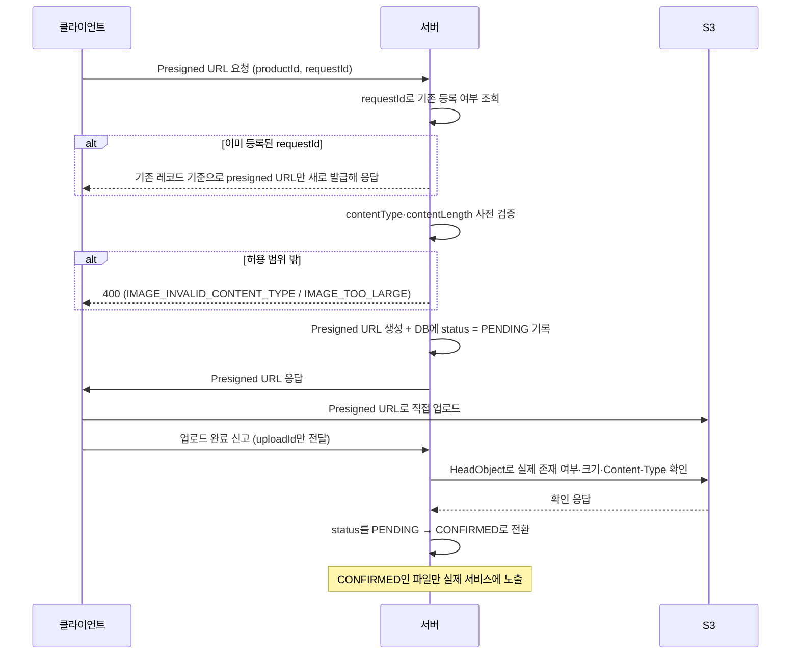

# 상품 이미지 등록 — S3 정합성 확보 전략

## 목차

1. [개요](#개요)
2. [핵심 문제: S3-DB 간 트랜잭션 불가](#핵심-문제-s3-db-간-트랜잭션-불가)
3. [근본 원인 분석](#근본-원인-분석)
4. [검토했던 해결 방안](#검토했던-해결-방안)
5. [최종 채택 방식](#최종-채택-방식)
6. [upload_id 식별자 설계](#upload_id-식별자-설계)
7. [남은 한계](#남은-한계)

---

## 개요

상품 이미지는 클라이언트가 Presigned URL로 S3에 직접 업로드한다. 서버를 거치지 않고 클라이언트 → S3로 파일이 바로 가기 때문에 서버 대역폭 부담이 없지만, "S3에 저장된 파일"과 "DB에 기록된 정보"가 서로 어긋날 수 있다.

이 문서는 그 문제를 어떻게 분석했고, 어떤 방안들을 검토한 끝에 지금 방식을 택했는지 정리한다.

서버가 하는 일은 uploadUrl(S3에 파일을 올릴 수 있는 임시 허가증 같은 URL)을 발급해서 관리자 화면(클라이언트)에 넘겨주는 것까지다.

## 핵심 문제: S3-DB 간 트랜잭션 불가

S3와 MySQL은 별개의 시스템이라 하나의 트랜잭션으로 묶을 수 없다. 그 결과 두 가지 정합성 문제가 생길 수 있다.

- 문제상황 1: S3 업로드는 성공했는데 DB 기록이 실패한 경우 → 아무도 참조하지 않는 고아 파일이 S3에 쌓인다.
- 문제상황 2: DB에는 기록됐는데 실제 S3 업로드가 실패한 경우 → 상품 이미지 테이블에 깨진 링크가 남는다.

기존에는 배치로 S3 객체 목록과 DB를 주기적으로 대조해서 이 두 문제를 사후에 잡아내는 방식을 생각했지만, 다음과 같은 한계가 있었다.

- 이미지가 많아질수록 매번 전체를 대조하는 연산이 비효율적이다.
- 문제상황 1은 저장 공간만 조금 낭비되는 정도라 큰 문제는 아니지만, 문제상황 2는 배치가 찾아낼 때까지 깨진 이미지가 그대로 노출된다는 점에서 심각한 문제다.
- 배치는 결국 사후 처리 방안이라, 문제를 예방하지는 못한다.

## 근본 원인 분석

두 문제상황은 겉보기에는 다르지만, 사실 원인은 하나다.
DB 기록 여부를 결정하는 근거가 신뢰할 수 없는 클라이언트 본인의 신고에만 의존한다는 점이다.

```
1. 클라이언트 → S3 : 실제 업로드
2. 클라이언트 → 서버 : "업로드 완료" 알림 (DB 기록을 결정하는 유일한 근거)
3. 서버 : DB에 기록
```

- 문제상황 1 = 1번은 성공, 2번(신고)이 누락된 경우
- 문제상황 2 = 1번은 실패, 2번(신고)만 온 경우

신호가 누락되면 고아 파일이, 신호가 거짓으로(혹은 실패했는데도) 오면 깨진 링크가 생긴다. 이 문제를 없애려면, DB에 기록할지 말지를 클라이언트 말이 아니라 S3가 직접 확인한 사실로 판단해야 한다.

## 검토했던 해결 방안

### S3 이벤트 알림 + SQS + Lambda

S3가 객체 생성을 실제로 확인하는 순간(ObjectCreated) 이벤트를 만들고, 이를 SQS를 거쳐 Lambda가 받아서 DB에 기록하는 방식이다.

```
S3 ObjectCreated 이벤트 → SQS(완충) → Lambda → DB 기록
```

- 장점: 트리거를 S3로 옮기면 문제상황 1·2가 애초에 생기지 않는다. 이미지가 몰려도 SQS가 완충해줘서 DB 커넥션이 한꺼번에 몰리는 일도 없다.
- 단점: Lambda 코드와 배포, SQS 큐 정책·DLQ·재시도 정책 설정 등 새로 관리해야 할 인프라가 늘어난다.

### S3 이벤트 알림 + EventBridge 직접 호출

Lambda와 SQS 없이, S3 이벤트를 EventBridge가 받아서 API Destination으로 서버를 바로 호출하는 방식이다.

```
S3 ObjectCreated 이벤트 → EventBridge(Rule) → API Destination → 서버 → DB 기록
```

- 장점: Lambda 같은 별도 컴퓨트나 SQS 같은 큐 없이, 이미 떠 있는 서버를 그대로 쓸 수 있어 관리할 인프라가 줄어든다.
- 단점: 서버가 외부에서 호출 가능한 엔드포인트를 새로 열어야 해서 인증 검증 코드가 필요하고, SQS가 해주던 부하 조절(동시성 제어)이 사라진다. 재시도가 다 실패하면 DLQ 없이는 이벤트가 사라질 수 있다.

### 대안 비교

두 방안 다 원인을 확실히 없앨 수 있지만, 팀 프로젝트 규모에 비해 관리할 인프라가 늘어난다는 부담이 있었다. 이를 고려해 더 가벼운 절충안을 최종적으로 택했다.

## 최종 채택 방식

클라이언트의 "완료 신고"를 아예 안 쓰지는 않지만, 그 말을 그대로 믿지는 않는다. 서버가 S3에 직접 재확인하는 절충안을 택했다. 신고는 "지금 확인해보라"는 신호로만 쓰고, 실제 판단은 서버가 S3에서 직접 받아온다.

발급 자체도 재시도에 안전해야 한다. `AdminProductImageCreateUploadUrlRequest.requestId`는
클라이언트가 생성하는 멱등키다. 같은 `productId`, `requestId`로 다시 요청이 오면 서버는 새로운 행을 만들지 않고 기존 데이터를 찾아 presigned
URL만 새로 발급해 돌려준다. URL 자체는 저장하지 않고 매번 새로 발급하므로, 재시도 응답이라도 그 자리에서 바로 쓸 수 있다. 
`product_image.request_id`에 `UNIQUE` 제약이 있어 두 요청이 동시에 들어와도 DB가 최종 방어선이 되고, 위반이 나면 재조회한 기존 값을 그대로 돌려준다.

### 전체 흐름



1. 서버가 Presigned URL을 발급한다. 먼저 같은 productId, requestId로 이미 발급한 적이 있는지 확인해 있으면 그 값을 기준으로 presigned URL만 새로 발급해 돌려주고, 없으면 클라이언트가 신고한 contentType, contentLength가 허용 범위인지 검증한 뒤 DB에 이미지 레코드를 status = PENDING으로 만들어둔다.
2. 클라이언트가 그 URL로 S3에 직접 업로드한다.
3. 클라이언트가 완료됐다고 신고하면(uploadId만 보내고 key는 보내지 않는다), 서버는 이 말을 그대로 믿지 않고 S3에 HeadObject를 호출해서 실제로 객체가 있는지 직접 확인한다.
4. HeadObject로 받은 크기·Content-Type은 발급 시 신고값과 재대조하지 않는다. presigned URL 자체가 발급 시점에 그 값들을 서명 조건에 포함시켜서, 신고와 다른 값으로 PUT하면 S3가 서명 불일치로 업로드를 403으로 거부하기 때문이다. 대신 여기서 대조하는 건 현재 서버 설정이다. 발급과 확정 사이에 관리자가 허용 범위를 좁혔다면, 발급 시점엔 유효했던 값이 지금은 더 이상 허용되지 않을 수 있고 그 경우만 여기서 걸러진다.
5. uploadId로 찾은 행의 productId·imageId가 경로 파라미터와 일치하는지도 함께 검증한다 — uploadId도 클라이언트가 보낸 값이라, 다른 업로드 건의 uploadId를 엉뚱한 경로에 잘못 실어 보내는 걸 이 대조로 막는다.
6. 확인되면 status를 PENDING → CONFIRMED로 바꾸고, CONFIRMED 상태인 이미지만 실제 상품 페이지에 노출한다. 조건이 다르면 객체를 지우고 실패로 응답하며, 아직 업로드 자체가 안 됐으면 PENDING을 유지해 재시도를 안내한다.

이미지 삭제는 반대 순서로 안전하게 처리한다 — S3 객체를 먼저 지우고 DB 행을 나중에 지운다. 객체 삭제가 실패하면 DB 행도 지우지 않는다. 순서를 반대로 하면(행을 먼저 지우면) key를 잃어 그 객체가 고아 객체로 확정되지만, 이 순서를 지키면 실패해도 재시도만 하면 되는 상태로 남는다.

### 왜 이 방식을 선택했는가

- 원인(클라이언트 말을 그대로 믿는 것)은 해결된다 — 최종 판단은 항상 서버가 S3에 직접 확인한 결과를 따른다.
- Lambda, SQS, EventBridge 등 별도로 관리해야 할 인프라가 없다 — 기존 서버 코드에 API 하나와 검증 로직만 추가하면 된다.
- 문제상황 2(깨진 링크)는 이 구조만으로 완전히 막힌다. DB가 CONFIRMED로 바뀌는 경로가 "서버가 S3에서 직접 존재를 확인했을 때" 하나뿐이기 때문이다.

## upload_id 식별자 설계

upload_id는 UUID v7로 생성한다(@UuidGenerator(style = VERSION_7), INSERT 시점에 ORM이 채운다).

이 값과 헷갈리기 쉬운 것이 public_id(추후 도입 예정, 외부에 리소스를 지목하기 위한 대체 식별자)인데, 둘은 목적이 다르다.

- public_id는 "이 리소스를 외부에서 안전하게 지목하기 위한 대체 ID"다 — 그 자체로 "이 행을 가리키는 주소" 역할을 한다. 한 번 발급되면 그 리소스가 존재하는 한 계속 유효하고, 여러 번 반복해서 써도 문제없는 값이다.
- upload_id는 "이 요청이 자격이 있는지 증명하는 1회성 비밀값"이다. PENDING에서 CONFIRMED로 넘어가는 딱 한 번의 순간에만 의미가 있고, 그 이후로는 다시 쓰일 일이 없다.

public_id는 URL에 노출되고 여러 번 재사용되는 값이라 정렬 가능성이 실질적인 이득이 되지만, upload_id는 짧은 시간 안에만 쓰이고 버려지는 값이라 정렬 가능성이 이득이 되지 않는다. public_id 체계를 그대로 사용했으면 upload_id가 "영구하게 유효한" 성격을 함께 물려받는다. 성격이 다른 두 개념이 하나의 인프라로 묶이면, 원래는 짧아야 할 노출 구간이 리소스 수명 전체로 늘어나고, 나중에 코드를 읽을 때 이 값이 재사용 가능한지 필드 이름만으로 판단할 수 없게 된다. 그래서 upload_id는 public_id 필드 체계를 가져와 쓰지 않고, 엔티티 필드에 직접 @UuidGenerator를 붙이는 독립적인 방식을 택했다.

다만 이 프로젝트에서는 upload_id 하나만으로 요청을 승인하지 않는다 — 완료 통지를 확정할 때 uploadId로 찾은 행의 productId·imageId가 경로 파라미터와 일치하는지 대조하는 정합성 검증이 두 번째 방어선으로 있다. 요청자 개인과 발급 건을 묶는 소유권 개념은 없고, 대신 이미지 API 전체가 관리자 역할 인가(hasRole(ADMIN))로 별도 보호된다. 그래서 upload_id를 우연히 추측당해도 경로 불일치 검증에서 다시 걸러진다.

### of(image, uploadUrl) 정적 팩터리를 쓰는 이유

uploadUrl은 저장된 값이 아니라 그 순간 S3 클라이언트가 만들어주는 값이라, 엔티티 하나만으로는 응답을 만들 수 없다. "저장된 값(엔티티)"과 "그 순간 계산되는 값(uploadUrl)"을 합치는 지점이 필요한데, 이걸 엔티티 안에 넣으면 안 되고(엔티티에 복합 객체를 넣지 않는다는 원칙과 어긋남) DTO의 정적 팩터리에서 조합하는 게 맞다.

of(image, uploadUrl)은 DB에 있던 값(image에서 꺼냄) + 방금 S3한테 받은 값(uploadUrl) 하나를 모아서 응답 객체로 포장하는 역할을 한다. ProductImage 엔티티 하나만 받는 형태로 만들었다면 uploadUrl을 채울 방법이 없었을 것이다.

## 남은 한계

이 방식은 문제상황 2(깨진 링크)는 확실히 막는다. 문제상황 1(고아 파일)은 이 확정 플로우 자체만으로는 못 막지만, 별도의 정리 배치(PendingProductImageCleanupService)를 함께 두어 해결했다.

### 이미 구현된 정리 배치

클라이언트가 업로드에 성공하고도 완료 신고를 보내지 않으면(앱 종료, 네트워크 단절 등) 서버가 재확인할 계기가 없어 그 행은 PENDING으로 남는다. 이걸 방치하지 않기 위해, PendingProductImageCleanupScheduler가 하루 1번(새벽 4시) PendingProductImageCleanupService.cleanupExpiredPending()을 돌려 유예 시간(기본 3시간, 조정 가능)을 넘긴 PENDING 행을 찾아 S3 객체를 먼저 지우고 DB 행을 나중에 지운다. delete() API와 같은 순서 원칙(객체 먼저, 행 나중)을 그대로 따라서, 중간에 실패해도 다음 주기에 같은 행을 다시 시도하는 것만으로 안전하다.

그 결과 PENDING 고아 레코드는 계속 남는 것이 아니라, 최대 (유예시간 + 배치 주기) 정도의 시간 동안만 존재하다가 자동으로 정리된다.

### 요청 트래픽에 얹은 보완 정리

배치 실행 횟수를 줄이기 위해, 처음에는 "업로드 URL 발급 시점마다 N분 뒤 스스로 재확인하는" 지연 스케줄을 검토했다. 그런데 이 방식은 모든 업로드 건마다 예약 작업을 하나씩 만드는 구조라, 업로드량이 많아지면 오히려 기존 배치보다 실행 횟수가 많아지는 역효과가 있어 반영하지 않았다.

대신 채택한 방식은 새 스케줄러를 아예 추가하지 않는 것이다. `createUploadUrl()`(같은 상품에 이미지를 또 올리려는 요청)이 호출될 때, 그 상품에 유예 시간(기본 10분)을 넘긴 PENDING 행이 남아있으면 추가로 확인해서 스스로 확정하거나 방치한다.

- 새로 도는 스케줄러가 없다 — 이미 일어난 요청에 로직만 얹는 것이라, 배치 개수는 하루 1번 그대로다.
- `product_image` 테이블의 `idx_product_image_pending_cleanup(upload_status, created_at)` 인덱스가 조회 확정 대상 조회까지 염두에 두고 설계되어 있어, 새 인덱스나 쿼리 없이 기존 `findByProductIdAndUploadStatus` 조회를 그대로 재사용한다.
- 다만 이 방식은 "해당 상품에 다시 이미지를 올리는 경우가 있을때만" 동작한다. 아예 다시 안 건드리는 상품의 고아 데이터는 여전히 배치가 최종적으로 처리한다. 따라서 이 방식은 배치를 대체하는 것이 아니라, 배치가 처리할 물량 중 흔한 경우를 배치보다 먼저 처리하는 보완이다.

### 그럼에도 남는 한계

- S3 객체 목록 기반 정합성 검증은 아니다. 이 배치는 DB의 PENDING 행을 시간 기준으로 훑는 것이지, S3 버킷의 실제 객체 목록과 DB를 대조하는 게 아니다. 지금 업로드 플로우는 항상 DB에 행을 먼저 만든 뒤에만 유효한 presigned URL을 내주므로 "DB에 기록이 전혀 없는 S3 객체"가 생길 경로는 설계상 없다고 보지만, 이를 실제로 감사하는 수단은 없다.
- Glacier 이관이나 유예기간을 둔 단계적 삭제는 아니다. 유예시간이 지나면 바로 하드 삭제한다. 유예시간을 너무 짧게 잡았거나 클라이언트의 업로드-신고 지연이 예상보다 길면, 정상적으로 진행 중인 업로드까지 지워질 수 있는데 되돌릴 방법이 없다.
- 유예시간(3시간) 자체가 실측이 아니라 추정치다. presigned URL 만료(5분)보다 넉넉히 잡은 값일 뿐, 실제 클라이언트의 신고 지연 분포를 보고 정한 값은 아니다.

배치가 이미 있는 이상, 완전한 S3 목록 대조 배치나 Glacier 기반 삭제 정책까지 갖추는 것은 얻는 이득 대비 비용이 더 크다고 판단해 미룬다. 유예시간을 너무 짧게 잡아 실제 업로드가 지워지는 사례가 관측되거나, 정리 배치가 못 잡는 고아 파일이 실제로 발견되면 그때 정합성 검증 배치를 추가할 예정이다.
